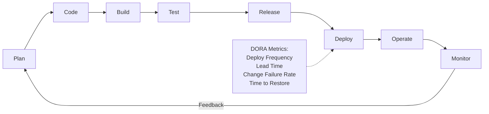

# 14 — DevOps

## What is it?

DevOps is a set of practices, tools, and a cultural philosophy that automates and integrates the processes between software development and IT operations. It emphasizes collaboration, automation, continuous delivery, and short feedback loops to deliver value to users faster and more reliably.



## The CALMS Framework

| Pillar | Description |
|--------|-------------|
| **C**ulture | Collaboration, shared responsibility, trust across Dev and Ops teams |
| **A**utomation | Infrastructure as Code, CI/CD pipelines, automated testing and deployment |
| **L**ean | Eliminate waste, amplify learning, decide as late as possible, deliver fast |
| **M**easurement | Metrics-driven decisions: DORA metrics, SLIs, SLOs, dashboards |
| **S**haring | Knowledge sharing, blameless postmortems, cross-functional teams |

## DORA Metrics

| Metric | Target (Elite) |
|--------|----------------|
| Deployment Frequency | Multiple deploys per day |
| Lead Time for Changes | Less than 1 hour |
| Change Failure Rate | Less than 5% |
| Time to Restore Service | Less than 1 hour |

## Topics

| # | Topic | Description |
|---|-------|-------------|
| 01 | [Git Workflows](01-git-workflows.md) | Branching strategies, conventional commits, pre-commit hooks, GPG signing |
| 02 | [GitHub Actions](02-github-actions.md) | CI/CD with GH Actions, matrix builds, environments, deployment to cloud |
| 03 | [Jenkins](03-jenkins.md) | Declarative & scripted pipelines, shared libraries, Blue Ocean |
| 04 | [ArgoCD](04-argocd.md) | GitOps, declarative deployments, sync strategies, cluster management |
| 05 | [Helm](05-helm.md) | Charts, templates, values, hooks, dependency management, Helmfile |
| 06 | [Ansible](06-ansible.md) | Inventory, playbooks, roles, modules, vault, AWX/Tower |
| 07 | [CI/CD Pipeline Design](07-ci-cd-pipeline-design.md) | Pipeline stages, approval gates, environment promotion, rollback |
| 08 | [Monitoring & Logging](08-monitoring-logging.md) | Metrics, centralized logging, alerting, SLOs, on-call |
| 09 | [DevSecOps](09-devops-security.md) | SAST/DAST, container scanning, secret management, SBOM |
| 10 | [Release Management](10-release-management.md) | Release strategies, feature flags, semantic versioning, changelog |

## Prerequisites

- [08-Docker](../08-Docker/README.md)
- [09-Kubernetes](../09-Kubernetes/README.md)
- [10-AWS](../10-AWS/README.md)
- [13-Terraform](../13-Terraform/README.md)

## Related Modules

- [15-SRE](../15-SRE/README.md) — SLOs, SLIs, error budgets, incident management

```

To contribute, add your notes under the relevant topic file and update the table above.

---
Previous: [13 &mdash; Terraform](../13-Terraform/README.md)
Next: [15 &mdash; SRE](../15-SRE/README.md)
