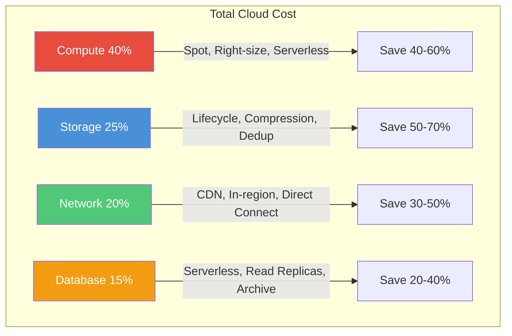

# Cost Optimization

## Cloud Cost Drivers



| Service | Cost Factor | Optimization |
|---------|-------------|-------------|
| **Compute** | Instance type, hours | Spot instances, auto-scaling, right-sizing |
| **Storage** | Volume, access frequency | Lifecycle policies, compression |
| **Network** | Data transfer, cross-region | CDN, keep traffic in-region |
| **Database** | Provisioned capacity, storage | Serverless, read replicas |
| **Data transfer** | Egress charges | CloudFront, direct connect |

## Optimization Strategies

### Compute
```yaml
- Use spot instances for batch/stateless workloads
- Auto-scale based on demand, not fixed capacity
- Right-size instances (monitor utilization)
- Use arm64 (Graviton) instances (20-40% cheaper)
- Consider serverless (Lambda) for variable workloads
```

### Storage
```yaml
- S3 lifecycle: Standard → IA → Glacier → Deep Archive
- Delete unused EBS volumes and snapshots
- Use compression before storage
- Deduplicate data
```

### Database
```yaml
- Use read replicas instead of scaling up master
- Serverless database for variable workloads
- Clean up old data (TTL, partitioning)
- Archive cold data to cheaper storage
```

## Cost Monitoring

| Tool | Purpose |
|------|---------|
| **AWS Cost Explorer** | Visualize spending trends |
| **AWS Budgets** | Set alerts for cost thresholds |
| **Grafana + CloudWatch** | Cost per service dashboard |
| **Infracost** | Cost estimation for Terraform |

## Interview Questions
1. How would you reduce cloud costs for a data-intensive application?
2. How do you calculate the total cost of ownership for an architecture?
3. When is it worth spending more on infrastructure to reduce engineering cost?
4. How do you balance performance vs cost?
5. Design a cost-monitoring system for a multi-service architecture
