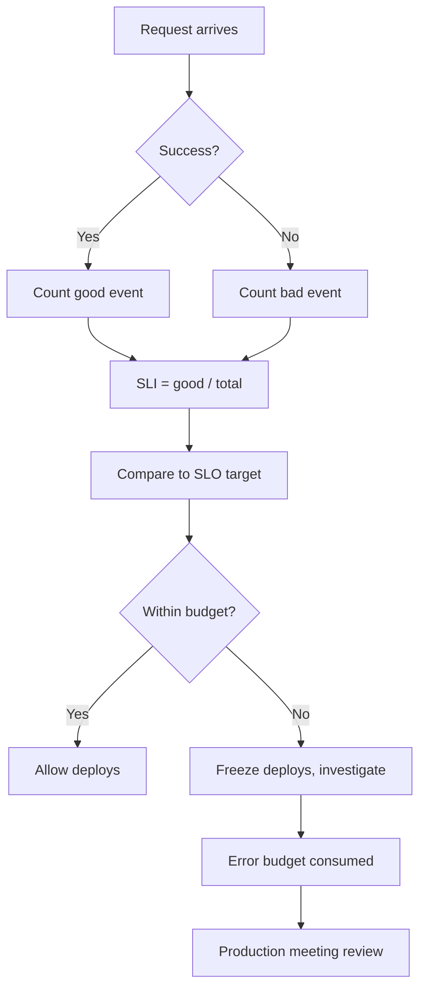

# SLOs, SLIs & Error Budgets

## What is it?

**SLI (Service Level Indicator)** — A quantitative measure of some aspect of the service (latency, error rate, throughput, saturation).

**SLO (Service Level Objective)** — A target value or range for an SLI over a time window (e.g., 99.9% of requests complete in < 200ms over 30 days).

**Error Budget** — The acceptable amount of unreliability: `100% - SLO`. If SLO is 99.9%, the error budget is 0.1% of total requests. You can spend this budget on deployments, experiments, or risk.

## Why it matters

- Error budgets give teams permission to deploy — as long as budget remains, velocity is allowed
- SLOs force explicit tradeoffs between feature velocity and reliability
- Without SLOs, there is no objective definition of "good enough"
- Error budgets replace fear-based decision-making with data

## Implementation

### Choosing SLIs

Use the **Four Golden Signals** (Google):

| Signal | Definition | Example SLI |
|--------|------------|-------------|
| **Latency** | Time to respond | p99 latency < 200ms |
| **Traffic** | Demand on system | Requests/second throughput |
| **Errors** | Failed requests | HTTP 5xx rate / error ratio |
| **Saturation** | How "full" the service is | CPU usage > 80%, queue depth |

### Defining SLO Tiers

| Tier | SLO | Error Budget (30 days) |
|------|-----|----------------------|
| **Tier 0** — Critical | 99.999% ("five nines") | 26 seconds downtime |
| **Tier 1** — Core | 99.99% ("four nines") | 4.3 minutes downtime |
| **Tier 2** — Standard | 99.9% ("three nines") | 43 minutes downtime |
| **Tier 3** — Best effort | 99% | 7.2 hours downtime |

### Error Budget Calculation

```
Error Budget = (1 - SLO) × Total Requests

Example:
  SLO = 99.9%         → Budget = 0.1%
  10M requests / month → Budget = 10,000 failed requests

Consumption = (Actual Errors / Total Requests) × 100
Remaining   = Max(0, Error Budget - Consumed)
```

### Multi-Window Multi-Burn-Rate Alerts

Instead of alerting on a single threshold, use **two windows** (short + long) to detect fast and slow burn simultaneously:

| Burn Rate | Window | Alert When |
|-----------|--------|------------|
| Fast (rate ≥ 10x) | Short (1h) | Budget will exhaust in < 6m |
| Medium (rate ≥ 2x) | Medium (6h) | Budget will exhaust in < 3d |
| Slow (rate ≥ 1x) | Long (30d) | SLO is at risk of breach |



### Burn Rate Alerting Formula

```
burn_rate = (error_rate / (1 - SLO))

Example:
  SLO = 99.9% → 1 - SLO = 0.001
  Observed error rate in window = 1%
  burn_rate = 0.01 / 0.001 = 10x

  At 10x burn, you exhaust budget in:
  Time_to_exhaust = window / burn_rate
                   = 30 days / 10 = 3 days
```

## Best Practices

- Start with SLIs you can actually measure; improve instrumentation later
- Use **slippy** (exhaust time) and **budget burn rate** for paging
- Don't alert on every SLO breach — alert when **burn rate** threatens the budget
- Set multiple tiers: paging alert (fast burn) + ticket alert (slow burn)
- Review SLOs quarterly with product teams
- Document the "SLO is at risk" runbook before deploying alerts

## Interview Questions

1. How would you design SLIs for a ride-sharing platform (Uber/Lyft)?
2. Explain the multi-window multi-burn-rate alerting strategy.
3. What happens when an error budget is fully consumed?
4. How do you balance SLOs across dependent services in a microservice architecture?
5. What is the difference between an SLO and an SLA? Can you have one without the other?
6. How would you calculate error budget for a service with 99.95% SLO and 5M requests/day?

## Cross-Links

- [14-DevOps: Monitoring & Logging](../14-DevOps/08-monitoring-logging.md) — Alerting and observability pipelines
- [17-Observability: Alerting](../17-Observability/05-alerting.md) — Alert design patterns
- [17-Observability: Metrics](../17-Observability/04-metrics.md) — Metric collection for SLIs
- [21-Staff-Engineer: Capacity Planning](../21-Staff-Engineer/08-capacity-planning.md) — Saturation SLI and capacity
