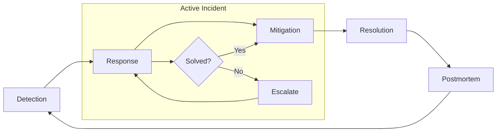

# Incident Management

## What is it?

Incident management is the structured process by which an organization detects, responds to, mitigates, and resolves service disruptions. It extends beyond technical debugging to include communication, coordination, escalation, and stakeholder management.

## Why it matters

- Without structure, incidents are chaotic — people step on each other, communication breaks, recovery is slow
- A well-run incident reduces **Time to Acknowledge (TTA)** and **Time to Mitigate (TTM)**
- Stakeholders (users, executives, legal) need clear, timely updates
- Post-incident analysis is only useful if the incident response was well-documented

## Implementation

### Incident Command System (ICS)

| Role | Responsibility |
|------|----------------|
| **Incident Commander (IC)** | Owns the response; delegates tasks; does NOT debug |
| **Operations Lead** | Debugs and fixes the technical issue |
| **Communications Lead** | Updates stakeholders, status page, internal chat |
| **Scribe** | Takes live timeline notes; preserves evidence |
| **SME (Subject Matter Expert)** | Brought in by IC for specialized domains (DB, networking, security) |

### Severity Levels

| Severity | Definition | Response Time | Example |
|----------|------------|---------------|---------|
| **SEV-0** | Complete outage, all users affected | Immediate, all hands | Region down, data loss |
| **SEV-1** | Major feature broken, significant users affected | < 15 min | Payment failures, login blocked |
| **SEV-2** | Partial degradation, minor users affected | < 1 hour | Slow search, minor UI bug |
| **SEV-3** | Minor issue, no user-facing impact | < 1 day | Internal dashboard stale |
| **SEV-4** | Cosmetic, questions, requests | < 1 week | Feature request, typo fix |

### Severity Matrix

| Criteria | SEV-0 | SEV-1 | SEV-2 | SEV-3 |
|----------|-------|-------|-------|-------|
| User impact | All users | Many users | Some users | Few/none |
| Data loss | Yes | Possible | No | No |
| Revenue impact | > $100K/hr | $10K–$100K/hr | < $10K/hr | None |
| Pager | Immediately | Immediately | 15-min delay | Email/ ticket |
| Executive notification | within 5 min | within 15 min | next standup | None |

### Incident Lifecycle



### Detection

- Monitoring alerts (see [17-Observability: Alerting](../17-Observability/05-alerting.md))
- User reports (ticketing system)
- Synthetic probes / uptime checks
- Anomaly detection on dashboards

### Response

1. Acknowledge the alert
2. Declare incident (open a channel, announce severity)
3. Appoint IC
4. Begin timeline log
5. Communicate initial assessment to stakeholders

### Mitigation

- Rollback deploy
- Redirect traffic to healthy region
- Scale up capacity
- Feature flag off the problematic functionality
- **Stop the bleeding first; fix root cause later**

### Resolution

- Confirm the mitigation is stable
- Monitor dashboard for 15-30 min to ensure no recurrence
- Clean up temporary workarounds
- Document final resolution in incident ticket

## Best Practices

- Declare incidents early and often — you can always downgrade severity
- A dedicated communications channel (#incident-xxx) with automated join link
- Use a **status page** (e.g., Statuspage.io, Cachet) for external communication
- Have **communication templates** ready — saves time during the crisis
- Hold a **postmortem within 48 hours** while details are fresh
- Pager escalation should have at least two levels before reaching engineering manager

## Communication Templates

### Initial Acknowledgment

```
We are investigating reports of [issue] affecting [users/feature]. 
We'll update in 15 minutes. #incident-123
```

### Mitigation Complete

```
We have identified [root cause] and applied [mitigation]. 
Monitoring for stability. Next update in 30 minutes.
```

### Resolution

```
The incident is resolved. [Service/feature] is operating normally. 
A detailed postmortem will be shared within 48 hours. 
[Link to incident report]
```

## Interview Questions

1. Walk me through how you'd handle a SEV-0 incident as Incident Commander.
2. What's the first thing you do when you get paged at 3 AM?
3. How do you ensure incident communication reaches the right stakeholders?
4. What information should a post-incident timeline capture?
5. How do you decide when to escalate an incident?
6. What is the difference between mitigation and resolution?

## Cross-Links

- [18-Case-Studies: GitHub Outage](../18-Case-Studies/05-github-outage.md) — Real incident timeline
- [18-Case-Studies: Fastly Outage](../18-Case-Studies/06-fastly-outage.md) — CDN incident case study
- [17-Observability: Alerting](../17-Observability/05-alerting.md) — Detection mechanisms
- [21-Staff-Engineer: Disaster Recovery](../21-Staff-Engineer/06-disaster-recovery.md) — DR and incident escalation
