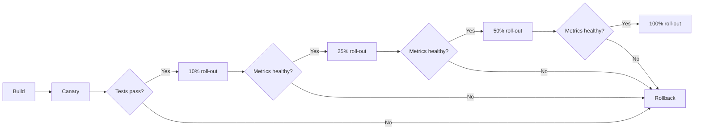

# Change Management

## What is it?

Change management in SRE governs how changes (code deploys, config updates, infrastructure changes) are introduced into production. It balances the need for velocity with the risk of introducing failures. Google's SRE model treats change management as a first-class reliability concern.

## Why it matters

- Most production incidents are caused by changes (deploys, config pushes, DNS updates)
- Uncontrolled change is the #1 cause of downtime
- A robust change management process reduces **Change Failure Rate (CFR)** and **Time to Restore (TTR)**
- It allows teams to move fast without breaking things

## Implementation

### Change Approval Processes

| Method | Description | When to Use |
|--------|-------------|-------------|
| **Self-service** | Engineer deploys with no approval | Low-risk, well-tested changes |
| **Peer review** | Another engineer must approve PR | Standard code/config changes |
| **Change Advisory Board (CAB)** | Formal meeting to approve changes | High-risk, infrastructure changes |
| **Automated gates** | CI/CD pipeline checks must pass | Every change, enforced by tooling |

### Progressive Delivery



### Feature Flags

Feature flags (toggles) decouple deployment from release:

```
Flag: new_recommendation_engine
  └── on for 5% of users (canary)
  └── ramping: 5% → 25% → 50% → 100%
  └── kill switch: immediate rollback without redeploy
```

Tools: LaunchDarkly, Unleash, Flagsmith, in-house config service.

### Canary Analysis

Automated canary analysis compares metrics between canary and baseline:

| Metric | Canary | Baseline | Pass? |
|--------|--------|----------|-------|
| Error rate | 0.1% | 0.05% | ❌ No |
| p99 latency | 210ms | 195ms | ❌ No |
| CPU usage | 45% | 42% | ✅ Yes |

If any metric deviates beyond threshold, the canary is automatically rolled back.

### Deployment Velocity Metrics

| Metric | Definition | Target |
|--------|------------|--------|
| **Deployment Frequency** | How often you deploy to production | Multiple/day |
| **Lead Time for Change** | Time from commit to production | < 1 hour |
| **Change Failure Rate (CFR)** | % of changes causing failures | < 5% |
| **Time to Restore** | Time to recover from failures | < 1 hour |

### Automate vs Manual Gates

| Gate | Automate? | Reason |
|------|-----------|--------|
| Unit/integration tests | ✅ Always | Fast, deterministic |
| Security scan | ✅ Always | Consistent, thorough |
| Load testing | ✅ For major changes | Can run in CI |
| Peer code review | ✅ LGTM in PR tool | Human judgment needed |
| CAB approval | 🟡 For high-risk only | Slow; avoid for standard changes |
| Executive sign-off | ❌ Never | Adds friction without reliability gain |

## Best Practices

- Use **feature flags** for all user-facing changes — even small ones
- Automate rollback: if canary fails, rollback automatically within 10 minutes
- Track **change failure rate** as a DORA metric; review in weekly ops meeting
- Implement **deployment freeze** during high-traffic periods (Black Friday, New Year)
- Use **change management as a service**: a centralized platform teams use rather than a CAB gatekeeping
- Every change should have a **known rollback procedure** documented

## Interview Questions

1. Design a progressive delivery strategy for a critical payment service.
2. What metrics would you monitor during a canary deployment?
3. How do you decide which changes require CAB approval vs self-service?
4. What is the relationship between feature flags and deployment frequency?
5. How do you prevent configuration drift across environments?
6. Explain how automated canary analysis works and what thresholds you'd set.

## Cross-Links

- [14-DevOps: CI/CD Pipeline Design](../14-DevOps/07-ci-cd-pipeline-design.md) — Pipeline stages and gates
- [14-DevOps: Release Management](../14-DevOps/10-release-management.md) — Release strategies, versioning
- [17-Observability: Metrics](../17-Observability/04-metrics.md) — Canary analysis metrics
- [21-Staff-Engineer: Tradeoffs](../21-Staff-Engineer/01-tradeoffs.md) — Velocity vs reliability tradeoffs
