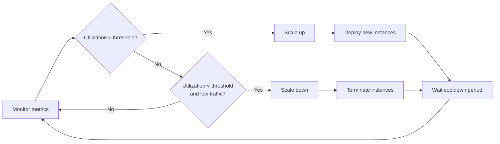

# Capacity Planning

## What is it?

Capacity planning is the process of predicting future resource needs (compute, memory, storage, network) and ensuring the system can handle anticipated demand within SLOs. Google's SRE teams treat it as a continuous activity, not a once-a-quarter exercise.

## Why it matters

- Running out of capacity causes outages, degraded performance, and SLO breaches
- Over-provisioning wastes money; under-provisioning loses users
- Capacity planning connects business metrics (users, revenue) to infrastructure costs
- It enables informed decisions about when to scale, buy reservations, or optimize

## Implementation

### Google's Capacity Planning Approach

Google uses a **demand forecasting + provisioning model**:

1. **Demand forecasting**: Use historical trends and business inputs to predict future load
2. **Capacity modeling**: Map demand to resource requirements (CPU, memory, disk, network)
3. **Provisioning**: Order resources with a **safety margin** (typically 20–50% headroom)
4. **Validation**: Load test to validate the model
5. **Monitoring**: Track utilization and adjust forecasts regularly

### Demand Forecasting

```
Method 1: Time-series extrapolation
  traffic_next_month = traffic_current × (1 + growth_rate)

Method 2: Leading indicators
  new_user_signups, marketing campaign launches, feature launches

Method 3: Scenario modeling
  Best case:  +50% growth (holiday surge)
  Expected:   +20% growth
  Worst case: +10% growth (flat user adoption)
```

### Capacity Modeling

| Resource | How to Model | Scaling Unit |
|----------|--------------|--------------|
| **CPU** | Requests/sec × avg CPU per request | vCPUs |
| **Memory** | Concurrent users × memory per session | GB |
| **Storage** | Data ingested/day × retention period | TB |
| **Network** | Peak bandwidth per user × concurrent users | Gbps |
| **Database** | Query rate × query complexity + indexes | IOPS, connections |

### Load Testing

**k6** — Modern, scriptable load testing tool:

```javascript
import http from 'k6/http';
import { check, sleep } from 'k6';

export const options = {
  stages: [
    { duration: '5m', target: 100 },   // ramp-up
    { duration: '10m', target: 1000 }, // sustained peak
    { duration: '5m', target: 0 },     // ramp-down
  ],
  thresholds: {
    http_req_duration: ['p(99)<500'], // SLO-aligned
    http_req_failed: ['rate<0.001'],
  },
};

export default function () {
  const res = http.get('https://api.example.com/users');
  check(res, { 'status 200': (r) => r.status === 200 });
  sleep(1);
}
```

**Locust** — Python-based, distributed:

```python
from locust import HttpUser, task, between

class WebsiteUser(HttpUser):
    wait_time = between(1, 3)
    
    @task
    def get_users(self):
        self.client.get("/users")
    
    @task(3)
    def search(self):
        self.client.get("/search?q=test")
```

### Resource Quotas

| Cloud | Mechanism |
|-------|-----------|
| AWS | Service Quotas, Reserved Instances, Savings Plans |
| GCP | Quota Manager, Committed Use Discounts |
| Azure | Subscription limits, Reservations |
| Kubernetes | ResourceQuota, LimitRange, Namespace quotas |

### Auto-Scaling Strategies

| Strategy | How It Works | Best For |
|----------|--------------|----------|
| **Target utilization** | Scale up when CPU > 70%, scale down when < 30% | Stateless apps, web servers |
| **Request-based** | Scale based on RPS or queue depth | API services, workers |
| **Scheduled** | Pre-scale based on known traffic patterns | Batch jobs, predictable peaks |
| **Predictive** | ML model forecasts future load | Services with cyclical patterns |



## Best Practices

- Always provision with **20-50% headroom** for unexpected traffic spikes
- Use **reserved instances** for baseline capacity, **spot/preemptible** for burst
- Test capacity **when traffic doubles** — not just at current load
- Combine **predictive and reactive** auto-scaling for best results
- Review capacity forecast **monthly** with engineering and product
- Document **capacity triggers** — what metric at what threshold triggers a ticket?

## Interview Questions

1. How would you estimate the capacity needed for a new product feature?
2. What metrics would you include in a capacity dashboard?
3. Explain the difference between vertical and horizontal scaling from a capacity perspective.
4. How do you handle sudden unexpected traffic spikes (Slashdot effect)?
5. How would you model capacity for a database that grows 500GB/day?
6. What is the relationship between load testing results and capacity planning?

## Cross-Links

- [21-Staff-Engineer: Capacity Planning](../21-Staff-Engineer/08-capacity-planning.md) — Advanced capacity modeling
- [21-Staff-Engineer: Multi-Region Design](../21-Staff-Engineer/05-multi-region-design.md) — Regional capacity
- [17-Observability: Monitoring](../17-Observability/02-monitoring.md) — Utilization dashboards
- [18-Case-Studies: YouTube](../18-Case-Studies/02-youtube.md) — Capacity at massive scale
