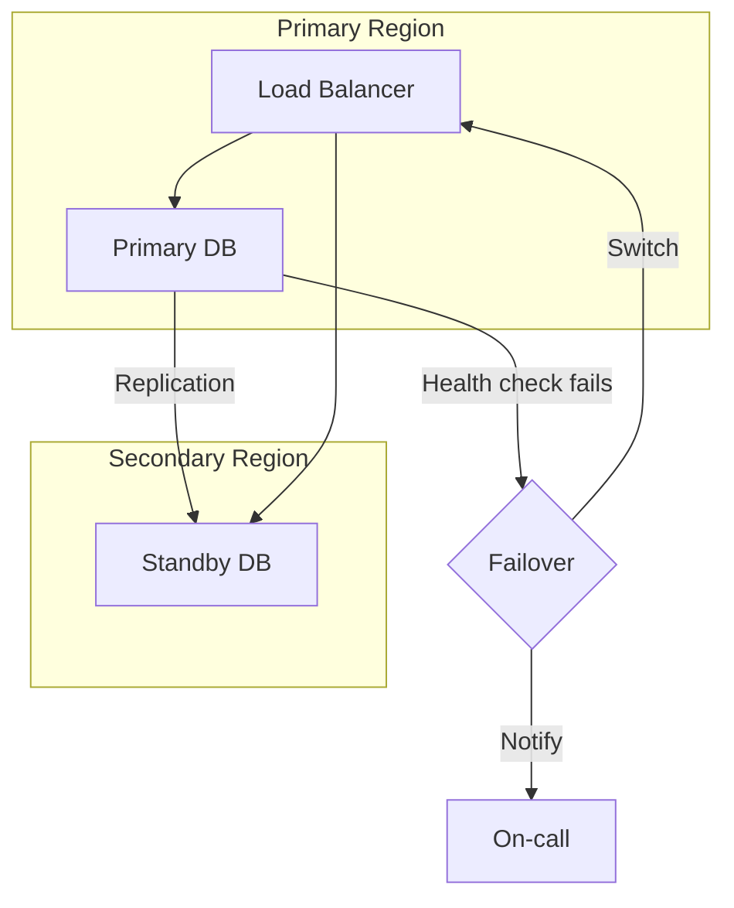

# Reliability Patterns

## What is it?

Reliability patterns are architectural building blocks that protect systems from cascading failures, handle partial outages gracefully, and maintain uptime even when dependencies fail. They are the implementation toolkit of SRE.

## Why it matters

- In distributed systems, everything fails eventually — networks, disks, services, dependencies
- Without reliability patterns, a single failure cascades into a complete outage
- These patterns are proven, language-agnostic, and compose into resilient architectures
- They reduce **blast radius** and improve **Time to Restore**

## Implementation

### 1. Redundancy

Run multiple instances of a component so that if one fails, others take over.

| Type | Example | Use Case |
|------|---------|----------|
| **Active-Active** | Multiple app servers behind LB | Stateless services |
| **Active-Passive** | Primary + standby DB | Stateful services |
| **N+2** | 3 replicas when 1 needed | Critical infrastructure |

### 2. Failover

Automatic or manual switch to a healthy replica when the primary fails.



### 3. Graceful Degradation

When a dependency fails, return a degraded (but functional) experience instead of an error.

```
Normal:      Recommendation Engine → personalized results
Degraded:    Recommendation Engine → timeout → return popular defaults
```

### 4. Load Shedding

Reject excess traffic to protect system capacity. Better to serve some users well than all users poorly.

- **Random load shedding**: Drop N% of requests
- **Priority-based**: Drop low-priority requests first (e.g., batch jobs, non-paying users)
- **Queue depth shedding**: Reject if queue exceeds threshold

### 5. Circuit Breaker

Prevents repeated calls to a failing dependency, giving it time to recover.

| State | Behavior |
|-------|----------|
| **Closed** | Normal operation; requests pass through |
| **Open** | Failures exceed threshold; requests fail fast (no call) |
| **Half-Open** | After timeout, allow one probe request; success → close, failure → open |

```python
class CircuitBreaker:
    def __init__(self, threshold=5, timeout=30):
        self.failures = 0
        self.threshold = threshold
        self.timeout = timeout
        self.state = "CLOSED"
        self.last_failure_time = 0

    def call(self, func, fallback=None):
        if self.state == "OPEN":
            if time.time() - self.last_failure_time > self.timeout:
                self.state = "HALF_OPEN"
            else:
                return fallback() if fallback else None
        
        try:
            result = func()
            if self.state == "HALF_OPEN":
                self.state = "CLOSED"
                self.failures = 0
            return result
        except Exception:
            self.failures += 1
            self.last_failure_time = time.time()
            if self.failures >= self.threshold:
                self.state = "OPEN"
            return fallback() if fallback else None
```

### 6. Bulkhead

Isolate components into separate pools so a failure in one doesn't starve others.

```
Without Bulkhead:         With Bulkhead:
┌─────────────────┐      ┌─────┬─────┬─────┐
│ Shared Thread    │      │Pool1│Pool2│Pool3│
│ Pool            │      │ APIs│Search│Auth │
│  API│Search│Auth│      │5 t│3 t│2 t│
│ (one failure     │      │(isolated failures)│
│  saturates all)  │      └─────┴─────┴─────┘
└─────────────────┘
```

Thread pool executors, connection pools per dependency (not shared).

### 7. Retry with Jitter

Retrying a failed request increases chance of success, but naive retries cause **retry storms**. Add jitter to spread out retries.

```
Without jitter:  0ms, 100ms, 200ms → synchronized wave
With jitter:     0ms, 87ms, 231ms → spreads load

def retry_with_jitter(fn, max_retries=3, base_delay=0.1):
    for attempt in range(max_retries):
        try:
            return fn()
        except Exception:
            if attempt == max_retries - 1:
                raise
            delay = base_delay * (2 ** attempt)  # exponential backoff
            jitter = random.uniform(0, delay)     # + jitter
            time.sleep(delay + jitter)
```

### 8. Timeouts

Every external call must have a timeout. Without one, a slow dependency holds threads indefinitely.

| Pattern | Value | Effect |
|---------|-------|--------|
| **Fixed timeout** | 500ms | Hard limit |
| **Dynamic timeout** | p99 × 3 | Adapts to service health |
| **Deadline propagation** | context deadline = 2s for full chain | Propagates from caller |

### 9. Health Checks

| Probe | What It Checks | Action on Failure |
|-------|----------------|-------------------|
| **Liveness** | Is the process running? | Restart (kill + replace) |
| **Readiness** | Can it serve traffic? | Remove from load balancer |
| **Startup** | Has initialization completed? | Delay liveness checks |

```yaml
# Kubernetes example
livenessProbe:
  httpGet: { path: /healthz, port: 8080 }
  initialDelaySeconds: 3
  periodSeconds: 10
readinessProbe:
  httpGet: { path: /readyz, port: 8080 }
  periodSeconds: 5
```

## Best Practices

- Always implement **timeout + circuit breaker + retry with jitter** together
- Use **bulkhead** to isolate critical user-facing paths from batch jobs
- Health checks should verify dependencies (DB, cache), not just return 200
- Set retry budgets on per-call-chain basis to prevent amplification
- Document **blast radius** of each service — who depends on it, what fails when it goes down
- Test reliability patterns with **chaos engineering** (see [21-Staff-Engineer: Chaos Engineering](../21-Staff-Engineer/07-chaos-engineering.md))

## Interview Questions

1. How does a circuit breaker differ from a retry? When would you use each?
2. Explain the bulkhead pattern and give a real-world example.
3. Why is jitter important in retry logic? What happens without it?
4. Design a health check strategy for a microservice with three downstream dependencies.
5. What is the difference between a readiness probe and a liveness probe?
6. How would you implement graceful degradation for a recommendation service?
7. What is load shedding and how do you decide which requests to shed?

## Cross-Links

- [21-Staff-Engineer: Chaos Engineering](../21-Staff-Engineer/07-chaos-engineering.md) — Testing reliability patterns
- [21-Staff-Engineer: Disaster Recovery](../21-Staff-Engineer/06-disaster-recovery.md) — Failover and redundancy
- [17-Observability: Monitoring](../17-Observability/02-monitoring.md) — Health check dashboards
- [18-Case-Studies: Netflix](../18-Case-Studies/01-netflix.md) — Chaos engineering at scale
