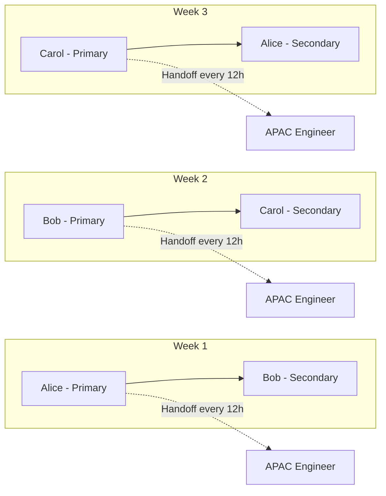

# Emergency Response

## What is it?

Emergency response defines the people, processes, and tools that ensure a team can respond to production incidents 24/7. It covers on-call rotations, escalation policies, runbooks, communication, and the organizational support structure around incident handling.

## Why it matters

- Every minute of outage costs money and user trust
- Without structured on-call, everyone burns out or nobody responds
- A well-designed on-call rotation reduces **pager fatigue** and improves **Mean Time to Acknowledge (MTTA)**
- Runbooks ensure that even a junior engineer can handle incidents effectively

## Implementation

### On-Call Rotations

| Model | How It Works | Pros | Cons |
|-------|--------------|------|------|
| **Primary/Secondary** | Primary takes pages; secondary covers if primary misses | Simple, clear ownership | Secondary rarely gets experience |
| **Follow-the-Sun** | Hand off to next timezone at end of day | No overnight calls | Requires global offices |
| **Pooled** | Whole team shares on-call one week at a time | Shared knowledge | High load during on-call week |
| **Opt-in (volunteer)** | Engineers volunteer for shifts | Respects preferences | Coverage gaps possible |

### Recommended Rotation: Weekly Primary + Follow-the-Sun



### Escalation Policy

| Level | Time | Contact | Action |
|-------|------|---------|--------|
| **L1** | 0–5 min | Primary on-call | Acknowledge, investigate, mitigate |
| **L2** | 5–10 min | Secondary on-call | Assist or take over if primary unresponsive |
| **L3** | 10–15 min | Service owner / SME | Escalate if non-trivial |
| **L4** | 15–30 min | Engineering manager | Coordinate cross-team response |
| **L5** | 30+ min | VP/Director | Declare major incident, exec notification |

### Pager Fatigue

Pager fatigue occurs when engineers are paged too often or for non-urgent alerts, leading to:

- Ignoring pages (alarm fatigue)
- Sleep deprivation
- Burnout and turnover
- Higher MTTA (engineers stop responding quickly)

**Mitigations:**

| Cause | Solution |
|-------|----------|
| Too many alerts | Tune alert thresholds; aim for < 2 pages per shift |
| Non-urgent alerts | Use tickets instead of pages for low-severity |
| False positives | Add deduplication, correlation, silencing |
| No rotation breaks | Mandatory 24h off after on-call shift ends |

### Runbooks

A runbook is a step-by-step guide for handling a specific incident type.

```
# Runbook: High Error Rate on User API

## Symptoms
- Error rate > 1% on /api/v1/users
- PagerDuty alert: "UserAPI-HighErrorRate"

## Impact
- Users cannot log in, register, or update profiles

## Steps
1. Check the dashboard: [link to Grafana]
2. Check recent deploys: were changes pushed?
3. If yes → rollback to last stable version
4. If no → check downstream dependencies:
   a. Is PostgreSQL reachable? → check pgBouncer
   b. Is Redis responding? → `redis-cli ping`
5. Check error logs in Kibana: [link to saved search]
6. If still unresolved → escalate to L3

## Rollback Procedure
kubectl rollout undo deployment/user-api -n production

## Post-Mitigation
- Notify in #incident channel
- Keep monitoring for 15 minutes
```

### Communication Templates

| Event | Channel | Template |
|-------|---------|----------|
| Acknowledgment | Slack / PagerDuty | "Incident [ID] acknowledged. Investigating. Next update in 15m." |
| Status update | Status page | "We're investigating reports of elevated errors on [service]. Users may experience [impact]." |
| Mitigated | Slack / email | "Issue mitigated. Monitoring. Root cause: [summary]. Full postmortem within 48h." |
| All clear | Status page | "The issue has been resolved. All services are operational." |

### Incident Commander Responsibilities

During an active incident, the IC:

1. **Declares** the incident with severity level
2. **Assembles** the response team in a dedicated channel
3. **Delegates** — does NOT debug, does NOT fix
4. **Tracks** timeline, decisions, and open questions
5. **Communicates** status updates every 15 min (or as agreed)
6. **Escalates** if severity increases or plateaus
7. **Declares** mitigation and hands off to resolution
8. **Triggers** postmortem process

## Best Practices

- On-call rotations should have **at least 3 people** to avoid burnout
- **No consecutive on-call weeks** for the same person
- Follow-the-sun is ideal for global teams; compensate with timezone-appropriate shifts otherwise
- Every alert that pages should have an associated **runbook**
- Test runbooks in **Game Days** (see [09-production-readiness.md](09-production-readiness.md))
- **Post-incident debrief** within 24 hours while memory is fresh
- Track on-call metrics: MTTA, MTTR, pages per shift, false positive rate

## Interview Questions

1. Design an on-call rotation for a 5-person SRE team covering 24/7.
2. How do you prevent pager fatigue in a fast-growing team?
3. What should be in a runbook for a database connection pool exhaustion incident?
4. What is the role of the Incident Commander and why should they not debug?
5. How do you handle an incident where the primary on-call doesn't respond?
6. What metrics do you use to measure the health of your on-call process?
7. How does follow-the-sun work for a remote team?

## Cross-Links

- [02-incident-management.md](02-incident-management.md) — Incident lifecycle and severity matrix
- [03-postmortem-culture.md](03-postmortem-culture.md) — Post-incident learning
- [17-Observability: Alerting](../17-Observability/05-alerting.md) — PagerDuty configuration, alert fatigue
- [18-Case-Studies: Fastly Outage](../18-Case-Studies/06-fastly-outage.md) — Incident response case study
- [21-Staff-Engineer: Disaster Recovery](../21-Staff-Engineer/06-disaster-recovery.md) — Recovery procedures
