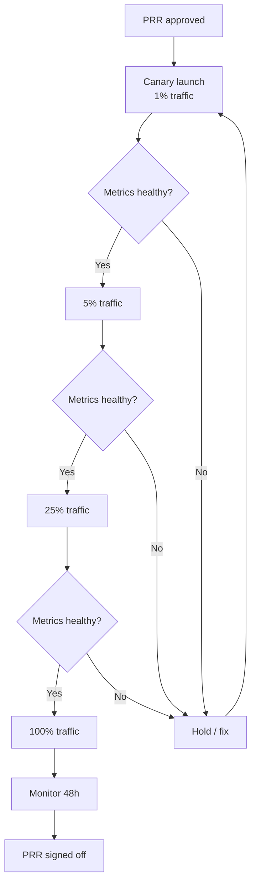

# Production Readiness

## What is it?

**Production Readiness Review (PRR)** is a formal assessment process that ensures a service meets the reliability, operability, and observability standards required to run in production. It's the SRE equivalent of a code review but for operational concerns. PRRs happen before a new service launches or a major feature goes live.

## Why it matters

- Most production incidents could have been prevented by a pre-launch review
- PRRs catch missing runbooks, inadequate monitoring, and insufficient capacity *before* they cause an outage
- A standardized checklist ensures every service hits a baseline bar for reliability
- PRRs create a shared language between dev teams and SRE about what "production ready" means

## Implementation

### Production Readiness Review Checklist

A PRR checklist typically covers these domains:

| Domain | Questions |
|--------|-----------|
| **Monitoring & Alerting** | Are SLIs defined? Are dashboards built? Are alerts configured with runbooks? |
| **Reliability** | Is there redundancy? Circuit breakers? Graceful degradation? |
| **Capacity** | Is capacity modeled? Load tested? Auto-scaling configured? |
| **Security** | Is auth enforced? Secrets managed? Dependencies scanned? |
| **Deployment** | Is CI/CD pipeline set up? Feature flags? Rollback procedure? |
| **Documentation** | Runbooks exist? Architecture diagram? On-call handoff doc? |
| **Dependencies** | Blast radius mapped? External dependency SLAs documented? |
| **Backup & DR** | Data backed up? Restore tested? Disaster recovery plan? |

### Sample PRR Checklist

```markdown
# Production Readiness Review — [Service Name]

## Observability
- [ ] SLIs defined (latency, errors, throughput, saturation)
- [ ] SLOs documented and reviewed with product
- [ ] Grafana dashboard covering all SLIs
- [ ] PagerDuty alerts configured for each SLO burn rate
- [ ] Logs shipping to centralized logging (ELK)
- [ ] Distributed tracing (OpenTelemetry) implemented

## Reliability
- [ ] Circuit breaker implemented for each downstream dependency
- [ ] Timeouts set on all external calls (< 500ms)
- [ ] Health check endpoints: /healthz, /readyz
- [ ] Graceful degradation or fallback behavior defined
- [ ] Load shedding strategy documented

## Deployment
- [ ] CI/CD pipeline passing (lint, test, build, deploy)
- [ ] Canary deployment strategy configured
- [ ] Rollback procedure documented and tested
- [ ] Feature flags for all major functionality

## Capacity & Performance
- [ ] Load tested to 2x expected peak traffic
- [ ] Auto-scaling configured with appropriate thresholds
- [ ] Resource limits set (CPU, memory, disk)
- [ ] Capacity forecast for next 6 months

## Security
- [ ] Secrets managed via vault (not env files or code)
- [ ] AuthN/AuthZ implemented (mTLS, OAuth2)
- [ ] Dependency vulnerabilities scanned
- [ ] Rate limiting configured

## Operations
- [ ] Runbooks for top 5 failure scenarios
- [ ] On-call rotation defined and trained
- [ ] Escalation path documented
- [ ] Status page integration set up
- [ ] Postmortem template ready

## Dependencies & Blast Radius
- [ ] All downstream dependencies documented
- [ ] Impact analysis: "what breaks when this service fails?"
- [ ] Degradation mode for each dependency failure
```

### Blast Radius Analysis

For each service, document:

```
Service: User API

Dependencies:
  ├── PostgreSQL (shared cluster)
  ├── Redis (cache)
  └── Auth Service (SSO)

Blast Radius (if User API goes down):
  ├── All user-facing features (login, register, profile)
  ├── Downstream services relying on user data:
  │   ├── Recommendation Engine
  │   ├── Notification Service
  │   └── Analytics Pipeline
  └── Revenue impact: $12K/min

Degradation Mode:
  ├── Auth → use cached tokens (1h TTL)
  ├── Profile → return cached snapshot
  └── Analytics → queue for later processing
```

### Launch Checklist (Go-Live Gate)

Before any service reaches production traffic:



### Deployment Freeze

A deployment freeze is a period (typically during holidays or major events) where changes are restricted to reduce risk.

| Type | Scope | Example |
|------|-------|---------|
| **Soft freeze** | No new features; bug fixes + security patches allowed | Holiday weekend |
| **Hard freeze** | No changes of any kind | Black Friday, New Year |
| **Read-only freeze** | No database schema changes, no config changes | Peak traffic period |

**Best practice**: If you need multiple freeze windows per year, your change management process is too risky. Fix the process, not the calendar.

### Game Days

A Game Day is a planned, controlled simulation of a failure scenario to test the team's response and the system's resilience.

| Element | Description |
|---------|-------------|
| **Scenario** | "The primary database region goes down" |
| **Objectives** | Test failover, test runbook, measure MTTR |
| **Participants** | On-call IC, SRE team, DBAs |
| **Inject failure** | Stop the DB process; network partition; simulate latency |
| **Observe** | How long to detect? How long to mitigate? |
| **Debrief** | What worked? What broke? Update runbooks |

## Best Practices

- **PRR is not a gate, it's a contract** — both dev and SRE teams sign off
- Start PRR early — the checklist should be reviewed when the service is 60% complete, not 99%
- Have a **tiered PRR**: critical services require full review; internal tools may skip some items
- Run a **Game Day within 2 weeks** of a new service launch
- Review and update PRR checklist **annually**
- Document **known failure modes** and their expected behavior

## Interview Questions

1. What would you include in a Production Readiness Review for a new payment service?
2. How do you handle a team that wants to skip the PRR to meet a deadline?
3. What is blast radius analysis and how do you document it?
4. Design a Game Day scenario for a multi-region database failover.
5. When is a deployment freeze appropriate?
6. How do you balance the need for velocity with the PRR process?
7. What are the differences between a launch checklist and a PRR?

## Cross-Links

- [18-Case-Studies: Facebook 2021](../18-Case-Studies/01-facebook-2021.md) — What happens without proper PRR
- [18-Case-Studies: GitLab Backup](../18-Case-Studies/07-gitlab-backup.md) — Backup readiness failure
- [14-DevOps: Release Management](../14-DevOps/10-release-management.md) — Release gates and checklists
- [21-Staff-Engineer: Multi-Region Design](../21-Staff-Engineer/05-multi-region-design.md) — Regional readiness
- [21-Staff-Engineer: Disaster Recovery](../21-Staff-Engineer/06-disaster-recovery.md) — DR plan readiness
- [06-reliability-patterns.md](06-reliability-patterns.md) — Patterns to include in PRR
