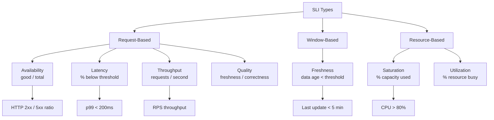
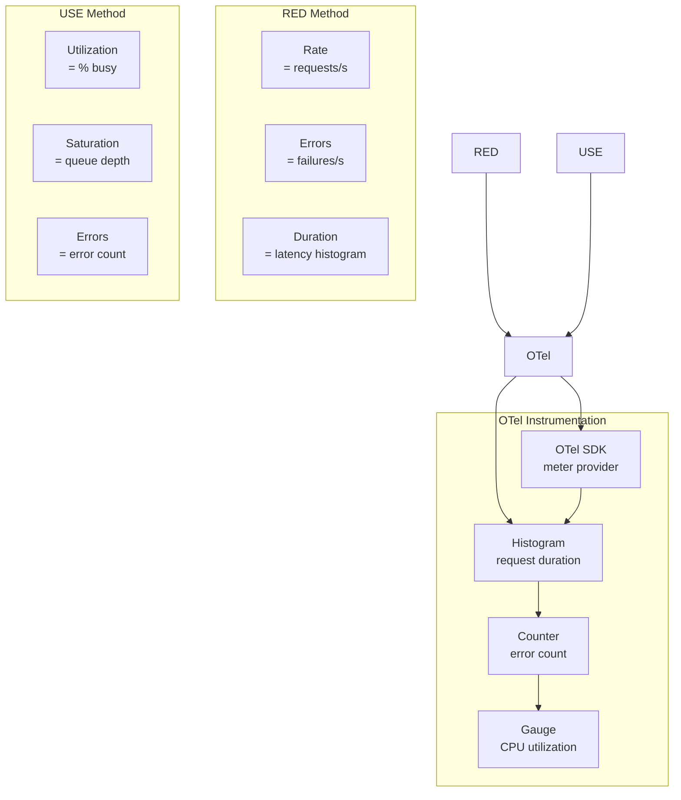

# 10 — SLI Deep Dive

## What is it?

A Service Level Indicator (SLI) is a carefully defined quantitative measure of some aspect of service quality. SLIs form the foundation of the SRE practice — without well-defined SLIs, SLOs and error budgets rest on subjective assumptions. This deep dive covers the SLI taxonomy, service-specific definitions, instrumentation patterns, and composition methods for everything from HTTP APIs to batch pipelines and CDNs.

## Why it matters

- Poorly defined SLIs create false alarms or miss real degradation
- Each service type requires different SLIs (HTTP response ≠ queue latency)
- Consistent SLI taxonomy enables comparison across services and teams
- SLI composition (rolling up) drives accurate end-to-end SLOs
- Instrumentation choices (RED vs USE metrics) determine SLI accuracy

## SLI Taxonomy



## SLI Definitions by Service Type

### HTTP APIs

```
Availability = count(HTTP status != 5xx) / count(total requests)

  Good events:  HTTP 200, 201, 204, 301, 302, 304, 401 (auth errors are user errors)
  Bad events:   HTTP 500, 502, 503, 504

Latency (p99) = P99 of request_duration_seconds for all requests

  Common thresholds:
    Critical:  p99 < 200ms
    Standard:  p99 < 500ms
    Batch:     p99 < 5s

Throughput = rate(http_requests_total[1m])
```

### gRPC APIs

```
Availability = count(status != UNAVAILABLE) / count(total)

  Standard gRPC status codes:
    Good:    OK, NotFound (user error), InvalidArgument
    Bad:     Internal, Unavailable, DeadlineExceeded, ResourceExhausted

Latency (p99) = P99 of grpc_server_handling_seconds

Quality = count(correct responses) / count(total)
  e.g., stale read detection in caching layers
```

### Queues (Pub/Sub, Kafka, SQS)

```
Delivery latency = time from publish to first consumer poll (p99)

Ack timeout ratio = count(ack_timeout) / count(messages received)

Dead letter ratio = count(DLQ entries) / count(messages)
  Threshold: < 0.1%

Message age = current_time - message_publish_time (max)
  Threshold: < 5 minutes for real-time queues
```

### Data Pipelines (Stream Processing / Batch)

```
Freshness = current_time - latest_processed_event_time
  Per-watermark lag

Completeness = count(records_processed) / count(expected_records)
  For batch: records written / records in source

Latency (end-to-end) = event_time at sink - event_time at source (p99)

Throughput = rate(records_processed[1m])
```

### Databases

```
Query latency = database query duration (p99)
  Threshold: < 100ms for OLTP, < 1s for analytical

Connection pool saturation = active_connections / max_connections
  Threshold: < 80%

Replication lag = seconds_behind_master (max)
  Threshold: < 5s

Error rate = count(query_errors) / count(total_queries)
  Threshold: < 0.1%
```

### Serverless (Lambda, Cloud Functions)

```
Cold start ratio = count(cold_starts) / count(invocations)
  Threshold: < 1%

Duration p99 = function execution time
  Threshold: within timeout budget (e.g., < 80% of timeout)

Error rate = count(invocation_errors) / count(total_invocations)

Throttle ratio = count(throttles) / count(invocation_requests)
```

### Batch Jobs (Cron, Airflow, Spark)

```
Success rate = count(successful_runs) / count(total_runs) over window
  Threshold: > 99.5%

Duration SLI = actual_duration / expected_duration
  Threshold: < 1.2x expected

Freshness = completion_time - scheduled_time
  Threshold: < 30 min overdue
```

### Storage (S3, GCS, Blob)

```
Availability = count(200 / 206 responses) / count(total)
  Standard storage: >= 99.99%
  Infrequent access: >= 99.9%

Latency = time to first byte (p99)
  For small objects: < 100ms
  For large objects: < 500ms

Data integrity = count(checksum_valid) / count(total_objects_read)
```

### CDN

```
Cache hit ratio = count(cache_hits) / count(total_requests)
  Target: > 90% for static, > 70% for dynamic

Origin latency = time to fetch from origin on miss (p99)
  Target: < 200ms

Error rate (edge) = count(5xx at edge) / count(total)
```

## Instrumentation Patterns

### RED Method (Request-based services)

```
Rate   → Requests per second (http_requests_total)
Errors → Failed requests per second (http_requests_errors_total)
Duration → Histogram of request duration (http_request_duration_seconds)
```

### USE Method (Resource-based services)

```
Utilization → % time resource is busy (cpu_usage_ratio)
Saturation → Queue depth or wait time (cpu_run_queue_length)
Errors → Count of error events (disk_io_errors_total)
```



### OTel Example

```python
from opentelemetry import metrics
from opentelemetry.sdk.metrics import MeterProvider

meter = metrics.get_meter_provider().get_meter("http-api")

# RED: request duration histogram
request_duration = meter.create_histogram(
    name="http.server.request_duration_seconds",
    description="HTTP request latency",
    unit="s",
    boundaries=[0.01, 0.05, 0.1, 0.2, 0.5, 1, 2, 5],
)

# RED: error counter
error_counter = meter.create_counter(
    name="http.server.request_errors",
    description="HTTP error count",
)

# USE: CPU gauge
cpu_utilization = meter.create_gauge(
    name="system.cpu.utilization",
    description="CPU utilization ratio",
)
```

## SLI Composition and Rollup

```mermaid
graph TB
    subgraph Microservice Architecture
        SVC1[Payment Service<br/>99.9% availability]
        SVC2[Inventory Service<br/>99.95% availability]
        SVC3[Notification Service<br/>99.5% availability]
    end
    subgraph Composition Rules
        DEP[If A depends on B:<br/>A_sli = min(A_sli, B_sli)]
        AVG[Rollup across instances:<br/>weighted by traffic]
        MULTI[Multi-SLI:<br/>min(availability, latency_sli)]
    end
    SVC1 --> DEP
    SVC2 --> DEP
    SVC3 --> DEP
    DEP --> COMP[Composite SLO<br/>min(svc1, svc2, svc3)]
```

### Composition Methods

| Method | Formula | Use Case |
|--------|---------|----------|
| **Minimum** | `SLI_total = min(SLI_a, SLI_b)` | Serial dependencies (A → B) |
| **Weighted** | `SLI_total = Σ(w_i × SLI_i)` | Parallel services with traffic weights |
| **Multi-SLI** | `SLI_total = min(SLI_avail, SLI_latency)` | Single service with multiple guarantees |
| **Count-based** | `SLI_total = good_total / total_total` | Aggregating raw counts across instances |

```python
# Composite SLI example
def compute_composite_sli(services):
    """
    services: list of dicts with 'sli' and 'weight' keys
    For serial dependencies, use min. For parallel, use weighted.
    """
    # Serial: service A depends on B depends on C
    serial_sli = min(s["sli"] for s in services)

    # Parallel: traffic-weighted average
    total_weight = sum(s["weight"] for s in services)
    weighted_sli = sum(
        s["sli"] * s["weight"] / total_weight for s in services
    )

    # Multi-SLI: both availability AND latency matter
    multi_sli = min(serial_sli, weighted_sli)

    return multi_sli
```

## Best Practices

- Define SLIs before you need them — instrument during development, not post-incident
- Use the RED method for user-facing services, USE method for infrastructure
- Always measure both good events and total events — don't infer totals
- Set histogram boundaries that align with your SLO targets (10ms bins near threshold)
- For batch: measure freshness and completeness, not just success rate
- Compose SLIs using minimum for serial dependencies, weighted for parallel
- Validate SLI definitions against real incidents — did the SLI catch the issue?
- Document SLI calculation methods for every service in a team-accessible format

## Interview Questions

| Question | Key points |
|----------|------------|
| *What are the three categories of SLIs?* | Request-based (availability, latency, throughput, quality), Window-based (freshness), Resource-based (saturation, utilization) |
| *How do you define availability for an HTTP API?* | Non-5xx responses / total responses; exclude user errors (4xx) from bad events |
| *What SLIs matter for a message queue?* | Delivery latency, ack timeout ratio, dead letter ratio, message age |
| *How do you measure SLI for a batch job?* | Success rate over runs, duration vs expected, freshness (completion - scheduled) |
| *What are the RED and USE methods?* | RED for services (Rate, Errors, Duration); USE for resources (Utilization, Saturation, Errors) |
| *How do you compose SLIs across services?* | Min for serial dependencies, weighted average for parallel, multi-SLI min for multiple guarantees |

---

**Next**: [11 — Multi-Window Burn-Rate Alerting](11-multi-window-burn-rate-alerting.md)
