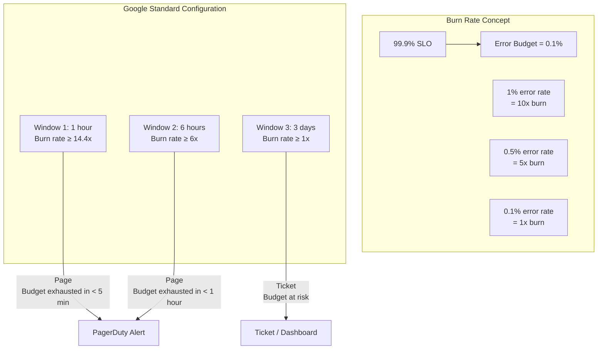
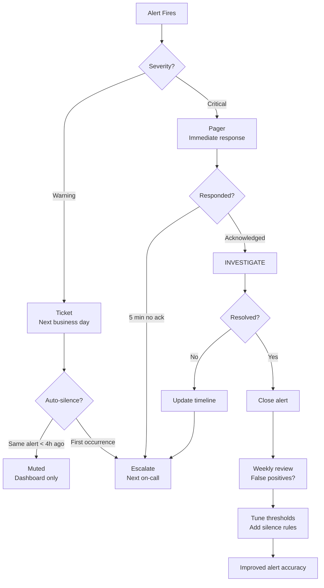

# 11 — Multi-Window Multi-Burn-Rate Alerting

## What is it?

Multi-Window Multi-Burn-Rate (MWMBR) alerting is the Google-recommended approach for alerting on SLO compliance. Instead of setting a static threshold on error rate, it uses two concurrent evaluation windows (short + long) to detect both fast-burning and slow-burning errors. This reduces alert fatigue by only paging when the error budget is truly at risk, while still catching sudden catastrophic failures quickly.

## Why it matters

- Static threshold alerts (e.g., "error rate > 5%") cause fatigue — they fire during normal traffic spikes
- A single long window misses fast burn (you exhaust budget before the alert fires)
- A single short window creates noise from brief transient errors
- MWMBR balances detection speed with accuracy by pairing windows
- Burn rate directly maps to error budget consumption — it tells you how fast you're going through budget

## MWMBR Theory



### Burn Rate Formula

```
burn_rate = observed_error_rate / (1 - SLO)

Example with 99.9% SLO:
  (1 - SLO) = 0.001

  Observed error rate = 2%  → burn_rate = 0.02 / 0.001 = 20x
  Observed error rate = 0.5% → burn_rate = 0.005 / 0.001 = 5x
  Observed error rate = 0.1% → burn_rate = 0.001 / 0.001 = 1x

Time to exhaust budget (at current burn rate):
  T_exhaust = evaluation_window / burn_rate

  Example: 6 hour window at 6x burn → T_exhaust = 6h / 6 = 1 hour
```

## Google Recommended Configuration

| Alert Severity | Burn Rate | Window | Budget Consumed | Time to Exhaust | Action |
|---------------|-----------|--------|-----------------|-----------------|--------|
| **Page** | ≥ 14.4x | 1 hour | 2.5% (in 1h at 14.4x) | < 5 min | Critical pager |
| **Page** | ≥ 6x | 6 hours | 5% (in 6h at 6x) | < 1 hour | Critical pager |
| **Ticket** | ≥ 1x | 3 days | 8% (in 3 days at 1x) | < 30 days | Ticket / dashboard |
| **Ticket** | ≥ 0.5x | 30 days | SLO at risk | > 30 days | Monitor / report |

### Why These Numbers?

```
Budget consumed per eval window = window_duration × burn_rate × (1 - SLO)

At 14.4x for 1 hour with 99.9% SLO:
  = 1h × 14.4 × 0.001 = 0.0144 = 1.44% of total window events

At 6x for 6 hours:
  = 6h × 6 × 0.001 = 0.036 = 3.6% of window events

At 1x for 3 days (72h):
  = 72h × 1 × 0.001 = 0.072 = 7.2% of window events
```

## PromQL Alert Rules

```yaml
# prometheus-rules.yaml
groups:
  - name: slo-alerts
    rules:
      - alert: HighErrorRate
        # Burn rate >= 14.4x with 99.9% SLO over 1 hour
        expr: |
          (
            sum(rate(http_requests_total{job="myapp", status=~"5.."}[1h]))
            /
            sum(rate(http_requests_total{job="myapp"}[1h]))
          ) > (14.4 * 0.001)
        for: 5m
        labels:
          severity: critical
          slo: 99.9%
          burn_rate: "14.4x"
        annotations:
          summary: "Error rate is burning budget at 14.4x (99.9% SLO)"
          description: "Budget will exhaust in ~5 minutes"

      - alert: MediumErrorRate
        # Burn rate >= 6x with 99.9% SLO over 6 hours
        expr: |
          (
            sum(rate(http_requests_total{job="myapp", status=~"5.."}[6h]))
            /
            sum(rate(http_requests_total{job="myapp"}[6h]))
          ) > (6 * 0.001)
        for: 30m
        labels:
          severity: critical
          slo: 99.9%
          burn_rate: "6x"
        annotations:
          summary: "Error rate burning at 6x over 6h window"
          description: "Budget will exhaust in ~1 hour"

      - alert: LowErrorRate
        # Burn rate >= 1x with 99.9% SLO over 3 days
        expr: |
          (
            sum(rate(http_requests_total{job="myapp", status=~"5.."}[3d]))
            /
            sum(rate(http_requests_total{job="myapp"}[3d]))
          ) > 0.001
        labels:
          severity: warning
          slo: 99.9%
          burn_rate: "1x"
        annotations:
          summary: "Error budget consumption at 1x (99.9% SLO)"
          description: "Error budget is being consumed. Investigate."

      - alert: ErrorBudgetExhausted
        expr: |
          (
            1 - (
              sum(rate(http_requests_total{job="myapp", status!~"5.."}[30d]))
              /
              sum(rate(http_requests_total{job="myapp"}[30d]))
            )
          ) * 100 > 0.1
        labels:
          severity: critical
        annotations:
          summary: "Error budget is exhausted (99.9% SLO)"
          description: "SLO breach confirmed over 30-day window."

### Burn Rate as a Reusable Recording Rule

```yaml
groups:
  - name: slo-recording-rules
    rules:
      - record: job:http_error_ratio:rate1h
        expr: |
          sum(rate(http_requests_total{status=~"5.."}[1h]))
          /
          sum(rate(http_requests_total[1h]))

      - record: job:burn_rate:1h
        expr: |
          job:http_error_ratio:rate1h / 0.001  # For 99.9% SLO

      - record: job:burn_rate:6h
        expr: |
          (
            sum(rate(http_requests_total{status=~"5.."}[6h]))
            /
            sum(rate(http_requests_total[6h]))
          ) / 0.001

      - record: job:error_budget_remaining_30d
        expr: |
          clamp_min(
            1 - (
              sum(rate(http_requests_total{status=~"5.."}[30d]))
              /
              sum(rate(http_requests_total[30d]))
            ) / 0.001,
            0
          )
```

## Cloud Monitoring and Datadog Configs

### Google Cloud Monitoring

```yaml
# Using MQL (Monitoring Query Language)
fetch prometheus_target
| { metric 'prometheus.googleapis.com/http_requests_total/counter'
    | filter resource.status =~ '5..'
    | rate 1h | every 1h }
| { metric 'prometheus.googleapis.com/http_requests_total/counter'
    | rate 1h | every 1h }
| ratio
| condition gt(14.4 * 0.001)
```

### Datadog

```yaml
# Datadog SLO Monitor
query: "avg(last_1h):((sum:http_requests.errors{*}.as_rate()) / (sum:http_requests.total{*}.as_rate())) > 14.4 * 0.001"
message: |-
  {{#is_alert}}High burn rate detected!{{/is_alert}}
  Burn rate: {{value}}x
  SLO target: 99.9%
  Window: 1h
```

### Grafana Alerting

```yaml
# Grafana managed alert rule
condition:
  - evaluator:
      type: gt
      params: [14.4]
    queryRef:
      datasourceUid: prometheus
      model:
        expr: |
          sum(rate(http_requests_total{status=~"5.."}[1h]))
          /
          sum(rate(http_requests_total[1h]))
          / 0.001
```

## Alert Severity Mapping

| Burn Rate | SLO 99.9% | SLO 99.99% | SLO 99.5% | Action |
|-----------|-----------|------------|-----------|--------|
| ≥ 14.4x | 1h window | 10min window | 12h window | Page |
| ≥ 6x | 6h window | 1h window | 3d window | Page |
| ≥ 1x | 3d window | 12h window | 7d window | Ticket |
| < 1x | 30d window | 30d window | 30d window | Dashboard |

Adjust windows proportionally for different SLO targets:
```
For SLO 99.99%:  1 - SLO = 0.0001 (10x tighter than 99.9%)
  → Windows should be 10x shorter OR burn rate thresholds 10x higher
```

## Alert Fatigue Mitigation



## Best Practices

- Configure at least three burn rate windows: 1h/14.4x (fast), 6h/6x (medium), 3d/1x (slow)
- Use `for:` clauses in Prometheus to prevent flapping alerts
- Page only on burn rates that will exhaust budget in less than 1 hour
- Create dashboard panels for remaining error budget and current burn rate
- Alert fatigue fix: tune thresholds, don't silence — silence hides problems
- Record burn rate as a recording rule for reuse across alerts and dashboards
- Test alert rules with historical data before deploying to production
- Adjust windows proportionally for different SLO targets (99.9% vs 99.99%)

## Interview Questions

| Question | Key points |
|----------|------------|
| *Explain multi-window multi-burn-rate alerting.* | Two concurrent windows: short detects fast burn, long detects slow burn; reduce fatigue |
| *What is burn rate and how is it calculated?* | `observed_error_rate / (1 - SLO)`; how fast you're consuming the error budget |
| *Why 14.4x/1h, 6x/6h, 1x/3d for 99.9% SLO?* | Exhaust budgets in ~5m, ~1h, ~30 days respectively; balance speed vs accuracy |
| *How do you implement MWMBR in Prometheus?* | Recording rules for burn rate per window; alert rules with thresholds and `for:` |
| *How do you adjust burn rate windows for different SLOs?* | Proportional to `1 - SLO`; 99.99% uses 10x shorter windows than 99.9% |
| *What prevents alert fatigue in this system?* | Only page on meaningful budget consumption; lower severity for slow burn; `for:` window |

---

**Next**: [12 — Error Budget Policy](12-error-budget-policy.md)
