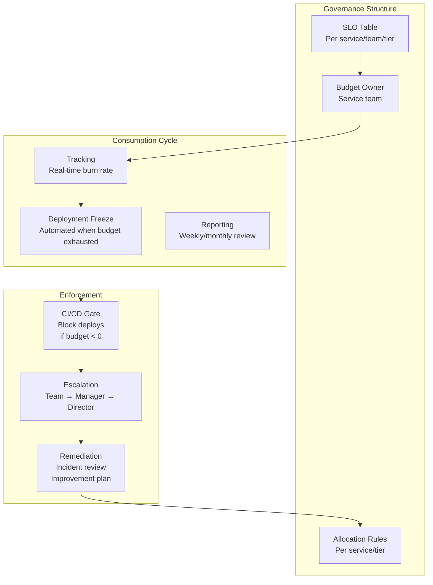
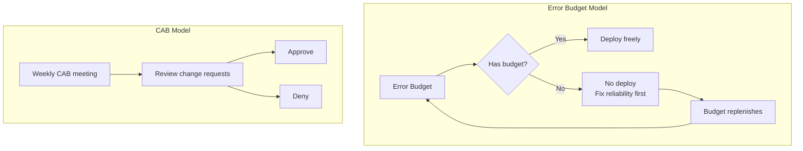

# 12 — Error Budget Policy

## What is it?

An Error Budget Policy defines the governance rules around how error budgets are owned, allocated, consumed, and enforced across an organization. It transforms the technical concept of error budgets into operational policy: who owns the budget, how much each team can spend, what happens when it runs out, and how it replenishes. A well-designed policy aligns engineering velocity with reliability without requiring manual approvals.

## Why it matters

- Without a policy, error budgets are ignored when they are most needed
- Deployment freezes must be automated, not decided in a meeting
- Multiple teams sharing a service need clear budget ownership
- Error budget allocation prevents one team's deploys from exhausting another's budget
- Escalation protocols ensure budget exhaustion triggers the right response level
- Replenishment mechanics prevent permanent "red" states that normalize failure

## Error Budget Governance



## Ownership

| Scope | Owner | Responsibility |
|-------|-------|----------------|
| **Service-level SLO** | Service team (team that owns the code) | Ensure SLO is met; owns deployment decisions |
| **Platform/infra SLO** | Platform team | Infrastructure reliability; dependency SLOs |
| **Tier 0 critical** | VP/Director of Engineering | Ultimate accountability; exception approval |
| **Shared service** | Consuming teams collectively | Contribution to budget consumption tracked per team |

```yaml
# catalog-info.yaml (Backstage service metadata)
spec:
  type: service
  owner: team-payments
  slo:
    tier: 1
    target: 99.99%
    window: rolling-30d
    owner: team-payments
    allocation:
      - team: team-payments
        percentage: 60
      - team: team-checkout
        percentage: 40
    replenishment: daily
    freeze_on_exhaust: true
```

## Allocation Per Service / Team / Tier

### Per-Tier Allocation

| Tier | SLO | Budget (30d) | Deploy Velocity | Freeze Policy |
|------|-----|-------------|----------------|---------------|
| **Tier 0** — Critical | 99.999% | 26s downtime | Low — change advisory board | Immediate freeze on any exhaustion |
| **Tier 1** — Core | 99.99% | 4.3 min | Medium — CI/CD with canary | Freeze at 100% consumption |
| **Tier 2** — Standard | 99.9% | 43 min | High — continuous deploy | Freeze at 100% + on-call review |
| **Tier 3** — Best effort | 99% | 7.2 hours | Very high — ship when ready | Monitor only, no freeze |

### Multi-Team Allocation

```python
# Allocation for a shared service
BUDGET_ALLOCATION = {
    "payment-service": {
        "total_budget": 0.001,  # 99.9% SLO → 0.1% error budget
        "teams": {
            "team-payments": {"share": 0.60, "used": 0.0},
            "team-checkout": {"share": 0.40, "used": 0.0},
        }
    }
}

def can_deploy(service_name, team_name):
    budget = BUDGET_ALLOCATION[service_name]
    team_budget = budget["total_budget"] * budget["teams"][team_name]["share"]
    team_used = budget["teams"][team_name]["used"]

    if team_used >= team_budget:
        return False, f"Team {team_name} has exhausted its budget allocation"
    return True, f"OK ({team_used/team_budget*100:.0f}% used)"
```

## Consumption Tracking

```python
# Real-time budget tracker (pseudo-code)
class ErrorBudgetTracker:
    def __init__(self, service_name, slo_target, window_seconds):
        self.service = service_name
        self.slo_target = slo_target
        self.window = window_seconds
        self.error_budget = 1 - slo_target

    def current_consumption(self):
        """Return % of budget consumed in current window"""
        good = query_metric("http_requests_good", self.service, self.window)
        total = query_metric("http_requests_total", self.service, self.window)

        if total == 0:
            return 0.0

        actual_error_rate = (total - good) / total
        budget_used = actual_error_rate / self.error_budget
        return min(budget_used, 1.0)  # Clamp to 100%

    def time_to_exhaustion(self, current_burn_rate):
        """Estimate time until budget is fully consumed"""
        remaining = 1.0 - self.current_consumption()
        if current_burn_rate <= 0:
            return float("inf")
        return (remaining * self.window) / current_burn_rate
```

## Deployment Freeze Mechanics

```mermaid
graph LR
    subgraph Normal
        D1[Deploy requested] --> D2{Budget OK?}
        D2 -->|Yes| D3[Approve deploy]
        D2 -->|No| D4{Budget drain<br/>rate?}
    end
    subgraph Freeze
        D4 -->|Spike| F1[Immediate freeze<br/>Pager alert]
        D4 -->|Gradual| F2[Warning +<br/>soft freeze]
        F1 --> F3[PRs blocked<br/>CI fails<br/>No deploys]
        F2 --> F3
    end
    subgraph Recovery
        F3 --> R1[Incident review]
        R1 --> R2[Stabilize service]
        R2 --> R3[Budget replenished<br/>(new window or manual)]
        R3 --> D1
    end
```

### CI/CD Gate Implementation

```yaml
# deploy-gate.yml (GitHub Actions or custom CI step)
- name: Check Error Budget
  id: budget-check
  run: |
    BUDGET=$(python scripts/check_budget.py --service myapp)
    if [ "$BUDGET" = "exhausted" ]; then
      echo "Error budget exhausted. Deploy blocked."
      echo "Contact #sre-team for remediation."
      exit 1
    fi
  env:
    SLO_TARGET: "99.9"
    WINDOW_DAYS: "30"

- name: Deploy
  if: steps.budget-check.outcome == 'success'
  run: |
    kubectl apply -f k8s/manifests/
```

## Replenishment

| Replenishment Method | Mechanism | Timeframe |
|---------------------|-----------|-----------|
| **Rolling window** | Old events age out of the window | Continuous (30-day window) |
| **Calendar reset** | Monthly error budget resets | Monthly |
| **Manual top-up** | Engineering director approval | On request |
| **Incident recovery** | Post-incident remediation restores budget | After root cause fixed |

```
Rolling window replenishment:
  Budget is consumed by errors in the last 30 days.
  As errors age out (older than 30 days), budget replenishes.

  If you exhausted budget on day 15 with 100% consumption:
    - Day 16-30: no deploys
    - Day 31: first day of window has no errors → budget partially recovers
    - Day 45: full 30 day window with no new errors → 100% budget restored
```

## Communication Protocols

| Event | Channel | Message |
|-------|---------|---------|
| **Budget at 50%** | Slack #slo-alerts | "Payment service: 50% budget consumed" |
| **Budget at 80%** | Slack @team-payments | "Alert: 80% consumed — slow down deploys" |
| **Budget exhausted** | PagerDuty + Slack | "CRITICAL: budget exhausted — freeze active" |
| **Budget restored** | Slack #slo-alerts | "Payment service: budget restored — deploys resumed" |
| **SLO breach window** | Weekly engineering email | "Services that breached SLO this week" |

## Escalation

| Budget Consumed | Action | Escalation Level |
|----------------|--------|------------------|
| < 80% | Normal operations | N/A |
| 80-99% | Deploy slowdown; ticket created | Service team |
| 100% (exhausted) | Immediate freeze; page on-call | Service team + SRE |
| 100% for 24+ hours | Emergency incident; director notified | Engineering Director |
| Repeated exhaustion | Root cause analysis; budget review | VP Engineering |

## Enforcement Automation

```python
# flask_error_budget_middleware.py
from flask import request, jsonify
from functools import wraps

def error_budget_gate(service_name, team_name):
    def decorator(f):
        @wraps(f)
        def wrapper(*args, **kwargs):
            allowed, msg = can_deploy(service_name, team_name)
            if not allowed:
                return jsonify({
                    "error": "deploy_blocked",
                    "message": msg,
                    "service": service_name,
                    "team": team_name,
                }), 403
            return f(*args, **kwargs)
        return wrapper
    return decorator

@app.route("/api/deploy", methods=["POST"])
@error_budget_gate("payment-service", "team-payments")
def deploy():
    # Deploy logic...
    return jsonify({"status": "deploying"})
```

## Error Budget vs Change Advisory Board (CAB)



| Aspect | Error Budget Policy | Change Advisory Board |
|--------|-------------------|---------------------|
| **Decision basis** | Data: measured error budget consumption | Opinion: board members' judgment |
| **Speed** | Automated, real-time | Manual, weekly meeting |
| **Scalability** | Infinite — self-service | Limited — every change reviewed |
| **Accountability** | Service team owns their budget | CAB owns no budget |
| **Tradeoff** | Reliability vs velocity | Risk vs speed (subjective) |

## Best Practices

- Automate deployment freezes at 100% budget consumption — no manual gating
- Allocate budget proportionally to teams sharing a service
- Use rolling windows for replenishment; calendar resets create "spend it or lose it" behavior
- Communicate budget status in the tools developers use daily (Slack, CI, IDE)
- Escalate repeated exhaustion to director level for remediation planning
- Track budget consumption per-team, per-service on shared dashboards
- Review budget allocations quarterly — adjust based on actual consumption patterns
- Distinguish between budget exhaustion from incidents vs sustained high error rates

## Interview Questions

| Question | Key points |
|----------|------------|
| *What is an error budget policy?* | Governance rules for ownership, allocation, consumption, freeze, and replenishment of error budgets |
| *How do you allocate budgets across teams?* | Percentage allocation based on deploy frequency and criticality; track per-team consumption |
| *What happens when a budget is exhausted?* | Automated deployment freeze; on-call paged; escalation to director if prolonged |
| *How does a rolling window replenish budget?* | Old errors age out of the window; budget recovers as the window moves forward |
| *How does error budget policy differ from a CAB?* | Data-driven, automated, self-service vs manual, opinion-based, meeting-gated |
| *What information should a budget communication include?* | Service name, consumption %, burn rate, time to exhaustion, freeze status |

---

**Next**: [13 — SLO Calculation Examples](13-slo-calculation-examples.md)
