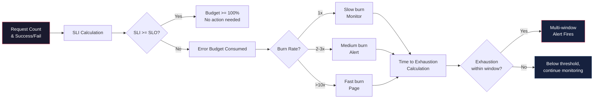

# 13 — SLO Calculation Examples

## What is it?

SLOs are theoretical targets that become operationally useful only when you can calculate them correctly. This file provides worked examples of common SLO calculation patterns: rolling window SLIs, calendar-aligned budgets, composite SLOs across dependencies, multi-SLI services, batch/storage SLOs, and advanced techniques like EWMA smoothing, confidence intervals, and time-to-exhaustion estimation.

## Why it matters

- Incorrect SLO calculation leads to false confidence or unnecessary pages
- Composite SLOs (service A depends on B) require careful composition math
- Batch and storage services don't fit request-based SLO models
- Understanding edge cases (zero traffic windows, initial state, clock skew) prevents calculation bugs
- Burn charts and time-to-exhaust models drive operational decision-making

## SLO Calculation Flow



## Worked Example 1: Rolling Window SLI and Error Budget

**Scenario**: An HTTP API with a 99.9% availability SLO over a rolling 30-day window.

```python
import datetime
from collections import deque

class RollingWindowSLI:
    def __init__(self, window_days=30, slo_target=0.999):
        self.window = window_days
        self.slo_target = slo_target
        self.error_budget = 1 - slo_target  # 0.001
        # Store (timestamp, 1 for good, 0 for bad)
        self.events = deque()

    def record(self, success: bool, timestamp=None):
        if timestamp is None:
            timestamp = datetime.datetime.utcnow()
        self.events.append((timestamp, 1 if success else 0))
        # Prune events outside the window
        cutoff = timestamp - datetime.timedelta(days=self.window)
        while self.events and self.events[0][0] < cutoff:
            self.events.popleft()

    def sli(self):
        if not self.events:
            return 1.0  # No events → no failures
        good = sum(e[1] for e in self.events)
        total = len(self.events)
        return good / total

    def budget_remaining(self):
        current_sli = self.sli()
        # Budget remaining = (current good rate - SLO) / (1 - SLO)
        # If sli >= target, budget is >= 100%
        actual_good_rate = current_sli
        if actual_good_rate >= self.slo_target:
            return 1.0
        # Budget used = (target - actual) / budget
        budget_used = (self.slo_target - actual_good_rate) / self.error_budget
        return max(0.0, 1.0 - budget_used)

    def burn_rate(self, hours=1):
        """Calculate burn rate over the last N hours"""
        now = datetime.datetime.utcnow()
        cutoff = now - datetime.timedelta(hours=hours)
        recent = [e for e in self.events if e[0] >= cutoff]
        if not recent:
            return 0.0
        errors = sum(1 for e in recent if e[1] == 0)
        total = len(recent)
        if total == 0:
            return 0.0
        error_rate = errors / total
        return error_rate / self.error_budget

# Usage
sli = RollingWindowSLI(window_days=30, slo_target=0.999)

# Simulate 1M requests with 0.05% error rate (within budget)
for i in range(1_000_000):
    sli.record(success=(i % 2000 != 0))  # 0.05% errors

print(f"SLI: {sli.sli():.6f}")             # ~0.9995
print(f"Budget remaining: {sli.budget_remaining():.2%}")  # ~50%
print(f"Burn rate (1h): {sli.burn_rate():.2f}x")
```

**Math check**: 0.05% error rate = 500 errors per 1M. Target is 0.1% (1,000 per 1M). Budget used = (0.001 - 0.0005) / 0.001 = 50%.

## Worked Example 2: Calendar-Aligned Monthly Budget

**Scenario**: Monthly SLO reset on the 1st of every month with a 99.95% target.

```python
class CalendarMonthlyBudget:
    def __init__(self, slo_target=0.9995):
        self.slo_target = slo_target
        self.error_budget = 1 - slo_target  # 0.0005 (0.05%)
        self.month = None
        self.good = 0
        self.total = 0

    def record(self, success: bool):
        now = datetime.datetime.utcnow()
        if now.month != self.month:
            # Reset at start of new month
            self.month = now.month
            self.good = 0
            self.total = 0
        self.total += 1
        if success:
            self.good += 1

    def budget_remaining(self):
        if self.total == 0:
            return 1.0
        actual_good = self.good / self.total
        if actual_good >= self.slo_target:
            return 1.0
        budget_used = (self.slo_target - actual_good) / self.error_budget
        return max(0.0, 1.0 - budget_used)

    def daily_burn_limit(self, days_in_month=30):
        """How many errors allowed per day to stay within budget"""
        total_allowed_errors = self.error_budget  # fraction of requests
        return total_allowed_errors / days_in_month

# Monthly example:
# 99.95% SLO = 0.05% budget = 0.0005
# For 50M requests/month: budget = 50M * 0.0005 = 25,000 errors
# Per day: ~833 errors/day
```

## Worked Example 3: Daily Reset for Batch Jobs

**Scenario**: A daily batch job must succeed 99.9% of the time.

```python
class DailyBatchSLO:
    def __init__(self, slo_target=0.999):
        self.slo_target = slo_target
        self.sli_window_days = 30  # Evaluate over last 30 days

    def record_run(self, date, success: bool):
        """Store daily run success/failure"""
        pass  # Store in DB

    def sli(self):
        """Rolling 30-day success rate"""
        # good_runs / total_runs over last 30 days
        pass

    def consecutive_failures_allowed(self):
        """How many consecutive days can fail before breaching SLO?"""
        # For 99.9%: 1 failure in 1000 days → 30-day window can have 0 failures
        # Budget per 30 days: 30 * (1 - 0.999) = 0.03 failures
        # So any single failure in a 30-day window breaches SLO
        expected_runs = 30
        allowed_failures = expected_runs * (1 - self.slo_target)
        return max(0, int(allowed_failures))  # = 0 for 99.9%

# For 99% batch SLO:
# Budget per 30 days: 30 * 0.01 = 0.3 failures
# So 1 failure in 3+ months → 3 failures in 30 days → check: 3/30 = 90% (breach)
```

## Worked Example 4: Composite SLO (Service A Depends on B)

**Scenario**: User-facing service A depends on internal service B. What is the composite SLO?

```python
def composite_serial_sli(sli_a, sli_b):
    """
    When A calls B synchronously:
    User success requires BOTH A and B to succeed.

    SLI_total = SLI_A × SLI_B (if they are independent)
    SLI_total = min(SLI_A, SLI_B) (worst case: A fails when B fails)

    For independent services:
    """
    return sli_a * sli_b  # Both must succeed

def composite_parallel_sli(slis_with_weights):
    """
    When user request fans out to multiple services:
    SLI_total = 1 - Π(1 - SLI_i) — at least one succeeds

    For load-balanced:
    SLI_total = Σ(w_i × SLI_i) — weighted by traffic
    """
    # At-least-one: availability improves
    prob_all_fail = 1.0
    for sli, _ in slis_with_weights:
        prob_all_fail *= (1 - sli)
    return 1 - prob_all_fail

# Example: A (99.9%) calls B (99.95%)
# Serial composite:
#   Independent: SLI = 0.999 × 0.9995 = 0.9985 (99.85%)
#   Worst case: SLI = min(0.999, 0.9995) = 0.999 (99.9%)
print(f"Composite (independent): {composite_serial_sli(0.999, 0.9995):.6f}")
print(f"Composite (worst case): {min(0.999, 0.9995):.6f}")
```

## Worked Example 5: Multi-SLI (Latency + Availability)

**Scenario**: A service commits to BOTH 99.9% availability AND p99 latency < 200ms for 95% of requests.

```python
class MultiSLI:
    def __init__(self):
        self.availability_target = 0.999
        self.latency_target = 0.200  # 200ms
        self.latency_percentile = 0.95  # p95

    def compute_sli(self, requests):
        """
        requests: list of (success: bool, latency_ms: float)
        Returns: (overall_sli, availability_ok, latency_ok)
        """
        total = len(requests)
        if total == 0:
            return 1.0, True, True

        # Availability SLI
        good = sum(1 for r in requests if r[0])
        avail_sli = good / total

        # Latency SLI (p95 under threshold)
        latencies = sorted(r[1] for r in requests)
        p95_idx = int(total * self.latency_percentile)
        p95_latency = latencies[p95_idx]
        latency_sli = sum(1 for r in requests
                         if r[1] <= self.latency_target * 1000) / total

        # Multi-SLI: both must pass
        overall = min(avail_sli, latency_sli)
        return overall, avail_sli >= self.availability_target, p95_latency <= self.latency_target * 1000

# Example: 1000 requests, 99.9% avail, p95 latency 180ms
requests = [(True, 45) for _ in range(950)]  # 950 good, fast
requests += [(True, 250) for _ in range(40)]  # 40 good, slow
requests += [(False, 200) for _ in range(10)]  # 10 errors

multi = MultiSLI()
overall, avail_ok, lat_ok = multi.compute_sli(requests)
print(f"Overall SLI: {overall:.4f}")
print(f"Availability OK: {avail_ok}, Latency OK: {lat_ok}")
```

## EWMA (Exponentially Weighted Moving Average)

```python
class EWMASLI:
    """EWMA smooths SLI over time, giving more weight to recent data"""

    def __init__(self, alpha=0.01, initial_sli=1.0):
        self.alpha = alpha  # Smoothing factor (lower = smoother)
        self.current_sli = initial_sli

    def update(self, success: bool):
        # EWMA = alpha × current + (1 - alpha) × previous
        observation = 1.0 if success else 0.0
        self.current_sli = (
            self.alpha * observation +
            (1 - self.alpha) * self.current_sli
        )
        return self.current_sli

    def estimate_budget_remaining(self, slo_target=0.999):
        return max(0, (self.current_sli - slo_target) / (1 - slo_target))

# Lower alpha = smoother but slower to detect change
# alpha=0.01: each new event has 1% weight
# alpha=0.1:  each new event has 10% weight (more responsive)
```

## Confidence Intervals for Low-Traffic Services

```python
import math
from scipy import stats  # or use approximation

def wilson_confidence_interval(good, total, confidence=0.95):
    """
    Wilson score interval for low-traffic services.
    Better than normal approximation when n is small.
    """
    if total == 0:
        return (0.0, 0.0)

    z = stats.norm.ppf(1 - (1 - confidence) / 2)  # ~1.96 for 95%
    p = good / total

    denominator = 1 + z**2 / total
    center = (p + z**2 / (2 * total)) / denominator
    margin = z * math.sqrt((p * (1 - p) / total + z**2 / (4 * total**2))) / denominator

    return (center - margin, center + margin)

# Example: 100 requests, 1 failure → SLI = 99%
# Wilson CI: ~(95.5%, 99.8%) — we can't say 99% confidently
low_traffic_sli = wilson_confidence_interval(99, 100)
print(f"95% CI for 99/100: ({low_traffic_sli[0]:.1%}, {low_traffic_sli[1]:.1%})")

# For high traffic: 100,000 requests, 100 failures → SLI = 99.9%
# Wilson CI: ~(99.87%, 99.93%) — tight confidence
high_traffic_sli = wilson_confidence_interval(99900, 100000)
print(f"95% CI for 99900/100000: ({high_traffic_sli[0]:.4%}, {high_traffic_sli[1]:.4%})")
```

## Burn Chart and Time-to-Exhaust

```python
def time_to_exhaustion(current_budget_remaining, current_burn_rate):
    """
    Estimate when budget will be exhausted at current burn rate.

    current_budget_remaining: 0.0 to 1.0
    current_burn_rate: multiplier of SLO target

    Returns: estimated hours until exhaustion
    """
    if current_burn_rate <= 0:
        return float("inf")

    # Budget will be 0 when: budget - burn_rate * time / total_window = 0
    # Time = budget * total_window / burn_rate
    # For a 30-day (720h) window:
    total_window_hours = 30 * 24
    hours = (current_budget_remaining * total_window_hours) / current_burn_rate
    return hours

# Example: 50% budget remaining at 6x burn rate
hours_left = time_to_exhaustion(0.5, 6)
print(f"Time to exhaust: {hours_left:.1f} hours ({hours_left/24:.1f} days)")
# = 0.5 * 720 / 6 = 60 hours = 2.5 days

# At 14.4x with 100% budget remaining:
hours_left = time_to_exhaustion(1.0, 14.4)
print(f"Time to exhaust at 14.4x: {hours_left:.1f} hours")
# = 1.0 * 720 / 14.4 = 50 hours (matches Google's ~2 days)
```

## Edge Cases

| Edge Case | Problem | Solution |
|-----------|---------|----------|
| **Zero traffic window** | Division by zero; SLI undefined | Return 1.0 (no traffic = no failures) |
| **Initial state (no data)** | Empty window | Start at 1.0 and degrade gracefully |
| **Clock skew** | Events timestamps out of order | Use monotonic clocks; tolerance for 5 min skew |
| **Partial window** | First 15 days of a 30-day window | Scale proportionally or compare trailing |
| **Sudden traffic drop** | Old errors dominate the window | Use EWMA or focus on burn rate over short window |
| **Maintenance windows** | Planned downtime reduces avail | Exclude from SLI calculation (tag with maintenance flag) |
| **Client retries** | Same failure counted multiple times | Deduplicate at the server side (client retry != new failure) |

```python
# Safe SLI calculation handling edge cases
def safe_sli(good, total):
    if total == 0:
        return 1.0  # No traffic = no failures
    if total < 100:
        # Low traffic: apply Wilson confidence interval lower bound
        ci_lower, _ = wilson_confidence_interval(good, total)
        return ci_lower  # Use conservative estimate
    return good / total

def with_maintenance_window(good, total, maintenance_events):
    """Exclude planned maintenance from SLI"""
    adjusted_good = good - maintenance_events["good"]
    adjusted_total = total - maintenance_events["total"]
    return safe_sli(adjusted_good, adjusted_total)
```

## Best Practices

- Use rolling windows for continuous services, calendar windows for batch/reporting
- Composite SLOs: multiply for serial, weighted-average for parallel
- For low-traffic services, use Wilson confidence interval to avoid false confidence
- EWMA smooths SLI but introduces lag — tune alpha to balance sensitivity vs noise
- Always handle zero-traffic and initial-state edge cases
- Burn charts are more actionable than raw SLI — track time-to-exhaustion
- Validate SLO calculations against production data before using in alerting

## Interview Questions

| Question | Key points |
|----------|------------|
| *How do you calculate a rolling window SLI?* | Good events / total events over last N days; prune old events |
| *What's the difference between rolling and calendar-aligned budgets?* | Rolling: continuously sliding window; Calendar: resets monthly/quarterly |
| *How do you compute a composite SLO for dependent services?* | Serial: multiply SLIs (or use min); Parallel: weighted average or 1 - Π(1-sli) |
| *What is multi-SLI and when is it used?* | Service commits to multiple dimensions (availability + latency); overall = min(all SLIs) |
| *How does EWMA differ from a standard rolling window?* | EWMA weights recent data exponentially; rolling window treats all events equally |
| *Why use confidence intervals for low-traffic services?* | Small sample sizes produce noisy SLIs; Wilson interval provides a conservative bound |
| *How do you handle maintenance windows in SLO calculation?* | Exclude from both good and total counts with explicit tagging |

---

**Next**: [14-DevOps/11-gitops-deep-dive.md](../14-DevOps/11-gitops-deep-dive.md)
