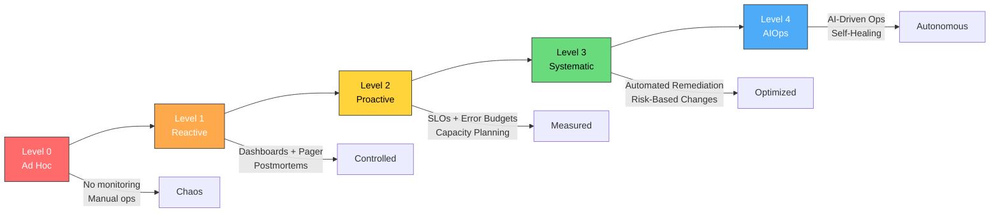

# SRE Maturity Model

## Architecture at a Glance



## What is it?

The SRE Maturity Model is a five-level framework (0–4) that helps organizations assess their reliability engineering practices across key capabilities and provides a roadmap for progressive improvement. Inspired by the Capability Maturity Model Integration (CMMI), it measures how systematically an organization approaches monitoring, incident response, change management, capacity planning, and reliability testing.

## Why it was created

- Teams lacked a structured way to benchmark their SRE adoption
- Organizations jumped to "hire SREs" without understanding the cultural and process prerequisites
- Vendors sold tools as "SRE solutions" without addressing the maturity gaps
- A common vocabulary was needed to align executive expectations with operational reality
- The model provides a clear investment roadmap: you cannot automate what you don't measure, and you cannot measure what you don't monitor

## When to use it

- During annual or quarterly SRE program reviews to measure progress
- When spinning up a new SRE team to set realistic first-year goals
- To justify headcount, tooling, or process investments to leadership
- Before adopting advanced practices (chaos engineering, AIOps) — ensure foundational levels are solid
- To compare maturity across multiple teams or business units within the same organization

## Hands-on Example

### Maturity Assessment Worksheet

```python
# sre_maturity_assessment.py — Score each capability 0-4
# Use this as a self-assessment tool during team retrospectives

CAPABILITIES = {
    "monitoring": {
        "name": "Monitoring & Observability",
        "levels": [
            "No monitoring; react to user complaints only",           # L0
            "Basic dashboards (CPU, memory); manual log digging",    # L1
            "Four Golden Signals; SLI dashboards; structured logs",  # L2
            "SLO-based alerting; multi-window burn-rate alerts; traces",  # L3
            "ML-driven anomaly detection; automated root-cause suggestions" # L4
        ]
    },
    "incident_response": {
        "name": "Incident Response",
        "levels": [
            "No defined process; whoever is on-call handles it",     # L0
            "Incident commander role; severity levels defined",      # L1
            "Scrum-based postmortems; blameless culture; timelines", # L2
            "Declared incidents tracked; comms templates; exercises",# L3
            "Auto-remediation playbooks; AI triage; self-healing"    # L4
        ]
    },
    "change_management": {
        "name": "Change Management",
        "levels": [
            "Manual deploys; no review; direct prod access",         # L0
            "Code reviews; deployment tickets; change window",       # L1
            "CI/CD pipelines; canary deploys; feature flags",        # L2
            "Progressive delivery; automated rollback; change risk scoring", # L3
            "Autonomous canary analysis; AI-driven release decisions" # L4
        ]
    },
    "capacity_planning": {
        "name": "Capacity Planning",
        "levels": [
            "No planning; add resources when things break",          # L0
            "Basic utilization dashboards; manual scaling",          # L1
            "Demand forecasting; auto-scaling; load testing",        # L2
            "Saturation SLIs; proactive provisioning; cost modeling",# L3
            "Predictive scaling; AI workload forecasting; carbon aware" # L4
        ]
    },
    "reliability_testing": {
        "name": "Reliability Testing",
        "levels": [
            "No testing in production",                              # L0
            "Manual smoke tests after deploy",                       # L1
            "CI/CD integration tests; load tests in staging",        # L2
            "Chaos experiments in prod; game days; steady-state",    # L3
            "Continuous automated chaos; fault-injection-as-code"    # L4
        ]
    }
}

def assess():
    print("=" * 60)
    print("  SRE MATURITY ASSESSMENT WORKSHEET")
    print("=" * 60)
    results = {}
    for key, cap in CAPABILITIES.items():
        print(f"\n--- {cap['name']} ---")
        for i, desc in enumerate(cap["levels"]):
            print(f"  [{i}] {desc}")
        score = int(input(f"  Score (0-4): "))
        results[key] = min(max(score, 0), 4)

    print("\n" + "=" * 60)
    print("  RESULTS")
    print("=" * 60)
    total = 0
    for key, cap in CAPABILITIES.items():
        s = results[key]
        total += s
        bar = "█" * s + "░" * (4 - s)
        print(f"  {cap['name']:30s} [{bar}] {s}/4")
    overall = total / len(CAPABILITIES)
    level_map = {0: "Ad Hoc", 1: "Reactive", 2: "Proactive", 3: "Systematic", 4: "AIOps"}
    level = min(int(round(overall)), 4)
    print(f"\n  OVERALL MATURITY: Level {level} — {level_map[level]}")
    print(f"  Average Score: {overall:.2f}/4.0")
    return results

if __name__ == "__main__":
    assess()
```

### Maturity Roadmap — Concrete Milestones

| Level | Milestone | Timeframe | Key Metric |
|-------|-----------|-----------|------------|
| L0 → L1 | On-call schedules + basic dashboards set up | 1–2 months | MTTA < 15 min |
| L1 → L2 | SLOs defined for top 3 services + error budgets | 3–6 months | Deploy frequency 2× |
| L2 → L3 | Canary deploys + multi-window alerting + game days | 6–12 months | Change fail rate < 5% |
| L3 → L4 | Auto-remediation for top 5 failure modes + AI-assisted triage | 12–18 months | MTTR reduced 50% |
| L4+ | Self-healing infrastructure + predictive capacity | 18–24 months | Pages per month < 3 |

## Best Practices

- Assess every 6 months and track trends — the score matters less than the direction
- Do not skip levels; Level 2 (SLOs + error budgets) is the critical foundation for everything above
- Start with monitoring maturity; you cannot improve what you cannot observe
- Involve both SRE and product engineering teams in the assessment for honest scoring
- Use the model to create a one-page maturity heatmap for leadership presentations
- Each level up requires investment in people, process, AND tools — never just one

## Interview Questions

**1. Your team is at Level 0 (Ad Hoc). What is the first thing you do to start climbing the maturity model?**

Stop everything and establish basic observability. Without monitoring, you are flying blind. Install a metrics pipeline (Prometheus/CloudWatch), create dashboards for the Four Golden Signals (latency, traffic, errors, saturation), and set up an on-call rotation with pager notification. This moves the team to Level 1 (Reactive). Only then define SLOs for the most critical service to kick off Level 2 (Proactive). Trying to jump to automated remediation (Level 3) before monitoring exists will fail because you cannot automate what you cannot measure.

**2. How would you assess maturity across five teams with different tech stacks and business criticality?**

Use the same five-capability framework but weight by service criticality (Tier 0/1 services have higher expectations). Aggregate scores per team into a radar chart. Present the spread — not just average — to show which teams are lagging. Crucially, normalize the assessment by having each team self-score AND have a central SRE team validate with objective evidence (e.g., "do you have documented SLOs?" rather than "do you think you have good reliability?"). Use the validated score for roadmap prioritization.

**3. What are the risks of adopting AIOps (Level 4) when you are still at Level 1?**

AIOps tools ingest metrics, logs, and traces to detect anomalies. At Level 1, those data sources are inconsistent, incomplete, or noisy. AIOps will produce a high false-positive rate, leading to alert fatigue and loss of trust in automated systems. The tool becomes shelfware. The correct sequence is: Level 2 establishes clean SLOs and structured data; Level 3 builds deterministic automated playbooks; only then does Level 4 AI add value by reducing noise further. Without the foundation, AIOps amplifies existing chaos.

## Real Company Usage

| Company | Starting Level | Current Level | Key Practices |
|---------|---------------|---------------|---------------|
| Google | L0 (2004) | L4 | SLOs, error budgets, SWE-SRE split, Borg-based auto-remediation |
| Netflix | L0 (2008) | L4 | Chaos Monkey, Spinnaker progressive delivery, self-healing |
| Spotify | L1 (2015) | L3 | Dapper-tuned squad model, SLOs per squad, game days |
| Etsy | L0 (2009) | L3 | Deployinator, continuous deployment, blameless postmortems |
| Financial firm | L0 (2018) | L2 | SLOs for trading systems, capacity planning, incident command |
| Healthcare startup | L1 (2020) | L2 | Prometheus monitoring, SLO dashboards, on-call rotations |
