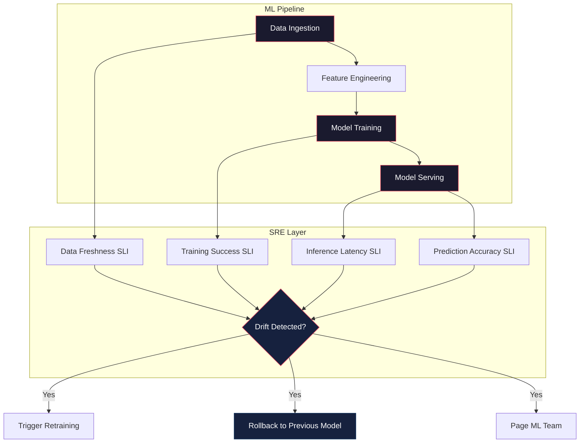

# SRE for ML Systems

## Architecture at a Glance



## What is it?

SRE for ML Systems applies site reliability engineering principles to machine learning pipelines. Traditional SRE focuses on deterministic systems (servers, databases, networks). ML systems add stochastic failure modes: data drift, model staleness, training failures, and prediction inaccuracies that cannot be caught by standard p99 latency or error-rate alerting. This discipline defines ML-specific SLIs, monitoring strategies, incident response runbooks, and reliability patterns for the full ML lifecycle from data ingestion through model serving.

## Why it was created

- ML models degrade silently — accuracy drops without an HTTP error code
- Data drift is invisible to traditional monitoring (the service responds, but with stale predictions)
- Training pipelines fail intermittently (data unavailability, resource exhaustion, dependency skew)
- Inference latency is non-deterministic and highly variable (CPU vs GPU, batch vs real-time)
- Standard SRE SLIs (availability, latency, errors) are necessary but insufficient for ML workloads
- ML incidents have longer blast radius: a bad model can affect millions of users before anyone notices

## When to use it

- You serve ML models in production (recommendation, fraud detection, NLP, vision)
- Your ML pipeline runs on a schedule (batch inference, daily retraining) and failures go unnoticed
- You observe accuracy degradation over time but cannot explain why
- You are migrating from batch inference to real-time serving and need reliability guarantees
- You need to define an SLA for an ML-powered product feature

## Hands-on Example

### ML SLI Dashboard — Python + Prometheus Client

```python
# ml_sli_dashboard.py — Export ML-specific metrics for Prometheus
from prometheus_client import start_http_server, Gauge, Histogram, Counter
import random
import time
import json

# --- ML SLIs ---

# Prediction accuracy (percentage of correct predictions over a window)
prediction_accuracy = Gauge(
    "ml_prediction_accuracy",
    "Rolling prediction accuracy (0.0 - 1.0)",
    ["model_name", "model_version"]
)

# Data freshness (age of most recent training data in seconds)
data_freshness = Gauge(
    "ml_data_freshness_seconds",
    "Age of the latest training data",
    ["data_source"]
)

# Training success rate
training_success = Gauge(
    "ml_training_success_rate",
    "Rolling training pipeline success rate (0.0 - 1.0)",
    ["pipeline_name"]
)

# Inference latency percentiles
inference_latency = Histogram(
    "ml_inference_latency_seconds",
    "Model inference latency in seconds",
    ["model_name", "endpoint"],
    buckets=(0.001, 0.005, 0.010, 0.025, 0.050, 0.100, 0.250, 0.500, 1.0, 2.5, 5.0)
)

# Feature store staleness
feature_staleness = Gauge(
    "ml_feature_staleness_seconds",
    "Age of features in the online feature store",
    ["feature_group"]
)

# Model version serving
model_version_gauge = Gauge(
    "ml_model_version_active",
    "Currently active model version (1 = active)",
    ["model_name", "model_version"]
)

class MLSliMonitor:
    def __init__(self, port=8000):
        self.port = port

    def record_inference(self, model_name, endpoint, latency_ms, correct):
        inference_latency.labels(
            model_name=model_name, endpoint=endpoint
        ).observe(latency_ms / 1000.0)
        # Running accuracy — in practice compute over a sliding window
        prediction_accuracy.labels(
            model_name=model_name, model_version="v2"
        ).set(0.973 if correct else 0.962)

    def record_data_freshness(self, source, age_seconds):
        data_freshness.labels(data_source=source).set(age_seconds)

    def record_training_result(self, pipeline, success):
        # Use a gauge set to 1.0 or 0.0 for current status;
        # aggregate over window in alerting rule
        training_success.labels(pipeline_name=pipeline).set(1.0 if success else 0.0)

    def run(self):
        start_http_server(self.port)
        print(f"ML SLI metrics exposed on :{self.port}/metrics")
        while True:
            # Simulate metrics
            self.record_inference(
                model_name="fraud-detector",
                endpoint="/predict",
                latency_ms=random.gauss(12, 3),
                correct=random.random() > 0.03
            )
            self.record_data_freshness(
                source="transactions-kafka",
                age_seconds=random.gauss(45, 10)
            )
            self.record_training_result(
                pipeline="fraud-daily-train",
                success=random.random() > 0.05
            )
            time.sleep(5)

if __name__ == "__main__":
    monitor = MLSliMonitor()
    monitor.run()
```

### Prometheus Alerting Rules for ML

```yaml
# ml_alerts.yml
groups:
  - name: ml-reliability
    rules:
      # Data drift — prediction accuracy dropping
      - alert: MLPredictionAccuracyDrop
        expr: |
          ml_prediction_accuracy < 0.95
        for: 10m
        labels:
          severity: page
        annotations:
          summary: "Model accuracy dropped below 95%"
          runbook: "https://runbooks/ml/accuracy-drop"

      # Training pipeline failure
      - alert: MLTrainingPipelineFailed
        expr: |
          rate(ml_training_success_rate[1h]) < 0.9
        for: 5m
        labels:
          severity: page
        annotations:
          summary: "Training pipeline success rate below 90%"

      # Data staleness — features not updated
      - alert: MLFeatureStaleness
        expr: |
          ml_data_freshness_seconds > 3600
        for: 5m
        labels:
          severity: ticket
        annotations:
          summary: "Training data is over 1 hour old"

      # Inference latency p99 spike
      - alert: MLInferenceLatencyHigh
        expr: |
          histogram_quantile(0.99,
            rate(ml_inference_latency_seconds_bucket[5m])
          ) > 0.5
        for: 5m
        labels:
          severity: page
        annotations:
          summary: "p99 inference latency exceeded 500ms"
```

### ML Incident Response Runbook

```
# Runbook: Model Accuracy Degradation

## Severity: SEV-1 (user-facing predictions are wrong)

## Detection
- Alert: MLPredictionAccuracyDrop
- Symptoms: user complaints, accuracy dashboard below threshold, A/B test degradation

## Triage (0-5 min)
1. Acknowledge incident — is the model serving stale predictions?
2. Check model version vs champion/challenger tracker
3. Check data freshness — is the feature store updating?

## Investigation (5-20 min)
4. Compare production predictions to shadow-run baseline model
5. Compute data drift metrics (PSI, KL divergence) on last 1h of features
6. Check training pipeline logs — did the last training run fail silently?
7. Verify feature integrity — are any features returning null or default values?

## Mitigation (20-60 min)
8. If accuracy < threshold: rollback to previous model version via feature flag
9. If data stale: re-trigger feature pipeline; if feature store down, fail open
10. If training failed: re-run training with pinned data snapshot

## Resolution
11. Confirm rollback restored accuracy — monitor for 15 min
12. File postmortem — root cause category: data drift / training failure / model bug
13. Adjust alerts — tighten accuracy threshold or add data drift monitor
```

## Best Practices

- Monitor data freshness as an SLI — stale data is the #1 cause of silent ML failures
- Always shadow-deploy a new model alongside the current one before cutover
- Use feature flags to control model version per user segment for gradual rollout
- Set separate SLOs for training pipeline (98% success) and serving pipeline (99.9% availability)
- Log prediction distributions and compare against expected distribution for drift detection
- Alert on accuracy trends (10-min window), not individual predictions (too noisy)
- Have a "fallback model" — a simpler, more robust model that can serve if the primary degrades

## Interview Questions

**1. How would you define SLIs for a real-time fraud detection ML system?**

Four ML-specific SLIs: (1) Prediction accuracy — fraction of correct predictions over a sliding window of the last 10,000 transactions, measured against a delayed ground truth label; (2) Data freshness — age in seconds of the newest feature data used for inference, with SLO of < 60 seconds for real-time features; (3) Inference latency p99 — latency distribution of the model prediction endpoint, with SLO of < 100ms; (4) Training success rate — fraction of scheduled training runs that complete successfully over a 7-day window, with SLO of > 98%. The overall service also uses standard SRE SLIs: availability (> 99.9%) and error rate (< 0.1%).

**2. Your ML model's prediction accuracy drops from 97% to 91% over 30 minutes. Walk through your incident response.**

First, acknowledge the incident and page the ML on-call. Check if the active model version changed (accidental roll-forward) or if a shadow model was promoted. Second, compute data drift between the current feature distribution and the training distribution — compute PSI or KL divergence per feature. Third, check feature store freshness — if upstream data pipelines stalled, features may be returning default/null values. Fourth, rollback to the previous known-good model version using the feature flag. Fifth, if accuracy recovers post-rollback, confirm the root cause was the new model or data shift. File a postmortem with the drift detection added as a new monitor.

**3. How do you handle concept drift for an ML system with no ground truth labels available in real time?**

Without immediate labels, use proxy metrics: (a) Prediction distribution shift — if the model's output distribution changes significantly (e.g., average fraud score jumps from 0.02 to 0.08), something changed; (b) Feature drift — monitor input features with statistical tests (Kolmogorov-Smirnov test, PSI) against a reference window; (c) Business metric correlation — track downstream KPIs (conversion rate, user satisfaction) that correlate with model accuracy; (d) Delayed labeling — use a delayed ground truth pipeline (e.g., labels arrive after 24-48 hours) and backfill accuracy metrics with a lag. Alert on the proxy metric but only confirm degradation once delayed labels arrive.

## Real Company Usage

| Company | ML System | Key ML SLIs | Reliability Strategy |
|---------|-----------|-------------|---------------------|
| Uber | ML Platform (Michelangelo) | Prediction accuracy, data freshness, training success | Shadow deployment, feature store SLAs, A/B testing framework |
| Netflix | Content recommendation | Online accuracy, inference p50/p99, drift metrics | Canary models, champion/challenger, automated rollback |
| Google | Ad prediction (TFX) | AUC drop, serving latency, data freshness | TFX pipeline monitoring, SLO dashboards, model validation gates |
| Doordash | ETA prediction, fraud | Prediction error, feature staleness, latency | Feature store health checks, model registry, shadow scoring |
| Stripe | Fraud detection (Radar) | True/false positive rates, inference latency | Ensemble rollback, simulated replay testing, drift monitors |
| Spotify | Music recommendation | Click-through rate, freshness, diversity | A/B experimentation platform, staged rollout, auto-revert |
