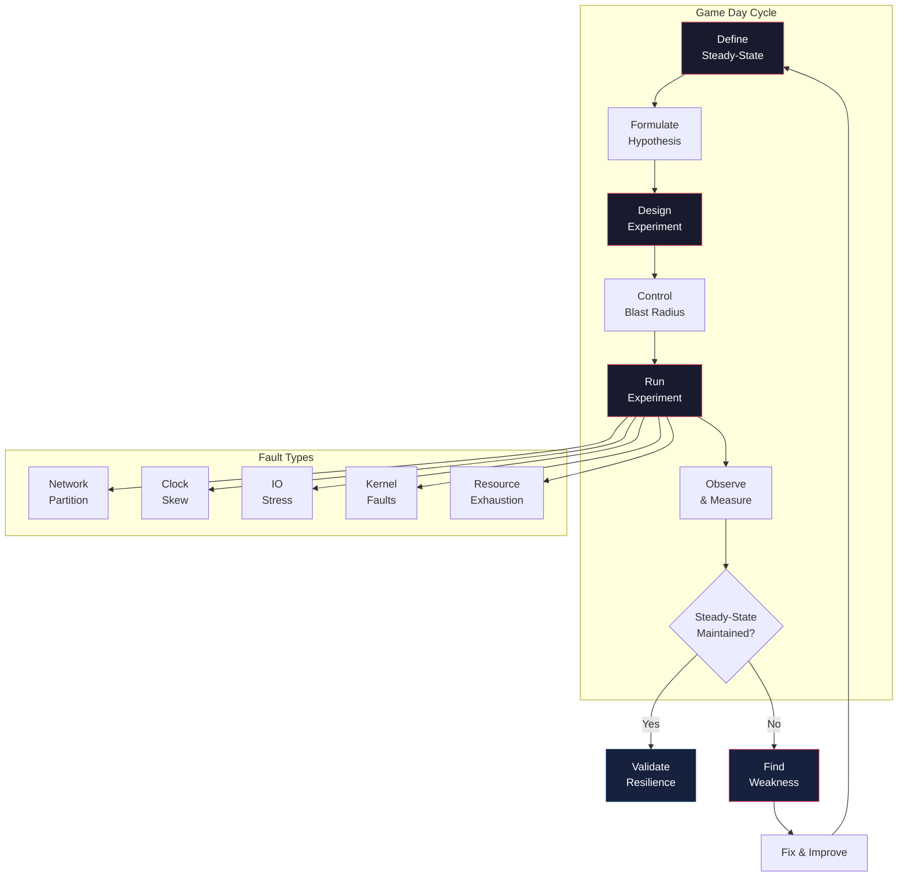

# Advanced Chaos Engineering

## Architecture at a Glance



## What is it?

Chaos Engineering is the discipline of experimenting on a system to build confidence in its capability to withstand turbulent conditions in production. This deep dive moves beyond the basics (Chaos Monkey killing random instances) into advanced methodologies: game day design with blast radius control, steady-state hypothesis formulation, automated experiment pipelines, and sophisticated failure injection including network partition, clock skew, IO stress, and kernel faults. It also covers the chaos maturity model for tracking organizational adoption.

## Why it was created

- Basic instance failure testing only validates stateless resilience; real-world failures are complex and cascading
- Teams ran chaos experiments without hypotheses, making results uninterpretable
- Blast radius was unbounded — experiments accidentally took down production
- Advanced failure modes (clock skew, kernel panics) were avoided because they seemed too dangerous
- Organizations needed a maturity framework to safely progress from simple to advanced experiments
- Automated, continuous chaos (integrated into CI/CD) was an aspirational but poorly documented pattern

## When to use it

- Your system already passes basic instance-failure tests (e.g., Chaos Monkey) and you need harder challenges
- You are designing a game day program and need a structured methodology
- You suspect edge cases like network partition, DNS failures, or clock drift will cause cascading failures
- You need to validate that a new resilience feature (circuit breaker, bulkhead, retry logic) actually works
- You want to measure chaos maturity and build a roadmap for your reliability team

## Hands-on Example

### Chaos Mesh Experiment: Network Partition

```yaml
# network-partition.yaml — Chaos Mesh NetworkChaos experiment
# Isolate service-a from service-b for 60 seconds
apiVersion: chaos-mesh.org/v1alpha1
kind: NetworkChaos
metadata:
  name: network-partition-ab
  namespace: production
spec:
  action: partition
  mode: all
  selector:
    namespaces:
      - production
    labelSelectors:
      app: service-a
  direction: both
  target:
    mode: all
    selector:
      namespaces:
        - production
      labelSelectors:
        app: service-b
  duration: 60s
  scheduler:
    cron: "@every 6h"  # Run every 6 hours in a controlled window
```

### Chaos Mesh Experiment: Clock Skew

```yaml
# clock-skew.yaml — Chaos Mesh TimeChaos experiment
# Skew service-a clock by +300 seconds (5 minutes forward)
# This tests: JWT validation, cache TTLs, metrics timestamps
apiVersion: chaos-mesh.org/v1alpha1
kind: TimeChaos
metadata:
  name: clock-skew-service-a
  namespace: production
spec:
  mode: one  # Target a single pod to limit blast radius
  selector:
    namespaces:
      - production
    labelSelectors:
      app: service-a
  timeOffset: "300s"
  clockIds:
    - CLOCK_REALTIME
  duration: "120s"
  scheduler:
    cron: "@every 12h"
```

### Chaos Mesh Experiment: IO Stress

```yaml
# io-stress.yaml — Chaos Mesh IOChaos experiment
# Add 50ms write latency and 20% write error rate to MySQL pods
apiVersion: chaos-mesh.org/v1alpha1
kind: IOChaos
metadata:
  name: mysql-io-latency
  namespace: production
spec:
  action: latency
  mode: one
  selector:
    namespaces:
      - production
    labelSelectors:
      app: mysql
  volumePath: /var/lib/mysql
  path: "/var/lib/mysql/**/*"
  delay: "50ms"
  percent: 100
  duration: "180s"
  scheduler:
    cron: "@every 24h"
```

### LitmusChaos Workflow: Multi-Fault Game Day

```yaml
# multi-fault-gameday.yaml — LitmusChaos workflow with sequential faults
apiVersion: litmuschaos.io/v1alpha1
kind: ChaosEngine
metadata:
  name: payment-service-gameday
  namespace: litmus
spec:
  appinfo:
    appkind: deployment
    applabel: app=payment-service
    appnamespace: production
  engineState: active
  chaosServiceAccount: litmus-admin
  experiments:
    # Phase 1: Network latency on database calls
    - name: pod-network-latency
      spec:
        components:
          env:
            - name: TARGET_SERVICE
              value: "payment-db:5432"
            - name: NETWORK_LATENCY
              value: "200ms"
            - name: TOTAL_CHAOS_DURATION
              value: "60"
        probe:
          - name: steady-state-http-probe
            type: httpProbe
            httpProbe/inputs:
              url: http://payment-service/health
              expectedStatusCode: 200
              runProperties:
                probeTimeout: 5
                interval: 10
                retry: 3
    # Phase 2: Kill one pod + CPU stress on remaining
    - name: pod-cpu-hog
      spec:
        components:
          env:
            - name: CPU_CORES
              value: "1"
            - name: TOTAL_CHAOS_DURATION
              value: "120"
        probe:
          - name: steady-state-sli-check
            type: promProbe
            promProbe/inputs:
              endpoint: http://prometheus:9090
              query: |
                (sum(rate(http_requests_total{status=~"5.."}[5m]))
                 / sum(rate(http_requests_total[5m]))) < 0.01
              comparator:
                type: string
                criteria: ==
                value: "1"
```

### Kernel Fault Injection with BPF

```bash
# Inject a slab cache allocation failure in the kernel (targeted)
# This tests how the application handles memory allocation failures
sudo bpftrace -e '
kprobe:__alloc_pages_nodemask {
    if (rand() % 1000 < 5) {  # 0.5% failure rate
        printf("Injecting page allocation failure for pid %d (%s)\n",
               pid, comm);
        override(-12);  # -ENOMEM
    }
}
' -c "python -c 'while True: x = [0]*1000000'"
```

### Steady-State Hypothesis Validation

```python
# steady_state_check.py — Validate steady state before/during/after experiment
import requests
import time

class SteadyStateValidator:
    def __init__(self, prometheus_url, sli_queries):
        self.prometheus = prometheus_url
        self.sli_queries = sli_queries
        self.baseline = {}

    def capture_baseline(self):
        """Record SLI values for 5 minutes before experiment"""
        print("Capturing baseline steady state...")
        for name, query in self.sli_queries.items():
            resp = requests.get(f"{self.prometheus}/api/v1/query",
                                params={"query": query})
            self.baseline[name] = float(resp.json()["data"]["result"][0]["value"][1])
        return self.baseline

    def check(self, tolerance=0.05):
        """Check if current SLIs are within tolerance of baseline"""
        deviations = []
        for name, query in self.sli_queries.items():
            resp = requests.get(f"{self.prometheus}/api/v1/query",
                                params={"query": query})
            current = float(resp.json()["data"]["result"][0]["value"][1])
            deviation = abs(current - self.baseline[name])
            if deviation > tolerance:
                deviations.append((name, self.baseline[name], current, deviation))
        return deviations

# Usage in game day automation:
validator = SteadyStateValidator("http://prometheus:9090", {
    "error_rate": 'sum(rate(http_requests_total{status=~"5.."}[5m])) / sum(rate(http_requests_total[5m]))',
    "p99_latency": 'histogram_quantile(0.99, sum(rate(http_request_duration_seconds_bucket[5m])) by (le))',
})

baseline = validator.capture_baseline()
# ... run chaos experiment ...
time.sleep(60)
deviations = validator.check(tolerance=0.02)

if deviations:
    print(f"STEADY STATE VIOLATED: {deviations}")
    # Abort experiment, initiate rollback procedure
    requests.post("http://chaos-controller/abort", json={"experiment": "game-day-42"})
else:
    print("Steady state maintained — system is resilient to this fault")
```

### Chaos Maturity Model

| Level | Name | Description | Practices |
|-------|------|-------------|-----------|
| 0 | No Chaos | No experiments; outages are surprises | Reactive incident response |
| 1 | Ad Hoc Chaos | Manual, unscripted experiments in staging | Occasional game days; no hypothesis |
| 2 | Scheduled Chaos | Recurring, scripted experiments with blast radius control | Game days on calendar; steady-state checks; scheduled experiments |
| 3 | Automated Chaos | Experiments run continuously in CI/CD pipelines | Automated experiment rollback; fault injection in integration tests; regression test suite for resilience |
| 4 | Continuous Verification | Every deployment is verified against chaos experiments | Autonomous experiment selection; real-time impact analysis; self-healing validation |

## Best Practices

- Always define the steady-state hypothesis before running an experiment — you need a clear "what normal looks like"
- Control blast radius: start with one pod / one replica / 5% of traffic, then expand
- Run experiments during low-traffic windows initially; move to business hours as confidence grows
- Use the probe mechanism (HTTP, PromQL, gRPC) to validate steady-state continuously during the experiment
- Automate experiment rollback: if steady state is violated beyond a threshold, stop and revert instantly
- Maintain an experiment catalog with clear descriptions, blast radius, and runbooks for abort
- After every failed experiment (steady-state violated), file a postmortem — the experiment found a real weakness
- Never run a chaos experiment without a way to stop it (kill switch, timeout, automated abort)

## Interview Questions

**1. Design a chaos experiment to test your payment service's resilience to a downstream database partition.**

First, define steady state: payment success rate > 99.9%, p99 latency < 500ms, no 5xx errors. Hypothesis: the payment service will gracefully degrade (fail open with an error message) when the database is unreachable and recover within 30 seconds of partition healing. Design: use Chaos Mesh NetworkChaos to partition payment-service from payment-db for 120 seconds. Blast radius: limit to 1 of 3 replicas. Probes: HTTP health check must still return 200 (the service should be healthy even if DB is unreachable for non-DB paths); PromQL query measuring 5xx rate during partition should validate graceful degradation. After 120s, verify recovery — success rate and latency return to baseline within 30 seconds. If the service crashes or accumulates errors that cascade, the experiment reveals a resilience gap (missing circuit breaker, no connection pool timeout, no retry backoff).

**2. What is the difference between Chaos Engineering and regular testing (unit/integration/stress)?**

Chaos Engineering experiments on running production or production-like systems with injected real-world failure conditions, measuring whether steady-state SLIs are maintained. Regular testing validates specific code paths with known inputs and expected outputs. The key differences: (a) Hypothesis-based — chaos starts from "I believe the system will remain steady under this fault" rather than "this function returns the correct output for this input"; (b) Black-box — chaos observes system behavior without assuming which component will fail; (c) Continuous — chaos should be run indefinitely, not just before releases; (d) Production environment — chaos gains confidence only when run in production where real traffic patterns, data volumes, and dependencies exist. In short, unit tests tell you "did I build it right?" Chaos tells you "is it still working when things go wrong?"

**3. How do you safely introduce clock skew as a chaos experiment in a production system?**

Clock skew is dangerous because it can corrupt data, invalidate auth tokens, and break distributed consensus. Safety steps: (1) Start in a non-production environment with synthetic traffic; validate that your JWT libraries, cache TTLs, and metric timestamps handle ±5 min skew. (2) Use Chaos Mesh TimeChaos with mode: one (single pod), not mode: all. (3) Begin with a small skew (+30 seconds, duration 60s) during a known low-traffic window. (4) Steady-state probes must include authentication success rate (does skew invalidate tokens?), metric ordering (are metrics timestamps monotonic?), and cross-service RPC success rate. (5) Have an automated abort: if auth failure rate spikes, immediately remove the time offset. (6) Only graduate to larger skews (+5 min, +1 hour) after multiple successful small-skew experiments. Never run clock skew on time-critical infrastructure (consensus protocols, distributed databases, certificate validation) without a dedicated safe-fail mechanism.

## Real Company Usage

| Company | Tools | Key Experiments | Maturity Level |
|---------|-------|-----------------|----------------|
| Netflix | Chaos Monkey, Chaos Kong, Litmus | AZ failover (Chaos Kong), regional failover, instance termination | L4 — Continuous |
| Amazon | AWS Fault Injection Simulator | Network partition, IO stress, EC2 stop, RDS failover | L4 — Continuous |
| Google | Internal (Monarch-based) + custom | Cluster failure, GCP region failover, load spike injection | L4 — Continuous |
| Microsoft | Azure Chaos Studio | VM shutdown, DNS failure, latency injection, certificate expiry | L3 — Automated |
| Slack | Internal (SAL) + custom | Database failover, cache cluster partition, message drop | L3 — Automated |
| Shopify | Toxiproxy, Gremlin, custom | Redis failover, MySQL replica lag, network latency | L3 — Automated |
| Uber | Internal Chaos Platform | Ringpop partition, Cassandra failure, deployment rollback | L3 — Automated |
