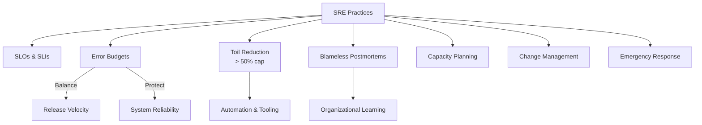

# 15 — Site Reliability Engineering

> Apply software engineering to operations. Run reliable systems at scale.

## What is it?

Site Reliability Engineering (SRE) is a discipline that applies software engineering principles to operations and infrastructure problems. Originated at Google in 2003 when Ben Treynor Sloss created the first SRE team, it treats operations as a software problem — using code to automate, measure, and improve system reliability.

## Google's SRE Model

| Principle | Description |
|-----------|-------------|
| **SLOs / SLIs / Error Budgets** | Define measurable reliability targets, measure compliance, use error budgets to balance reliability vs velocity |
| **Toil Elimination** | Cap operational work (toil) at 50% of SRE time; automate the rest |
| **Blameless Postmortems** | Assume good intent; fix the system, not the person |
| **Capacity Planning** | Model demand growth; provision with margin |
| **Change Management** | Progressive delivery; automated rollback; change failure rate < 5% |
| **Emergency Response** | Runbooks, on-call rotations, incident command system |
| **Production Readiness** | Reviews, launch checklists, Game Days |

## Topics

| # | Topic | Description |
|---|-------|-------------|
| 1 | [SLOs, SLIs & Error Budgets](01-slo-sli-error-budgets.md) | Defining and measuring reliability |
| 2 | [Incident Management](02-incident-management.md) | Structured incident response |
| 3 | [Postmortem Culture](03-postmortem-culture.md) | Blameless learning from failures |
| 4 | [Change Management](04-change-management.md) | Safe, progressive delivery |
| 5 | [Capacity Planning](05-capacity-planning.md) | Forecasting and provisioning |
| 6 | [Reliability Patterns](06-reliability-patterns.md) | Circuit breakers, bulkheads, retries |
| 7 | [Toil Reduction](07-toil-reduction.md) | Automating operational work |
| 8 | [Emergency Response](08-emergency-response.md) | On-call, escalation, runbooks |
| 9 | [Production Readiness](09-production-readiness.md) | Launch checklists, PRRs, Game Days |

## Key Metrics

| Metric | Target (Elite) |
|--------|----------------|
| Deployment Frequency | Multiple per day |
| Lead Time for Change | < 1 hour |
| Change Failure Rate | < 5% |
| Time to Restore Service | < 1 hour |

## Related Modules

- [14-DevOps](../14-DevOps/README.md) — CI/CD pipelines, deployment strategies, DORA metrics
- [17-Observability](../17-Observability/README.md) — Monitoring, alerting, logging, tracing
- [18-Case-Studies](../18-Case-Studies/README.md) — Real-world incidents and lessons
- [21-Staff-Engineer](../21-Staff-Engineer/README.md) — Tradeoffs, chaos engineering, disaster recovery

## Interview Questions

1. What is the difference between SRE and DevOps?
2. Explain error budgets and how they balance reliability vs velocity.
3. How do you calculate an SLO and what happens when you breach it?
4. Describe Google's approach to toil reduction.
5. What is a blameless postmortem and why is it important?
6. How do you design an on-call rotation that prevents pager fatigue?
7. Explain the multi-window multi-burn-rate alerting approach.
8. What is the difference between a readiness probe and a liveness probe?
9. How does a circuit breaker pattern improve system reliability?
10. What would you include in a Production Readiness Review checklist?

---

Previous: [14-DevOps](../14-DevOps/README.md)
Next: [16-Security](../16-Security/README.md)
