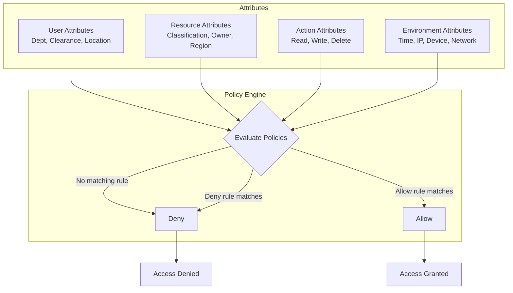

# ABAC (Attribute-Based Access Control)

## Definition
ABAC grants access based on evaluating policies against **attributes** of the user, resource, action, and environment. It's more flexible than RBAC and enables fine-grained, context-aware authorization.



## Attribute Types

| Category | Examples | Source |
|----------|----------|--------|
| **User** | Department, clearance level, location, role, team | Identity provider (IdP) |
| **Resource** | Classification, owner, type, sensitivity, region | Resource metadata |
| **Action** | Read, write, delete, export, share | API endpoint |
| **Environment** | Time of day, IP address, device type, network, geo | Request context |

## Policy Example (AWS IAM-style)

```json
{
  "PolicyName": "engineering-code-access",
  "Statement": [
    {
      "Effect": "Allow",
      "Action": ["code:Get*", "code:List*"],
      "Resource": "arn:aws:codecommit:*:*:EngineeringRepo",
      "Condition": {
        "StringEquals": {
          "aws:PrincipalTag/Department": "engineering"
        },
        "IpAddress": {
          "aws:SourceIp": "10.0.0.0/8"
        }
      }
    }
  ]
}
```

## ABAC vs RBAC

```
RBAC: User has role → role has permissions
  ├── "Alice is Admin" → admin: {read, write, delete}
  ├── "Bob is Editor" → editor: {read, write}
  └── "Carol is Viewer" → viewer: {read}

ABAC: Access based on attribute evaluation
  ├── "Alice can edit documents in her department"
  ├── "Any authenticated user can read public documents"
  ├── "Only document owners can delete"
  ├── "Contractors can't access confidential documents"
  └── "Access to PII data requires VP approval AND US IP AND business hours"

When to choose:
- RBAC: < 100 roles, stable permissions, simple hierarchy
- ABAC: Dynamic, multi-dimensional, compliance-heavy, >
```

## Policy Evaluation Engine

```
Request: User wants ACTION on RESOURCE in ENVIRONMENT

Policy Engine (OPA/Cedar):
  1. Collect attributes: user.*, resource.*, action, environment.*
  2. Load all applicable policies (cached)
  3. Evaluate policies in order:
     - If DENY policy matches → deny (immediate)
     - If ALLOW policy matches → allow
     - No match → default deny
  4. Return decision + optional reason

Performance optimization:
- Index policies by resource type
- Cache compiled policies (AST)
- Precompute user attributes at login time
- Use eager evaluation for common deny rules
```

## Interview Questions

1. How does ABAC differ from RBAC?
2. What are the advantages of ABAC for multi-tenant systems?
3. How do you evaluate ABAC policies efficiently at scale?
4. What tools exist for ABAC policy management? (OPA, Cedar, AWS IAM)
5. Design an ABAC system for a document management platform
6. How would you migrate from RBAC to ABAC?
