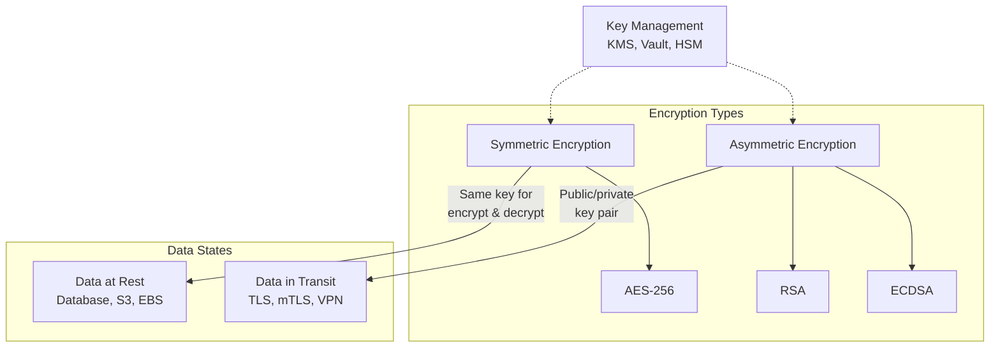

# Encryption

## Definition
Encryption transforms data into an unreadable format using an algorithm and a key. Only those with the correct key can decrypt and read the data.



## Types

| Type | Description | Use Case |
|------|-------------|----------|
| **Symmetric** | Same key for encrypt/decrypt | Data at rest (AES-256) |
| **Asymmetric** | Public/private key pair | Key exchange, TLS (RSA, ECDSA) |
| **At Rest** | Encrypt stored data | Database encryption, S3 SSE |
| **In Transit** | Encrypt network traffic | TLS, mTLS, VPN |

## Encryption in Distributed Systems

```
┌─────────────────────────────────────────────┐
│              Encryption Layers                │
├─────────────────────────────────────────────┤
│                                               │
│  Client-side: Data encrypted before sending  │
│  Transport:   TLS between services           │
│  Database:    TDE (Transparent Data Encrypt) │
│  Storage:     S3 SSE, EBS encryption         │
│  Application: Field-level encryption         │
│  Backup:      Encrypted backup files         │
│                                               │
└─────────────────────────────────────────────┘
```

## Key Management

| System | Description |
|--------|-------------|
| **AWS KMS** | Managed key creation and rotation |
| **HashiCorp Vault** | Secrets management, dynamic secrets |
| **Cloud HSM** | Hardware security module |
| **Env variables** | Simple, but less secure |

## Interview Questions
1. Compare symmetric vs asymmetric encryption
2. How does TLS provide encryption in transit?
3. What is key rotation and why is it important?
4. How do you encrypt data at rest in a database?
5. Design an encryption strategy for a multi-tenant SaaS
