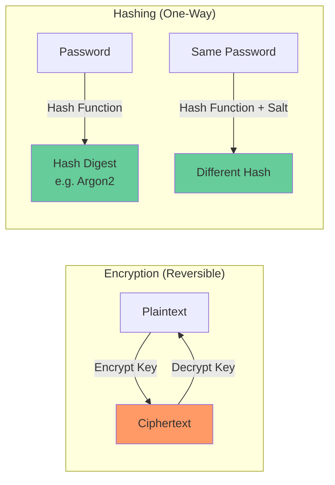

# Hashing

## Definition
Hashing is a one-way function that converts data to a fixed-size value (hash/digest). Unlike encryption, hashing cannot be reversed.



## Hashing vs Encryption

```
Encryption:  plaintext → ciphertext → plaintext (reversible)
Hashing:     plaintext → hash (NOT reversible)
```

## Common Hash Algorithms

| Algorithm | Output | Use | Security |
|-----------|--------|-----|----------|
| **SHA-256** | 256 bits | Integrity, signatures | Secure |
| **SHA-3** | Variable | Modern alternative | Very secure |
| **bcrypt** | Variable | Password storage | Good (adaptive) |
| **Argon2** | Variable | Password storage | Best (memory-hard) |
| **MD5** | 128 bits | Checksums | Broken (collisions) |
| **SHA-1** | 160 bits | Legacy | Broken (collisions) |

## Password Storage

```python
# ❌ Wrong: plaintext or unsalted hash
store(password)

# ❌ Better but still wrong: hash without salt
store(sha256(password))

# ✅ Correct: slow hash + salt
from argon2 import PasswordHasher
ph = PasswordHasher()
hash = ph.hash(password)  # Includes salt
store(hash)

# Verification
ph.verify(hash, password)
```

## Interview Questions
1. Why should passwords be hashed with bcrypt or Argon2 instead of SHA-256?
2. What is a salt and why is it important?
3. How does hashing ensure data integrity?
4. What is a hash collision and how do algorithms handle it?
5. Design a secure password storage system
