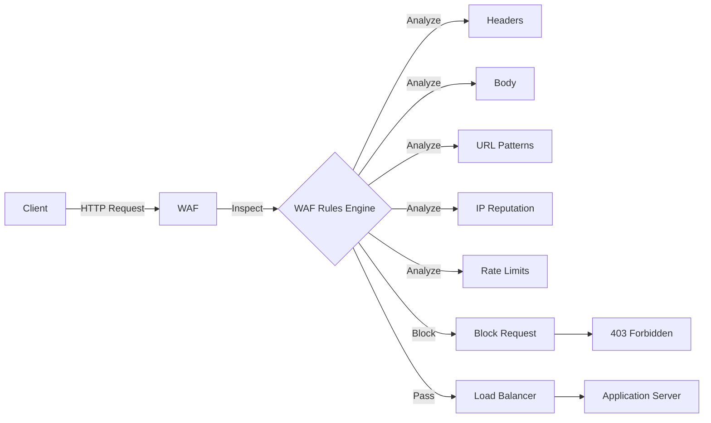

# WAF (Web Application Firewall)

## Definition
A WAF filters, monitors, and blocks HTTP traffic to and from web applications. It protects against common web exploits like SQL injection, XSS, and CSRF.



## Attack Types Blocked

| Attack | Description | WAF Rule |
|--------|-------------|----------|
| SQL Injection | Malicious SQL in input | Block ' OR 1=1 -- |
| XSS | Script injection | Block <script> tags |
| CSRF | Cross-site request forgery | Validate tokens |
| Path traversal | ../ in URL | Block directory traversal |
| Remote file inclusion | PHP URL inclusion | Block external URLs |

## WAF Deployment

```
Client ──► WAF ──► Load Balancer ──► Application
              │
              │ Analyze:
              │ - HTTP headers
              │ - Request body
              │ - URL patterns
              │ - IP reputation
              │ - Rate
```

## Interview Questions
1. What attacks does a WAF protect against?
2. Compare WAF vs traditional firewall
3. How does AWS WAF differ from Cloudflare WAF?
4. When would you use a WAF vs application-level security?
5. Design a WAF rule for protecting against SQL injection
