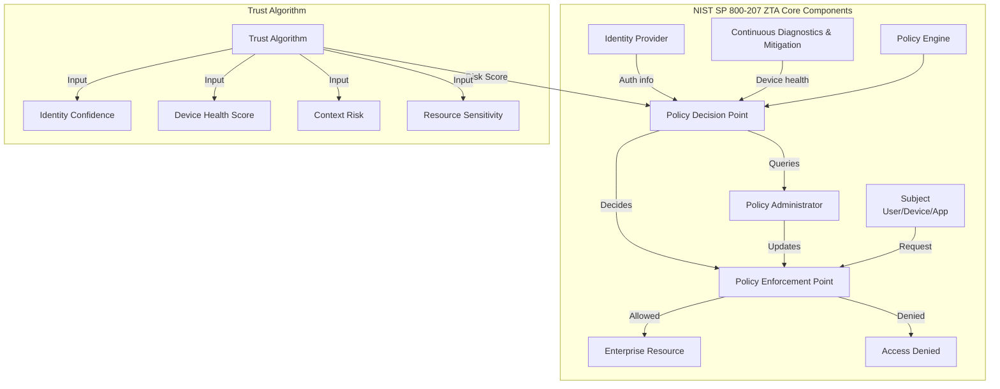
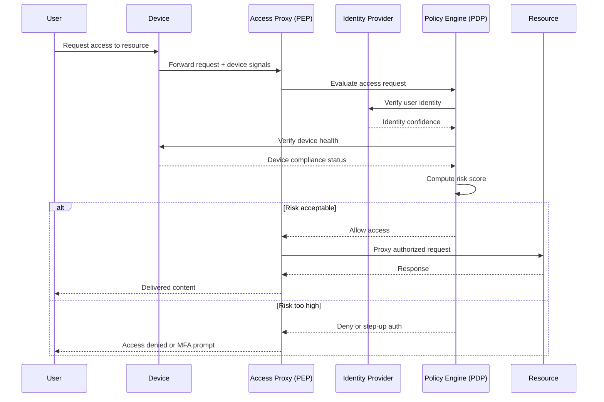

# Zero Trust Architecture

## Definition
Zero Trust is a security model based on the principle "never trust, always verify." It assumes no implicit trust is granted to assets or user accounts based solely on their physical or network location (e.g., inside the corporate perimeter). Every access request is fully authenticated, authorized, and encrypted before granting access.

## Core Principles

| Principle | Description |
|-----------|-------------|
| **Never Trust, Always Verify** | Always authenticate and authorize based on all available data points |
| **Least Privilege** | Grant only the minimum permissions needed for a task |
| **Assume Breach** | Design systems assuming an attacker is already present |
| **Microsegmentation** | Isolate workloads and enforce granular access between them |
| **Continuous Validation** | Re-evaluate trust for every request, not just at session start |

## Zero Trust (BeyondCorp) Model

```
Traditional Perimeter Security:
  User ──► VPN ──► Corporate Network ──► All Apps

Zero Trust (BeyondCorp):
  User ──► Auth Proxy ──► App
  Device ──► Device Inventory ──► Policy Engine
  Identity ──► IAM ──► Access Decision
  
  Access = f(identity, device, context, resource)
```

Google BeyondCorp pioneered the Zero Trust model by moving access control from the network perimeter to users and devices. Every request is evaluated against:

- User identity and group membership
- Device inventory and patch state
- Context (location, time, data sensitivity)
- Resource sensitivity

## ZTNA vs VPN

| Aspect | VPN | ZTNA |
|--------|-----|------|
| **Access** | Network-level (entire subnet) | Application-level (specific app) |
| **Visibility** | User on internal network | User invisible to network |
| **Latency** | Added by VPN gateway | Direct connect to app |
| **Security** | Trust after auth | Continuous verification |
| **User Experience** | Separate client, slow | Transparent, fast |
| **Scalability** | Hard at scale | Cloud-native, elastic |

## Zero Trust Maturity Model

```
Level 1: Traditional
  - VPN-based access
  - Static firewall rules
  - No device trust

Level 2: Initial
  - MFA for remote access
  - Basic network segmentation
  - Manual device compliance

Level 3: Advanced
  - ZTNA for critical apps
  - Identity-aware proxy
  - Microsegmentation (virtual networks)

Level 4: Optimized
  - Full ZTNA for all apps
  - Continuous risk assessment
  - Automated policy enforcement
  - AI-driven anomaly detection
```

## NIST SP 800-207 Zero Trust Architecture



## Zero Trust Implementation Approaches

### Identity-Centric
```
Core: Identity is the primary security boundary
├── BeyondCorp (Google)
├── Conditional Access (Azure AD)
├── Okta / Auth0
└── Keycloak
```

### Device-Centric
```
Core: Device trust must be established before access
├── Device inventory (Jamf, Intune, Fleet)
├── Certificate-based device auth
├── Hardware attestation (TPM)
└── TEE (Trusted Execution Environment)
```

### Workload-Centric
```
Core: Secure inter-service communication in cloud-native environments
├── Service mesh (Istio, Linkerd) with mTLS
├── Cilium Network Policies
├── SPIFFE/SPIRE (workload identity)
└── gRPC with per-call auth
```

## Real-World Implementations

| Organization | Implementation | Key Features |
|-------------|---------------|--------------|
| **Google BeyondCorp** | Access Proxy + Identity-Aware Proxy | Device signals, user context, dynamic trust |
| **Cloudflare Zero Trust** | Cloudflare Gateway + Access | Global edge, ZTNA, CASB, DLP in one |
| **Zscaler** | Zscaler Private Access (ZPA) | App segmentation, user-to-app ZTNA |
| **Microsoft** | Azure AD Conditional Access | MFA, device compliance, risk-based policies |
| **Cisco** | Duo + SD-WAN | Zero Trust for remote and branch |

## Microsegmentation

```
Traditional Segmentation:
  [DMZ] ──► [Internal Network] ──► [Database]
  │                                  │
  All hosts trust each other         Direct DB access from any app

Microsegmentation:
  [Web App] ──► [App Service] ──► [Database]
     │               │                │
  Only Web → App     Only App → DB    DB denies all others
  via policy         via policy       (least privilege)
```

## Zero Trust Architecture Diagram



## Interview Questions

1. What are the core principles of Zero Trust Architecture?
2. How does BeyondCorp implement Zero Trust compared to traditional VPN?
3. What is the difference between ZTNA and VPN?
4. How does NIST SP 800-207 define Zero Trust Architecture?
5. What are the three implementation approaches for Zero Trust (identity, device, workload)?
6. How does microsegmentation improve security in a Zero Trust model?
7. Compare Google BeyondCorp, Cloudflare Zero Trust, and Zscaler approaches
