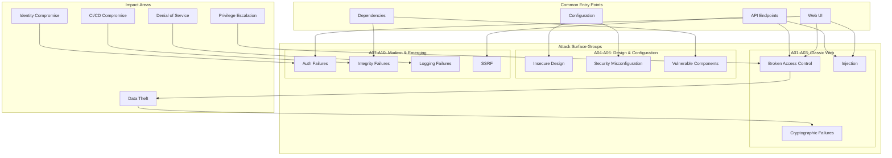

# OWASP Top 10 (2021)

## Definition
The OWASP Top 10 is a standard awareness document for web application security. It represents a broad consensus on the most critical security risks facing web applications. The 2021 edition shifted from listing specific vulnerabilities to focusing on categories of security weaknesses.

## OWASP Top 10:2021 Categories

| Rank | Category | Risk Score | Key Change from 2017 |
|------|----------|------------|---------------------|
| 1 | Broken Access Control | 95th percentile | Moved up from #5 |
| 2 | Cryptographic Failures | 93rd | Renamed from "Sensitive Data Exposure" |
| 3 | Injection | 90th | SQL, NoSQL, OS, LDAP injection |
| 4 | Insecure Design | 88th | New category |
| 5 | Security Misconfiguration | 86th | Moved up from #6 |
| 6 | Vulnerable and Outdated Components | 84th | Renamed from "Using Components with Known Vulnerabilities" |
| 7 | Identification and Authentication Failures | 82nd | Renamed from "Broken Authentication" |
| 8 | Software and Data Integrity Failures | 80th | New category (includes CI/CD, pipelines) |
| 9 | Security Logging and Monitoring Failures | 78th | Renamed from "Insufficient Logging and Monitoring" |
| 10 | SSRF (Server-Side Request Forgery) | 76th | New category |

## Attack Surface Diagram



## 1. Broken Access Control (A01)

**Description**: Failures in enforcing what users are allowed to do. Attackers exploit these to access unauthorized functionality or data.

**Examples**:
- Insecure Direct Object Reference (IDOR): `GET /api/users/12345` — changing 12345 to 12346 returns another user's data
- Missing access control on admin endpoints: `GET /admin/delete-user`
- Path traversal: `GET /../config/database.yml`
- CORS misconfiguration allowing unauthorized cross-origin requests

**Prevention**:
- Default deny all access, explicit allow per role
- Centralized access control enforcement (not per-controller)
- Deny by default for all admin functions
- Rate limit and monitor for brute-force attempts
- Use automated scanners to detect missing controls

## 2. Cryptographic Failures (A02)

**Description**: Failures related to cryptography that expose sensitive data. Previously called "Sensitive Data Exposure."

**Examples**:
- Transmitting data in cleartext (HTTP instead of HTTPS)
- Using weak cryptographic algorithms (MD5, SHA-1, DES, RC4)
- Default or hardcoded encryption keys
- Not encrypting sensitive data at rest (PII, credentials, payment data)
- Weak random number generation

**Prevention**:
- Use TLS 1.3 everywhere
- Encrypt all sensitive data at rest (AES-256-GCM)
- Use strong modern algorithms (Argon2 for passwords, bcrypt as minimum)
- Never roll your own cryptography
- Use automated secret scanning in code repositories

## 3. Injection (A03)

**Description**: Untrusted data sent to an interpreter as part of a command or query.

**Examples**:
```sql
-- SQL Injection
SELECT * FROM users WHERE username = 'admin' OR '1'='1' -- '

-- NoSQL Injection (MongoDB)
db.users.find({ username: { $gt: "" }, password: { $gt: "" } })

-- OS Injection
Runtime.getRuntime().exec("ping " + userInput);

-- LDAP Injection
(&(uid=admin)(userPassword=*))
```

**Prevention**:
- Use parameterized queries (prepared statements) for all database access
- Use ORM/ODM with built-in injection protection
- Validate and sanitize input server-side
- Escape special characters per context (SQL, HTML, shell)
- Use Object-Relational Mapping (ORM) libraries with auto-escape

## 4. Insecure Design (A04)

**Description**: Risks related to design and architecture flaws. New category in 2021.

**Examples**:
- Missing threat modeling during design phase
- Unbounded resource consumption (no rate limits, no pagination)
- Trusting client-side validation without server-side checks
- Insufficient authorization design from the start
- No defense in depth

**Prevention**:
- Adopt Secure Design Principles (security by design)
- Perform threat modeling during architecture reviews
- Establish secure design patterns library
- Use security-focused usability studies
- Implement rate limiting and quota management from day one

## 5. Security Misconfiguration (A05)

**Description**: Improper configuration of security controls.

**Examples**:
- Default credentials still active (admin/admin)
- Directory listing enabled on web servers
- Unnecessary open ports and services
- Debug/verbose error messages in production
- Missing security headers (HSTS, CSP, X-Frame-Options)
- Overly permissive CORS policies (`Access-Control-Allow-Origin: *`)

**Prevention**:
- Hardened base images and configuration templates
- Automated configuration scanning (CIS benchmarks)
- Disable unnecessary features and services
- Regular security header audits
- Infrastructure as Code with security validation gates

## 6. Vulnerable and Outdated Components (A06)

**Description**: Using components (libraries, frameworks, software) with known vulnerabilities.

**Examples**:
- Log4Shell (Log4j CVE-2021-44228)
- Using a library version with a known CVE for years
- Unpatched web server or application server
- Outdated transitive dependencies

**Prevention**:
- Maintain software bill of materials (SBOM)
- Use automated dependency scanning (Dependabot, Snyk, Trivy)
- Remove unused dependencies and features
- Continuously monitor for CVEs
- Apply patches promptly, especially for critical/high severity

## 7. Identification and Authentication Failures (A07)

**Description**: Failures related to user identity, authentication, and session management.

**Examples**:
- No rate limiting on login endpoints (brute force)
- Weak password policies
- Session IDs in URLs
- No MFA for privileged accounts
- Session fixation vulnerabilities
- Credential stuffing (no breach detection)

**Prevention**:
- Enforce strong password policies (12+ characters)
- Implement MFA, especially for sensitive operations
- Use secure session management (HttpOnly, Secure, SameSite cookies)
- Rate limit login attempts
- Check passwords against breach databases (Have I Been Pwned API)
- Implement step-up authentication for critical actions

## 8. Software and Data Integrity Failures (A08)

**Description**: Failures related to CI/CD pipelines, auto-update mechanisms, and unsigned code/data. New category in 2021.

**Examples**:
- Unsigned software updates (man-in-the-middle can inject malicious code)
- Insecure CI/CD pipeline (compromised build server)
- Unvalidated third-party packages without integrity checks
- Insecure deserialization of untrusted data
- Auto-update mechanism that downloads code over HTTP

**Prevention**:
- Sign all artifacts (code, containers, packages) with trusted keys
- Verify signatures before execution
- Use software supply chain security tools (SLSA, in-toto, Cosign)
- Validate CI/CD pipeline integrity
- Use Subresource Integrity (SRI) for third-party scripts

## 9. Security Logging and Monitoring Failures (A09)

**Description**: Insufficient logging, detection, and response capabilities.

**Examples**:
- No logging of failed login attempts
- Logs not monitored for suspicious activity
- Logs stored locally, lost on instance termination
- No centralized logging across services
- No automated alerting on known attack patterns

**Prevention**:
- Log all authentication decisions (success, failure, MFA step-up)
- Include sufficient context (timestamp, user, IP, action, result)
- Centralize logs with proper retention (at least 90 days, 1 year for compliance)
- Implement automated alerting on suspicious patterns
- Test alerting and incident response regularly

## 10. Server-Side Request Forgery (SSRF) (A10)

**Description**: An attacker induces the application to make requests to unexpected destinations (internal services, cloud metadata endpoints). New category in 2021.

**Examples**:
```python
# Vulnerable
import requests
url = request.GET.get("url")  # https://evil.com/?http://169.254.169.254/latest/meta-data/
response = requests.get(url)

# Cloud metadata endpoints
# AWS: http://169.254.169.254/latest/meta-data/
# GCP: http://metadata.google.internal/computeMetadata/v1/
# Azure: http://169.254.169.254/metadata/instance
```

**Prevention**:
- Deny all outbound traffic by default, allow specific destinations
- Validate and sanitize URLs (allowlist of schemes, hosts, ports)
- Use a separate proxy for outbound requests with strict rules
- Disable unnecessary redirects
- Use network policies to limit pod/container egress
- Block access to metadata endpoints at the firewall/network level

## Interview Questions

1. What changed in OWASP Top 10:2021 compared to 2017?
2. Describe each of the top 10 risks with an example
3. How would you prevent SQL injection across an organization?
4. What is the difference between Insecure Design and Security Misconfiguration?
5. How do Software and Data Integrity Failures manifest in CI/CD pipelines?
6. What are the most common sources of SSRF vulnerabilities?
7. Design a defense-in-depth strategy covering all OWASP Top 10 categories
