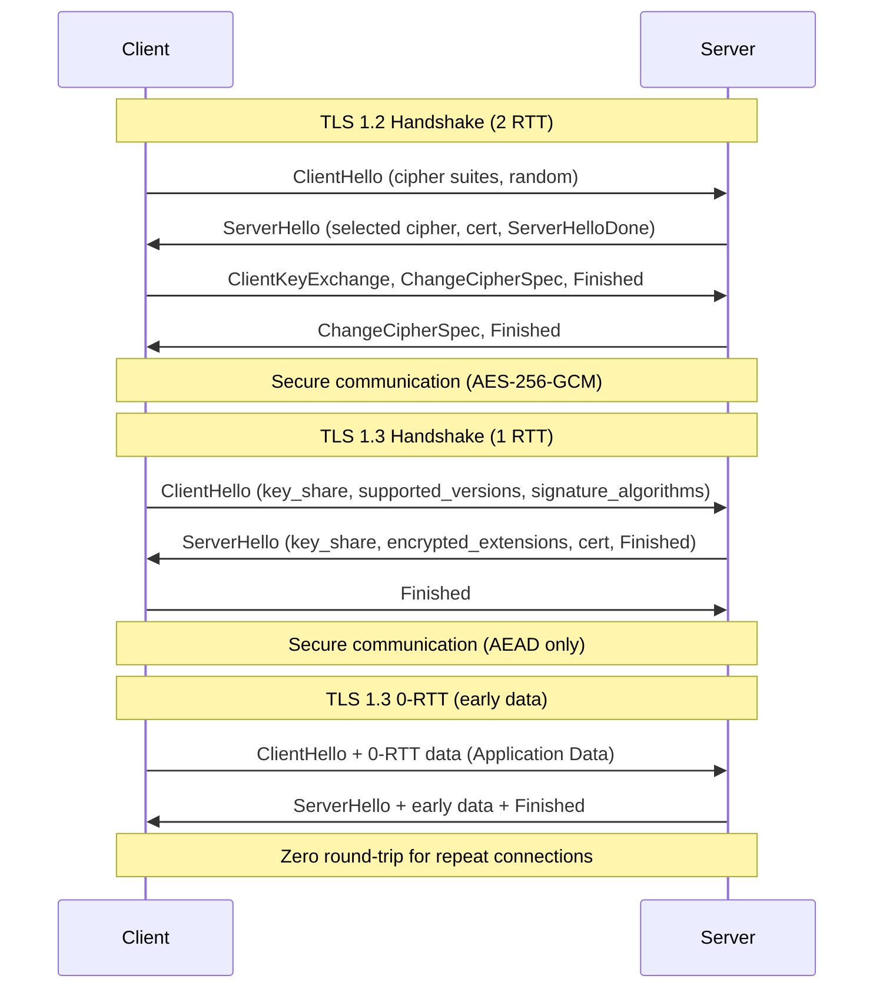
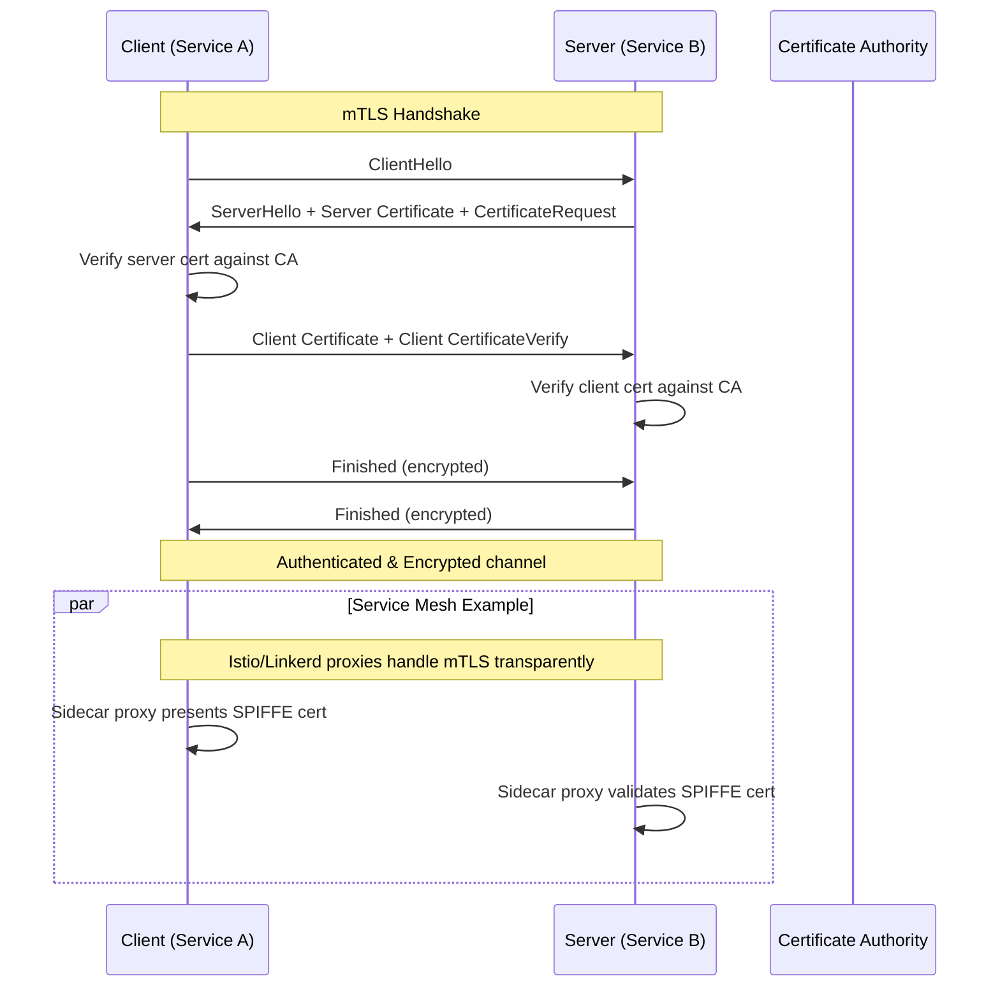

# TLS and mTLS Deep Dive

## Definition
Transport Layer Security (TLS) is a cryptographic protocol that provides secure communication over a network. Mutual TLS (mTLS) extends TLS so both client and server authenticate each other using certificates.

## TLS 1.3 Handshake (vs TLS 1.2)



## Key Differences: TLS 1.2 vs 1.3

| Feature | TLS 1.2 | TLS 1.3 |
|---------|---------|---------|
| **Handshake Round Trips** | 2 RTT (full) | 1 RTT (full), 0 RTT (resumption) |
| **Supported Cipher Suites** | Many (including weak) | AEAD only (TLS_AES_128_GCM_SHA256, TLS_AES_256_GCM_SHA384, TLS_CHACHA20_POLY1305_SHA256) |
| **Key Exchange** | RSA, DH, ECDH | (EC)DHE only (PFS mandatory) |
| **Signature Algorithms** | RSA, DSA, ECDSA | RSA, ECDSA, EdDSA |
| **Hahdshake Encryption** | After ChangeCipherSpec | Full handshake encrypted |
| **0-RTT** | Not supported | Supported (with anti-replay) |
| **Legacy/CBC Ciphers** | Supported | Removed |
| **Compression** | Supported | Removed |
| **Renegotiation** | Supported | Removed |
| **Server Name Indication (SNI)** | Plaintext | Encrypted (ECH) |

## Cipher Suites

A cipher suite defines the combination of key exchange, authentication, encryption, and MAC algorithms.

```
TLS 1.3 Format: TLS_{KEX}_{AUTH}_{AEAD}_{HASH}
Example:        TLS_AES_256_GCM_SHA384
                ├──── Len ────┤
                ├ Key Exchange: ECDHE (implicit)
                ├ Auth: ECDSA or RSA
                ├ AEAD: AES-256-GCM
                └ Hash: SHA-384

TLS 1.2 Format: TLS_{KEX_WITH_AUTH}_{AEAD}_{HASH}
Example:        TLS_ECDHE_RSA_WITH_AES_256_GCM_SHA384
```

### Preferred Cipher Suites (2026)

| Priority | Suite | Security | Performance |
|----------|-------|----------|-------------|
| 1 | TLS_AES_256_GCM_SHA384 | Very High | Good (HW-accelerated) |
| 2 | TLS_CHACHA20_POLY1305_SHA256 | Very High | Excellent (mobile without AES-NI) |
| 3 | TLS_AES_128_GCM_SHA256 | High | Best (fastest, sufficient for most) |
| 4 | TLS_ECDHE_ECDSA_WITH_AES_256_GCM_SHA384 | Very High | Good |
| 5 | TLS_ECDHE_RSA_WITH_AES_256_GCM_SHA384 | Very High | Good |

## mTLS (Mutual TLS)

In mTLS, the client also presents a certificate to the server, enabling bidirectional authentication.

```
Standard TLS:
  Server shows certificate → Client verifies
  Client is anonymous (or uses password/token)

mTLS:
  Server shows certificate → Client verifies
  Client shows certificate → Server verifies
  Both sides authenticated
```



## Certificate Chain and CA Hierarchy

```
Root CA (Offline / HSM-protected)
│
├── Intermediate CA (Signing)
│   ├── Server Certificate (leaf)
│   ├── Server Certificate
│   └── ...
│
├── Intermediate CA (Code Signing)
│   ├── Code Signing Cert
│   └── ...
│
└── Cross-Signed Root (for compatibility)
```

Chain validation:
```
Leaf Cert ──► Intermediate ──► Root (self-signed, trusted)
     │              │                │
  Subject       Issuer =        Issuer =
  = api.example.com  Intermediate   Root
                 CA             (in trust store)
```

## Certificate Pinning vs Certificate Transparency

| Aspect | Certificate Pinning | Certificate Transparency |
|--------|--------------------|-------------------------|
| **Approach** | Hard-code expected cert or public key | Public append-only logs of all issued certs |
| **Key Benefit** | Prevents MITM even if CA is compromised | Detects mis-issued certificates |
| **Operational Burden** | High (rotation breaks clients) | Low (automatic via browser) |
| **Failure Mode** | App breakage on cert rotation | Without checking, CAs can silently issue |
| **Modern Recommendation** | Avoid for web; use only for mobile apps (with failback) | Mandatory for publicly trusted TLS certs |
| **Implementation** | `public-key-pins` (deprecated HPKP), mobile `ssl_pinning` | Signed Certificate Timestamps (SCTs) |

## cert-manager on Kubernetes

```
Workflow:
  cert-manager Controller ──► Issuer/ClusterIssuer
         │                           │
         ├── Self-Signed             ├── Let's Encrypt
         ├── CA (internal)           ├── Vault
         ├── Venafi                  └── AWS PCA
         └── External (ACME)

Certificate Resource:
  apiVersion: cert-manager.io/v1
  kind: Certificate
  metadata:
    name: ingress-tls
    namespace: production
  spec:
    secretName: prod-tls
    duration: 2160h  # 90 days
    renewBefore: 360h  # 15 days
    dnsNames:
      - app.example.com
    issuerRef:
      name: letsencrypt-prod
      kind: ClusterIssuer
```

### ACME Protocol (Let's Encrypt)

```
Client                    ACME Server
  │                            │
  │── Account Registration ──>│
  │<── Account URL ───────────│
  │                            │
  │── New Order (domains) ───>│
  │<── Authorizations ────────│
  │                            │
  ├── HTTP-01 Challenge ──────┤
  │  (serve token at /.well-known/acme-challenge/)
  │    or
  ├── DNS-01 Challenge ───────┤
  │  (TXT record with token)
  │    or
  ├── TLS-ALPN-01 ────────────┤
  │  (TLS handshake response)
  │                            │
  │<── Validated ─────────────│
  │── Finalize (CSR) ────────>│
  │<── Certificate ───────────│
  │                            │
  │── Auto-renew at 30 days ──>│
```

## Interview Questions

1. What are the key differences between TLS 1.2 and TLS 1.3 handshakes?
2. How does mTLS work and when would you use it over standard TLS?
3. What is a certificate chain and how does a CA hierarchy work?
4. Compare certificate pinning and certificate transparency
5. How does cert-manager automate certificate management on Kubernetes?
6. What is the ACME protocol and how does Let's Encrypt use it?
7. What cipher suites should you prefer in 2026 for web services?
