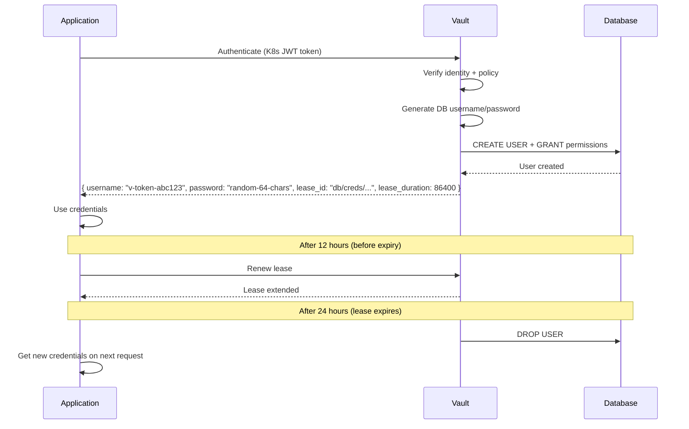

# Secrets Management

## Definition
Secrets management is the practice of securely storing, accessing, rotating, and auditing sensitive information such as API keys, database passwords, certificates, and encryption keys. Proper secrets management prevents credential leakage and enables automated, secure operations at scale.

## HashiCorp Vault Architecture

```mermaid
graph TD
    subgraph "Vault Clients"
        APP[Application]
        CI[CI/CD Pipeline]
        K8S[Kubernetes Pod]
    end
    
    subgraph "Vault Cluster"
        VAPI[Vault API<br/>Port 8200]
        
        subgraph "Auth Methods"
            TK[Token]
            K8[Kubernetes]
            LDAP[LDAP]
            JWT[OIDC/JWT]
            AWS[AWS IAM]
        end
        
        subgraph "Secret Engines"
            KV[K/V v2]
            DB[Database]
            PKI[PKI/Certificates]
            TRANS[Transit]
            AWS_SEC[AWS Secrets]
        end
        
        VAPI --> Auth{Auth Method}
        Auth -->|Authenticated| Policy[ACL Policies]
        Policy --> Secret[Secret Engine Access]
        Secret --> KV
        Secret --> DB
        Secret --> PKI
        Secret --> TRANS
        Secret --> AWS_SEC
    end
    
    subgraph "Storage Backend"
        CONSUL[Consul]
        RAFT[Raft (Integrated)]
        S3[AWS S3]
    end
    
    Vault --> CONSUL
    Vault --> RAFT
    Vault --> S3
    
    subgraph "Audit"
        LOG[Audit Log]
        SYSLOG[Syslog]
    end
    
    Vault --> LOG
    Vault --> SYSLOG
```

## Vault Key Concepts

| Concept | Description |
|---------|-------------|
| **Secret Engine** | Storage backend for secrets (K/V, database, PKI, AWS) |
| **Auth Method** | Way to authenticate to Vault (token, Kubernetes, OIDC) |
| **Policy** | ACL rules governing who can access which paths |
| **Lease** | Time-bound access to a secret with TTL and renewal |
| **Dynamic Secret** | Generated on-demand, short-lived, auto-expires |
| **Audit Device** | Logs all requests and responses for compliance |
| **Barrier** | Encryption layer protecting all stored data |

## Dynamic Secrets (Vault Database Engine)

```
Static Secret (bad):
  ├── password = "P@ssw0rd123"
  ├── stored in config files, env vars
  ├── shared across all instances
  └── never changes (or manual rotation)

Dynamic Secret (good):
  ├── Generated on demand by Vault
  ├── TTL: 24 hours (auto-expires)
  ├── Each service instance gets unique credentials
  ├── Revocation is automatic (lease expiry)
  └── Audit trail: Who requested what, when
```

### Database Credential Rotation Flow



## Cloud Secrets Manager Comparison

| Feature | AWS Secrets Manager | Azure Key Vault | GCP Secret Manager | HashiCorp Vault |
|---------|-------------------|-----------------|-------------------|-----------------|
| **Managed Rotation** | Yes (RDS, Redshift, DocumentDB) | Yes (certificates, storage keys) | No (Pub/Sub for custom rotation) | External (via Vault agent) |
| **Dynamic Secrets** | No | No | No | Yes (database, cloud IAM) |
| **Encryption** | KMS (CMK) | HSM-backed | CMEK (Cloud KMS) | Integrated or external HSM |
| **Audit** | CloudTrail | Azure Monitor | Cloud Audit Logs | Audit devices |
| **Replication** | Multi-Region replicas | Geo-redundant | Multi-region | Active/DR cluster |
| **Pricing** | $0.40/secret/month + API calls | $0.03/10K operations | $0.06/secret/month + operations | Open-source (free) |
| **Secret Size** | 64KB | 25KB | 64KB | 32KB (1MB with config) |
| **Open Source** | No | No | No | Yes (Community Edition) |

## Kubernetes Secrets Management

### External Secrets Operator

```
Kubernetes                 External Secrets Operator           Backend
    │                              │                              │
    ┌──────────────────────────────┴──────────────────────────────┐
    │                                                             │
 ExternalSecret                                                    │
  (CRD)                                                           │
    │                                                             │
    ├── spec.refreshInterval: 1h                                  │
    ├── spec.secretStoreRef: aws-secrets-store                    │
    └── spec.data:                                                │
          - secretKey: db_password                                │
            remoteRef:                                            │
              key: /production/db/password                        │
                                                                │
    │                              │                              │
    │                              ├── Fetch from AWS Secrets      │
    │                              ├── Create/Update K8s Secret    │
    │                              └── Controller sync loop       │
    │                                                             │
    └── Kubernetes Secret (auto-created) ──────────► Pod mounts
```

### Sealed Secrets

```
Workflow:
  1. Developer creates SealedSecret CRD (encrypted, safe in Git)
  2. Sealed Secrets controller decrypts using cluster key
  3. Controller creates regular Kubernetes Secret

  # Encrypt (CLI):
  kubeseal --controller-name sealed-secrets \
    --controller-namespace kube-system \
    < secret.yaml > sealedsecret.yaml  # Safe to commit

  # Decrypt happens only in-cluster (controller has private key)
```

| Approach | Pros | Cons |
|----------|------|------|
| **External Secrets Operator** | GitOps-friendly, real-time sync, multi-backend | Adds CRD dependency, external connection required |
| **Sealed Secrets** | Git-native, works offline, simple | No rotation without CI, single-key risk |
| **Vault CSI Provider** | Dynamic secrets, leases, no K8s Secret object | Vault dependency, more complex |
| **AWS Secrets Store CSI** | IAM integration, rotation provider | AWS-specific, per-pod mount |

## Secrets Rotation Strategies

| Strategy | Description | Downtime | Complexity |
|----------|-------------|----------|------------|
| **Dual Credentials** | Two valid credentials during rotation window | None | Medium |
| **Blue/Green** | Rotate one side while other serves | None | High |
| **Graceful Expiry** | Allow old credentials for a grace period | None | Low (unless near expiry) |
| **Rolling Restart** | Rotate + restart instances one by one | Minimal | Low |
| **Hot Reload** | Application reloads secrets without restart | Zero | Medium (watch file, SIGHUP) |

### Dual Credential Pattern

```
Phase 1:  { primary: v1, secondary: v1 }  (current)
Phase 2:  { primary: v2, secondary: v1 }  (rotate primary, old backup)
Phase 3:  { primary: v2, secondary: v2 }  (rotate secondary, wait for all services to pick up)
Phase 4:  { primary: v2, secondary: v2 }  (old v1 fully deprecated)
```

## Best Practices

```
DO:
  ├── Use dynamic, short-lived secrets where possible
  ├── Rotate static secrets regularly (minimum 90 days)
  ├── Store secrets in memory, never on disk
  ├── Use a dedicated secrets backend (Vault, cloud-native)
  ├── Implement least-privilege access to secrets
  ├── Enable audit logging for all secret access
  ├── Encrypt secrets both in transit (TLS) and at rest
  ├── Use dual credentials during rotation for zero-downtime
  └── Automate rotation with CI/CD pipelines

DON'T:
  ├── Store secrets in environment variables (process env is readable)
  ├── Commit secrets to version control
  ├── Share secrets via chat, email, or ticketing systems
  ├── Use the same secret across environments
  ├── Log secrets (even masked)
  ├── Hardcode default passwords
  └── Expose secrets in error messages
```

## Interview Questions

1. How does HashiCorp Vault's architecture work (auth methods, secret engines, audit)?
2. What are dynamic secrets and why are they more secure than static ones?
3. Compare AWS Secrets Manager, Azure Key Vault, GCP Secret Manager, and HashiCorp Vault
4. How does External Secrets Operator work on Kubernetes?
5. What is the difference between Sealed Secrets and External Secrets Operator?
6. Describe a rotation strategy that achieves zero downtime
7. What are the anti-patterns for secrets management?
