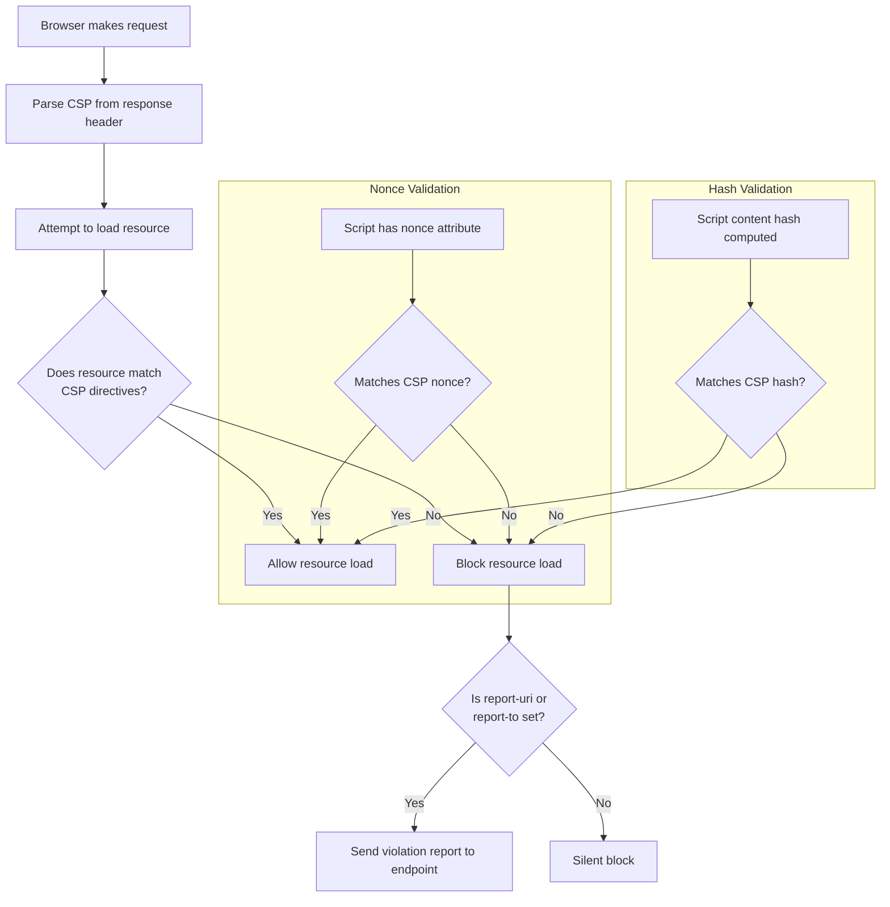

# Security Headers and CSP

## Definition
Security headers are HTTP response headers that instruct browsers and clients how to behave regarding security policies. They provide defense-in-depth by enabling browser-side protections against common attack vectors like XSS, clickjacking, data exfiltration, and protocol downgrade attacks.

## Content Security Policy (CSP)

CSP is a security standard that helps prevent XSS and data injection attacks by specifying which content sources are allowed to be loaded and executed by the browser.

### CSP Directives

| Directive | Controls | Example |
|-----------|----------|---------|
| `default-src` | Fallback for all resource types | `default-src 'self'` |
| `script-src` | Allowed JavaScript sources | `script-src 'self' https://cdn.example.com` |
| `style-src` | Allowed CSS sources | `style-src 'self' 'unsafe-inline'` |
| `img-src` | Allowed image sources | `img-src 'self' data: https://*.cloudfront.net` |
| `connect-src` | Allowed XHR/WebSocket/fetch targets | `connect-src 'self' https://api.example.com` |
| `frame-src` | Allowed frame/iframe sources | `frame-src 'none'` |
| `frame-ancestors` | Who can embed the page in a frame | `frame-ancestors 'none'` |
| `object-src` | Allowed plugin sources (Flash, Java) | `object-src 'none'` |
| `font-src` | Allowed font sources | `font-src 'self' https://fonts.gstatic.com` |
| `base-uri` | Allowed `<base>` tag URIs | `base-uri 'self'` |
| `form-action` | Allowed form submission endpoints | `form-action 'self'` |
| `report-uri` / `report-to` | Where to send violation reports | `report-uri /csp-violation` |

### CSP Strict Policy (Recommended)

```
# Level 1: Initial (nonce-based, strict)
Content-Security-Policy:
  default-src 'self';
  script-src 'nonce-{random}' 'strict-dynamic';
  style-src 'self' 'unsafe-inline';
  img-src 'self' data:;
  object-src 'none';
  base-uri 'self';
  form-action 'self';
  frame-ancestors 'none';
  block-all-mixed-content;
  upgrade-insecure-requests;

# Level 2: Locked down for high-security apps
Content-Security-Policy:
  default-src 'none';
  script-src 'nonce-{random}' 'strict-dynamic' https:;
  style-src 'self';
  img-src 'self';
  connect-src 'self';
  font-src 'self';
  object-src 'none';
  base-uri 'none';
  form-action 'self';
  frame-ancestors 'none';
```

### CSP Evaluation Flow



### Nonce vs Hash

| Method | Description | When to Use |
|--------|-------------|-------------|
| **Nonce** | Random token per request, set in CSP header and script tag | Dynamic scripts, SPA frameworks (React, Vue, Angular) |
| **Hash** | SHA hash of inline script content | Static inline scripts, analytics snippets |
| **Strict-Dynamic** | Scripts loaded by trusted scripts are also trusted | Modern web apps with many dynamic script loads |

## HTTP Strict Transport Security (HSTS)

```
Strict-Transport-Security: max-age=63072000; includeSubDomains; preload

Parameters:
- max-age: Seconds to remember HTTPS-only (2 years recommended)
- includeSubDomains: Apply to all subdomains
- preload: Allow inclusion in browser preload lists

Preload List:
  Submit domain to https://hstspreload.org
  Chrome, Firefox, Safari, Edge use this list
  Once preloaded, cannot be removed easily (permanent)
```

## X-Frame-Options

```
# Deny: Cannot be embedded in any frame
X-Frame-Options: DENY

# SameOrigin: Can only be embedded on same origin
X-Frame-Options: SAMEORIGIN

# Note: CSP frame-ancestors replaces this in modern browsers
# Prefer: Content-Security-Policy: frame-ancestors 'none'
```

## X-Content-Type-Options

```
# Prevents MIME type sniffing (browser trying to guess content type)
X-Content-Type-Options: nosniff

# Without this, a browser might execute a .jpg as JavaScript if
# Content-Type header is missing or misleading
```

## Referrer-Policy

```
# Recommended: strict-origin-when-cross-origin
Referrer-Policy: strict-origin-when-cross-origin

Policy Options:
  Policy                        | Cross-Origin Referrer
  ──────────────────────────────┼─────────────────────
  no-referrer                   | (none)
  same-origin                   | (none)
  origin                        | https://example.com
  strict-origin                 | https://example.com (HTTPS→HTTPS only)
  unsafe-url                    | https://example.com/path?query
  no-referrer-when-downgrade    | Full URL (HTTPS→HTTPS), none (HTTPS→HTTP)
  strict-origin-when-cross-origin | Full (same), Origin (cross HTTPS)
  origin-when-cross-origin      | Full (same), Origin (cross)
```

## Permissions-Policy (formerly Feature-Policy)

```
# Restrict browser features
Permissions-Policy:
  camera=(),
  microphone=(),
  geolocation=(self),
  payment=(),
  fullscreen=(self),
  accelerometer=(),
  gyroscope=(),
  magnetometer=(),
  usb=(),
  autoplay=(self)

# Format: feature=(allowlist)
# () = none, * = all, (self) = same origin
# https://example.com = specific origin
```

## Subresource Integrity (SRI)

```html
<!-- Without SRI: CDN script could be compromised -->
<script src="https://cdn.example.com/react.production.min.js"></script>

<!-- With SRI: Browser verifies hash before executing -->
<script 
  src="https://cdn.example.com/react.production.min.js"
  integrity="sha384-oqVuAfXRKap7fdgcCY5uykM6+R9GqQ8K/uxy9rx7HNQlGYl1kPzQho1wx4JwY8wC"
  crossorigin="anonymous">
</script>
```

## CORS Configuration Best Practices

```
# Strict (production)
Access-Control-Allow-Origin: https://app.example.com
Access-Control-Allow-Methods: GET, POST, PUT, DELETE, OPTIONS
Access-Control-Allow-Headers: Content-Type, Authorization, X-Requested-With
Access-Control-Allow-Credentials: true
Access-Control-Max-Age: 86400
Access-Control-Expose-Headers: X-Request-Id

# Never allow * with credentials
# Never allow * in production (specific origin only)
# Validate Origin header server-side (not just reflect it)
# Use Vary: Origin header when dynamically setting Allow-Origin

DANGEROUS PATTERNS:
  Access-Control-Allow-Origin: *           # Allows any site (unless no credentials)
  Access-Control-Allow-Origin: null        # Allows sandboxed iframes
  Reflecting Origin header unvalidated     # Attacker can add any origin
  Using * with credentials                 # Invalid, but confusing intent
  Allowing all methods/headers             # Overly permissive
```

## Security Headers Checklist

```
HEADER                            VALUE                                    REQUIRED  RECOMMENDED
───────────────────────────────── ──────────────────────────────────────── ───────── ───────────
Content-Security-Policy           See strict policy above                  ✅ Yes     ✅ Yes
Strict-Transport-Security         max-age=63072000; includeSubDomains     ✅ Yes     ✅ Yes
X-Content-Type-Options            nosniff                                 ✅ Yes     ✅ Yes
X-Frame-Options                   DENY                                    ✅ Yes     ✅ Yes
Referrer-Policy                   strict-origin-when-cross-origin          ❌ No     ✅ Yes
Permissions-Policy                Feature restrictions                     ❌ No     ✅ Yes
Access-Control-Allow-Origin       Specific origin                          ❌ No     ✅ Yes (if API)
Cross-Origin-Resource-Policy      same-site                                ❌ No     ✅ Yes
Cross-Origin-Opener-Policy        same-origin                              ❌ No     ✅ Yes
Cross-Origin-Embedder-Policy      require-corp                             ❌ No     ❌ (requires COEP)
X-Permitted-Cross-Domain-Policies none-only                                ❌ No     ✅ (legacy flash)

# Example nginx configuration:
add_header Content-Security-Policy "default-src 'self'; script-src 'nonce-${request_id}' 'strict-dynamic'; object-src 'none'; base-uri 'self';" always;
add_header Strict-Transport-Security "max-age=63072000; includeSubDomains; preload" always;
add_header X-Content-Type-Options nosniff always;
add_header X-Frame-Options DENY always;
add_header Referrer-Policy "strict-origin-when-cross-origin" always;
add_header Permissions-Policy "camera=(), microphone=(), geolocation=(self), payment=()" always;
```

## Interview Questions

1. How does Content Security Policy prevent XSS attacks?
2. What is the difference between a CSP nonce and a CSP hash?
3. How does HSTS work and what does the preload directive do?
4. What security headers should every production website include?
5. How does CORS differ from CSP in what they protect?
6. What is Subresource Integrity and when would you use it?
7. Design a CSP policy for a modern single-page application
