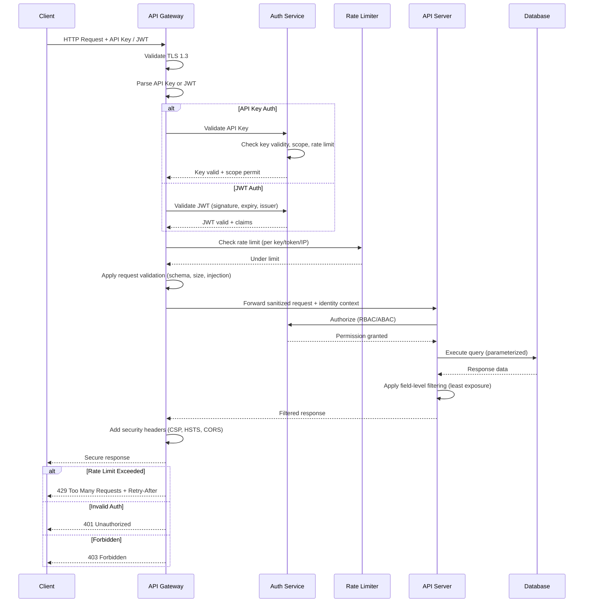
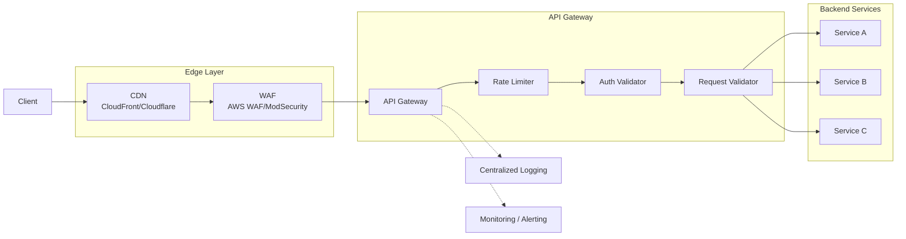

# API Security

## Definition
API security encompasses the practices, tools, and policies used to protect APIs from attacks and unauthorized access. As APIs become the primary interface for applications, securing them against threats like injection, broken authentication, excessive data exposure, and DDoS is critical.

## Secure API Request Flow



## API Key Management

| Aspect | Best Practice |
|--------|--------------|
| **Generation** | Cryptographically random (at least 32 bytes, base64 encoded) |
| **Storage** | Hashed (bcrypt/argon2) with raw key shown once to user |
| **Rotation** | Support multiple valid keys per user during rotation window |
| **Rate Limiting** | Per-key limits with burst allowance |
| **Scoping** | Each key scoped to specific API operations |
| **Revocation** | Immediate invalidation, propagated within seconds |
| **Audit** | Log every API call with key identifier (not value) |

### API Key Generation

```python
import secrets, hashlib, base64

def generate_api_key():
    # Generate 32 random bytes
    raw_key = secrets.token_bytes(32)
    # Encode as base64 for user-facing key
    api_key = base64.b64encode(raw_key).decode('utf-8')
    # Store the hash
    key_hash = hashlib.sha256(raw_key).hexdigest()
    # Store key_hash, return api_key (shown once)
    return f"sk_{api_key}", key_hash

# Result: sk_aGVsbG8gd29ybGQgdGhpcyBpcyBhIHRlc3Q...
# Stored: sha256(raw_key)
```

## JWT Validation Best Practices

### Algorithm Enforcement

```python
# VULNERABLE: Accepts algorithm from token header
jwt.decode(token, key_input, algorithms=None)

# SECURE: Explicitly restrict to expected algorithms
jwt.decode(
    token,
    public_key,
    algorithms=["RS256"],
    issuer="https://auth.example.com",
    audience="api.example.com",
    options={
        "verify_signature": True,
        "verify_exp": True,
        "verify_iat": True,
        "verify_iss": True,
        "verify_aud": True,
    }
)
```

### Kid Injection Prevention

```
Attack: If the library looks up the key by "kid" header
  and kid is tainted, attacker can point to a file or
  controlled URL.

Vulnerable flow:
  1. Token header: { "alg": "HS256", "kid": "../../public/keys/weak.key" }
  2. Library loads key from attacker-controlled path
  3. Signs with HS256 using known public key
  4. Server accepts forged token

Prevention:
  - Always validate alg against an allowlist (never "none")
  - Never derive trust from kid alone
  - Use a dedicated JWKS endpoint with key validation
  - Implement key ID pinning (only known kid values)
```

### Required JWT Validation Steps

| Check | Description | Prevention |
|-------|-------------|------------|
| **Signature** | Verify token is signed by trusted issuer | Token forgery |
| **Algorithm** | Ensure alg matches expected (reject `none`, `HS256` with RSA keys) | Alg confusion, none attack |
| **Expiration (exp)** | Token is not expired | Replay of expired tokens |
| **Issuer (iss)** | Token originated from expected issuer | Cross-tenant token reuse |
| **Audience (aud)** | Token is intended for this service | Token misuse across services |
| **Not Before (nbf)** | Token is not used before its valid time | Future-dated token abuse |
| **Issued At (iat)** | Token was issued within acceptable timeframe | Stale token acceptance |
| **Key ID (kid)** | Valid kid, not attacker-controlled | Kid injection |

## OAuth 2.0 Scopes and Audience

```
Scope Format:  {resource}:{action}
Examples:
  - users:read        (read user profiles)
  - users:write       (modify user profiles)
  - payments:read     (view payment history)
  - payments:write    (create payments)
  - admin:all         (full administrative access)

Audience: Identifies which service/API the token is for
  - aud: https://api.example.com
  - Token issued for one audience should not work for another

Least privilege:
  - Request minimal scopes needed
  - User must consent to each scope
  - API validates both scope AND audience
```

## GraphQL Security

| Threat | Description | Mitigation |
|--------|-------------|------------|
| **Depth Limiting** | Deeply nested queries crash the server | Limit max query depth (default 5-7) |
| **Query Cost Analysis** | Expensive queries (many fields, many objects) cause DoS | Assign cost per field, reject queries above limit |
| **Rate Limiting** | Unlimited queries overwhelm resolvers | Rate limit per user/token/IP |
| **Batching Attacks** | DDoS via many queries in one request | Limit batch size, require unique operations |
| **Introspection Abuse** | Attackers discover entire schema | Disable introspection in production |
| **Field Suggestion** | Typed field names help attackers guess | Disable suggestion in production |
| **Auth at Resolver Level** | Some fields exposed without auth | Auth in every resolver, not just entry point |

### GraphQL Query Cost Analysis

```graphql
# Field costs:
# Query: token = 1, users:list = 2, user:profile = 3, email = 1, posts = 3

# Dangerous query (cost = 1 + 2 + 10*3 + 10*3*2 = 87)
query Dangerous {
  token  # cost: 1
  users(first: 10) {  # cost: 2
    profile {  # cost: 3 * 10 = 30
      email  # cost: 1 * 10 = 10
    }
    posts(first: 5) {  # cost: 3 * 10 = 30
      title  # cost: 2 * 10 = 20
    }
  }
}

# Safe config:
# Max query cost: 100
# Max depth: 5
# Max aliases: 10
# Query timeout: 5s
```

## API Gateway Security Patterns



## Real-World API Security Examples

| Company | API Security Approach |
|---------|----------------------|
| **Stripe API** | Idempotency keys, signed webhooks, API key per environment, granular scopes (read, write, w+write), PCI DSS compliant |
| **GitHub API** | Personal access tokens with fine-grained scopes, OAuth App tokens, signed webhooks, rate limiting per token/resource, audit log |
| **Twilio API** | Account SID + Auth Token, subaccount isolation, webhook signature validation (Twilio-Signature), per-function API keys |
| **Google APIs** | OAuth 2.0 with scopes, API key restriction (HTTP referrer, IP), quota per project, API console with usage monitoring |
| **AWS APIs** | IAM with ABAC, SigV4 signing, STS temporary credentials, resource-based policies, CloudTrail audit of all API calls |

## Webhook Security

```
Webhook Receiver Best Practices:
  1. Validate webhook signature on every request
  2. Use unique secrets per webhook endpoint
  3. Replay protection (timestamp + nonce check)
  4. IP allowlisting where possible
  5. Use a dedicated endpoint URL per source
  6. Respond quickly (200 OK, then process async)
  7. Log all webhook requests with signature verification result

# Example: Stripe webhook signature validation
stripe.Webhook.construct_event(
    payload=request.body,
    sig_header=request.headers['Stripe-Signature'],
    endpoint_secret='whsec_...'
)
```

## Interview Questions

1. How would you design an API key management system with rotation and revocation?
2. What JWT attacks exist and how do you prevent each one?
3. How do you secure a GraphQL API against abuse?
4. What is the role of an API Gateway in security?
5. How do OAuth 2.0 scopes and audience claims prevent token misuse?
6. Compare Stripe, GitHub, and Twilio API security approaches
7. How do you validate incoming webhooks securely?
