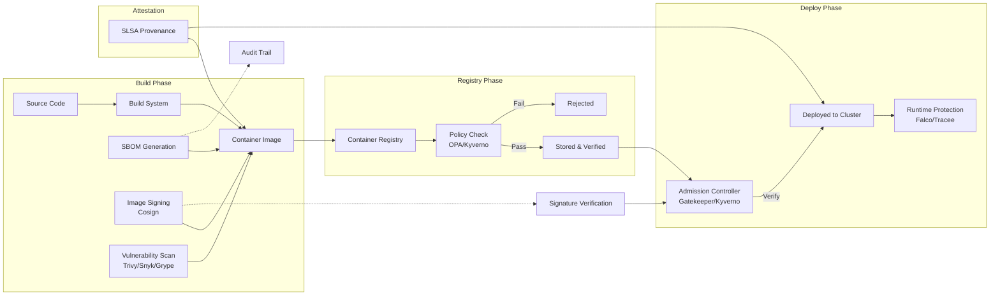

# Container Security

## Definition
Container security encompasses the practices, tools, and policies for securing containerized applications throughout the entire lifecycle — from image creation and registry storage to deployment and runtime. It addresses vulnerabilities, misconfigurations, and supply chain risks unique to container environments.

## Container Supply Chain Security



## Image Scanning

| Tool | Type | Key Features | Integration |
|------|------|-------------|-------------|
| **Trivy** | Open-Source | Fast, comprehensive DB, multi-language deps, IaC scanning | CI/CD, Kubernetes |
| **Snyk** | Commercial | Developer-first, fix PRs, priority scoring | IDE, GitHub, CI/CD |
| **Grype** | Open-Source | Anchore ecosystem, Syft SBOM integration | CLI, GitHub Actions |
| **Clair** | Open-Source | Registry-integrated, API-first | Quay, CoreOS |
| **Anchore** | Open-Source + Enterprise | Deep policy engine, provenance tracking | CI/CD, Kubernetes |
| **Docker Scout** | Built-in | Docker Desktop integration, CVE to fix mapping | Docker CLI, Hub |

### Vulnerability Severity

```
Critical:    Remote code execution, auth bypass
High:       Data access, privilege escalation
Medium:     Limited exploitation, requires conditions
Low:        Minimal impact, hard to exploit

Policy:
  - Block: ANY Critical or High vulnerability
  - Warn: Medium vulnerabilities
  - Allow: Low or none
```

## Dockerfile Best Practices

```dockerfile
# 1. Use minimal, distroless base images
FROM golang:1.22 AS builder
WORKDIR /app
COPY go.mod go.sum ./
RUN go mod download
COPY . .
RUN CGO_ENABLED=0 GOOS=linux go build -o /app/server

# Distroless: no shell, no package manager, minimal attack surface
FROM gcr.io/distroless/static-debian12:nonroot AS runtime
COPY --from=builder /app/server /server

# 2. Use non-root user
USER 65532:65532

# 3. Set metadata
LABEL org.opencontainers.image.source="https://github.com/org/repo"
LABEL org.opencontainers.image.version="1.0.0"

# 4. Health check
HEALTHCHECK --interval=30s --timeout=3s --start-period=5s --retries=3 \
  CMD ["/server", "health"]

# 5. Use explicit EXPOSE
EXPOSE 8080

# 6. Use exec form of ENTRYPOINT
ENTRYPOINT ["/server"]
CMD ["serve"]
```

### Dockerfile Anti-Patterns

```
BAD:
  FROM ubuntu:latest          # Latest = unpredictable
  RUN apt-get update           # Cache layers, stale packages
  USER root                    # Container runs as root
  COPY . .                     # Copies secrets, .env, .git
  CMD node server.js           # Shell form (no PID 1 signal handling)
  /bin/bash -c "..."           # Shell in final image (attack surface)

GOOD:
  FROM node:22-alpine          # Specific version, minimal
  COPY package*.json ./        # Dependency layer first
  USER node                    # Non-root user
  COPY --chown=node:node . .   # Proper ownership
  HEALTHCHECK --interval=30s   # Health monitoring
  CMD ["node", "server.js"]    # Exec form
```

## Pod Security Standards (Kubernetes)

| Standard | Description | Example Restrictions |
|----------|-------------|---------------------|
| **Privileged** | Unrestricted, least secure | No constraints (legacy/system pods) |
| **Baseline** | Minimal restrictions, prevents known escalations | No privileged containers, no hostPID, no hostNetwork, no hostPath |
| **Restricted** | Hardened, follows Pod Security best practices | All Baseline + readOnlyRootFilesystem, non-root user, seccomp default |

### Restricted Pod Example

```yaml
apiVersion: v1
kind: Pod
metadata:
  name: secure-pod
  labels:
    pod-security.kubernetes.io/enforce: restricted
spec:
  securityContext:
    seccompProfile:
      type: RuntimeDefault
    runAsNonRoot: true
    runAsUser: 1000
    fsGroup: 1000
  containers:
  - name: app
    image: myapp:1.0.0
    securityContext:
      allowPrivilegeEscalation: false
      capabilities:
        drop: ["ALL"]
      readOnlyRootFilesystem: true
      runAsNonRoot: true
    resources:
      limits:
        memory: "512Mi"
        cpu: "500m"
```

## Admission Controllers

### OPA/Gatekeeper

```
OPA/Gatekeeper enforces policies at admission time using Rego language.
It prevents pods from being created if they violate policies.

Example Policy (Rego):
  package k8srestricted
  
  violation[{"msg": msg}] {
    container := input.review.object.spec.containers[_]
    not container.securityContext.runAsNonRoot
    msg := "Containers must run as non-root"
  }

Example Constraint:
  apiVersion: constraints.gatekeeper.sh/v1beta1
  kind: K8sRequiredLabels
  metadata:
    name: require-team-label
  spec:
    match:
      kinds:
        - apiGroups: [""]
          kinds: ["Namespace"]
    parameters:
      labels: ["team", "owner", "environment"]
```

### Kyverno

```yaml
# Kyverno uses Kubernetes-native YAML policies (no Rego)
apiVersion: kyverno.io/v1
kind: ClusterPolicy
metadata:
  name: require-non-root
spec:
  validationFailureAction: Enforce
  rules:
  - name: check-run-as-non-root
    match:
      any:
      - resources:
          kinds:
          - Pod
    validate:
      message: "Containers must run as non-root user"
      pattern:
        spec:
          securityContext:
            runAsNonRoot: true
          containers:
          - securityContext:
              runAsNonRoot: true
```

## Runtime Security

### Falco

Falco monitors system calls and detects anomalous behavior in containers.

```
Rules:
  - Shell spawned in container (possible compromise)
  - Unexpected outbound network connections
  - Privilege escalation attempts
  - Sensitive file reads (/etc/shadow, /var/run/secrets)
  - Write to /etc or system binaries

Example Rule:
  - rule: Terminal shell in container
    desc: A shell was spawned in a container
    condition: >
      spawned_process and
      container and
      shell_procs and
      not user_expected_shells
    output: >
      Shell spawned in container
      (user=%user.name container=%container.name shell=%proc.name)
    priority: WARNING
    tags: [container, shell, mitre_execution]
```

### Tracee

Tracee uses eBPF to trace system events at the kernel level with low overhead.

```
Capabilities:
  - New executable detection
  - Fileless execution (memfd_create)
  - Kernel module loading
  - Dynamic code loading
  - Container breakout detection
  - Privilege escalation via setuid/setcap
```

## SBOM, SLSA, and Supply Chain Security

| Standard | Description | Key Requirements |
|----------|-------------|------------------|
| **SBOM (CycloneDX)** | Bill of materials: all components and dependencies | Complete dependency tree, hashes, licenses |
| **SLSA (Supply-chain Levels for Software Artifacts)** | Security framework for software supply chain | Build integrity, provenance, hermetic builds |
| **Cosign** | Container image signing and verification | Signatures stored in OCI registry, keyless (Sigstore) |
| **in-toto** | Framework to secure software supply chain integrity | Step-by-step attestation of build pipeline |

### SBOM Generation

```bash
# Syft generates SBOM
syft my-image:latest -o cyclonedx-json > sbom.cyclonedx.json

# Trivy generates SBOM
trivy image --format cyclonedx -o sbom.json my-image:latest

# Verify with Cosign (keyless)
cosign verify my-image:latest \
  --certificate-identity-regexp "@example.com" \
  --certificate-oidc-issuer https://accounts.google.com
```

## Real-World Tools

| Company / Project | Area | Description |
|-------------------|------|-------------|
| **Chainguard** | Images | Distroless, minimal, CVE-free base images (Wolfi OS) |
| **Anchore** | Scanning | Enterprise container scanning and policy engine |
| **Aqua Security** | Runtime | Container runtime protection, drift prevention |
| **Sigstore** | Signing | Open-source signing service (Cosign, Fulcio, Rekor) |
| **ControlPlane** | Policy | Gatekeeper-based policy engine for regulated industries |
| **Docker Scout** | Analysis | Docker-native vulnerability analysis and remediation |

## Container Security Maturity Model

```
Level 1: Basic
  - Pull images from public registries without verification
  - Run containers as root
  - No vulnerability scanning

Level 2: Foundational
  - Scan images in CI/CD (Trivy/Snyk)
  - Use non-root user in Dockerfile
  - Pin base image versions

Level 3: Advanced
  - Admission control (Kyverno/Gatekeeper)
  - Pod Security Standards (Restricted)
  - Image signing (Cosign)
  - SBOM generation and storage

Level 4: Proactive
  - Runtime security (Falco/Tracee)
  - SLSA build level 3+
  - Automated policy enforcement
  - Continuous vulnerability monitoring

Level 5: Zero-Trust
  - Full supply chain attestation
  - Just-in-time container access
  - Automated incident response
  - Hardware-enforced isolation (gVisor/Firecracker)
```

## Interview Questions

1. How do you secure a container image from build to production?
2. What is the difference between image scanning and runtime security?
3. How do Pod Security Standards (Privileged, Baseline, Restricted) differ?
4. What is SLSA and why is it important for supply chain security?
5. How do OPA/Gatekeeper and Kyverno enforce security policies?
6. What tools exist for container runtime security (Falco, Tracee)?
7. How would you design a secure container supply chain with SBOM, signing, and attestation?
