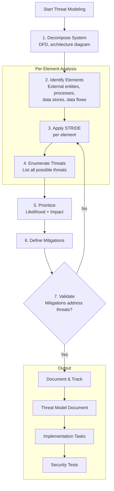
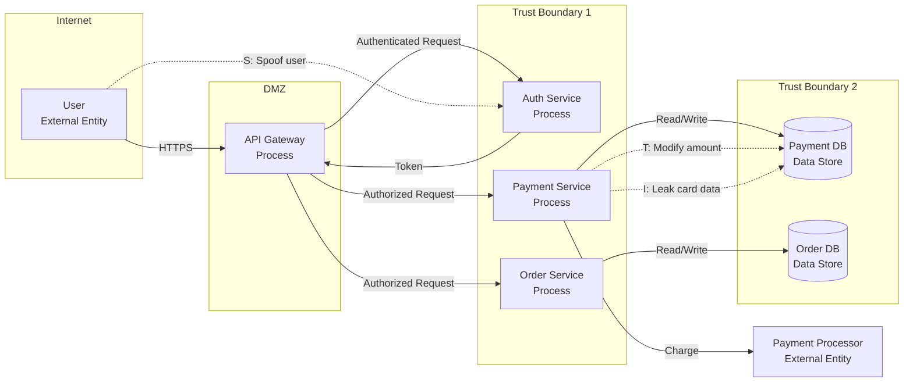

# Threat Modeling

## Definition
Threat modeling is a structured approach to identifying, quantifying, and addressing security risks in a system. It involves understanding the system, identifying threats, and defining mitigations before vulnerabilities are exploited in production. Threat modeling is most effective when performed during the design phase.

## STRIDE per Element

STRIDE is a Microsoft-developed threat classification framework. Each threat type is evaluated per system element (component, data store, data flow, trust boundary).

| Threat | Definition | Example | Mitigation |
|--------|------------|---------|------------|
| **Spoofing** | Impersonating someone or something else | Attacker pretends to be a valid user | Authentication, mTLS, API keys |
| **Tampering** | Malicious modification of data | Attacker modifies a request in transit | Integrity checks, signing, TLS |
| **Repudiation** | Denying having performed an action | User claims they did not make a transaction | Audit logs, digital signatures |
| **Information Disclosure** | Exposing data to unauthorized parties | Database exposed via SQL injection | Encryption, access control, input validation |
| **Denial of Service** | Making system unavailable | Overwhelming an API with requests | Rate limiting, auto-scaling, WAF |
| **Elevation of Privilege** | Gaining higher permissions than authorized | Regular user becomes admin | RBAC, principle of least privilege |

### STRIDE per Element Matrix

```
Element Type         | S    T    R    I    D    E
─────────────────────┼──────────────────────────────
External Entity      | Yes  No   Yes  No   No   No
Process              | Yes  Yes  Yes  Yes  Yes  Yes
Data Store           | No   Yes  Yes  Yes  Yes  No
Data Flow            | Yes  Yes  Yes  Yes  No   No
Trust Boundary       | —    —    —    —    —    —  (crossing triggers threats)

Example — Payment Service:
  User (External Entity):
    S: Attacker impersonates user → Mitigation: MFA
    R: User denies purchase → Mitigation: audit log with intent proof
  
  Payment Process:
    S: Service impersonates another service → Mitigation: mTLS
    T: Transaction modified → Mitigation: request signing
    I: Transaction data leaked → Mitigation: encryption
    D: Payment service overwhelmed → Mitigation: rate limiting
    E: Attacker escalates to admin → Mitigation: RBAC
  
  Database (Data Store):
    T: Records modified → Mitigation: database audit
    I: Records leaked → Mitigation: encryption at rest
    D: Connect pool exhausted → Mitigation: connection limits
```

### STRIDE Threat Modeling Process



## Data Flow Diagrams (DFDs)

DFDs are the foundation of threat modeling. They map how data moves through the system.

### DFD Notation

```
External Entity (User, External Service):
  ┌──────────┐
  │   User   │
  └──────────┘

Process (Your service):
  ┌──────────┐
  │  Auth    │
  │  Service │
  └──────────┘

Data Store (Database, Cache):
  ┌──────────┐
  │ DB (PII) │
  └──────────┘

Data Flow (Direction of data movement):
  ────────►

Trust Boundary (Network zone change):
  ════════════
```

### Example DFD — Payment System



## Threat Trees and Attack Trees

### Threat Tree Example — SQL Injection

```
SQL Injection
├── User input not sanitized
│   ├── String concatenation in SQL query
│   ├── Dynamic queries without parameterization
│   └── ORM misconfiguration
├── Error messages reveal schema
│   ├── Verbose database errors in response
│   └── Stack traces exposed to users
├── Input validation bypass
│   ├── Encoding tricks (URL, Unicode)
│   ├── Second-order injection (stored XSS → later use)
│   └── WAF bypass techniques
└── Out-of-band exfiltration
    ├── DNS exfiltration
    ├── HTTP request to attacker server
    └── Time-based inference
```

### Attack Tree Example — Payment System

```
Goal: Steal Payment Data
├── 1. Intercept data in transit
│   ├── 1.1 MITM on TLS connection [Cost: High, Likelihood: Low]
│   └── 1.2 Read from network tap [Cost: High, Likelihood: Low]
├── 2. Access database directly
│   ├── 2.1 SQL Injection [Cost: Medium, Likelihood: Medium]
│   ├── 2.2 Stolen DB credentials [Cost: Medium, Likelihood: Low]
│   └── 2.3 Backup exposure [Cost: Low, Likelihood: Medium]
├── 3. Abuse API
│   ├── 3.1 IDOR on payment endpoint [Cost: Low, Likelihood: High]
│   ├── 3.2 Weak auth bypass [Cost: Low, Likelihood: Medium]
│   └── 3.3 Replay attack [Cost: Low, Likelihood: Medium]
└── 4. Compromise admin account
    ├── 4.1 Phishing [Cost: Low, Likelihood: High]
    ├── 4.2 Session hijacking [Cost: Medium, Likelihood: Medium]
    └── 4.3 Credential stuffing [Cost: Low, Likelihood: Medium]
```

## PASTA Methodology (7 Stages)

PASTA (Process for Attack Simulation and Threat Analysis) is a risk-centric threat modeling methodology.

| Stage | Name | Activity | Output |
|-------|------|----------|--------|
| **I** | Define Objectives | Business context, compliance requirements, security goals | Security requirements checklist |
| **II** | Define Technical Scope | Application architecture, APIs, data flows, technologies used | Technical scope diagram |
| **III** | Application Decomposition | DFDs, trust boundaries, asset identification | DFD with trust boundaries |
| **IV** | Threat Analysis | STRIDE per element, attack surface enumeration | Threat list with STRIDE categories |
| **V** | Vulnerability Analysis | Map threats to vulnerabilities, research CVEs | Vulnerability mapping |
| **VI** | Attack Modeling | Attack trees, attack scenarios, exploit analysis | Attack trees with likelihood/cost |
| **VII** | Risk & Impact Analysis | Risk scoring, residual risk, mitigation priorities | Risk report with remediation plan |

## Risk Scoring

### DREAD Framework

| Rating | Damage | Reproducibility | Exploitability | Affected Users | Discoverability |
|--------|--------|----------------|----------------|----------------|-----------------|
| **3 (High)** | Complete system compromise | Always reproducible | No auth required | All users | Publicly known |
| **2 (Medium)** | Sensitive data exposure | Sometimes | Auth required | Some users | Easy to find |
| **1 (Low)** | Minor info leak | Hard to reproduce | Complex conditions | Few users | Hard to discover |

```
Risk Score = (D + R + E + A + D) / 15 * 100

Example — SQL Injection in Payment API:
  Damage: 3 (complete DB access)
  Reproducibility: 3 (automated tools)
  Exploitability: 2 (WAF may block)
  Affected Users: 3 (all payment users)
  Discoverability: 3 (well-known attack)
  
  Score = (3+3+2+3+3) / 15 * 100 = 93% (Critical)
```

### CVSS v3.1 Scoring

```
CVSS Vector: CVSS:3.1/AV:N/AC:L/PR:N/UI:N/S:U/C:H/I:H/A:H

Components:
  AV: Attack Vector (N=Network, A=Adjacent, L=Local, P=Physical)
  AC: Attack Complexity (L=Low, H=High)
  PR: Privileges Required (N=None, L=Low, H=High)
  UI: User Interaction (N=None, R=Required)
  S: Scope (U=Unchanged, C=Changed)
  C: Confidentiality (H=High, L=Low, N=None)
  I: Integrity (H=High, L=Low, N=None)
  A: Availability (H=High, L=Low, N=None)

Severity:
  Critical: 9.0-10.0
  High:     7.0-8.9
  Medium:   4.0-6.9
  Low:      0.1-3.9
```

## Threat Modeling Example — Payment System

### System Context

```
Users place orders, pay via credit card, system processes payment through
PSP (Payment Service Provider).

Components:
  - Web UI (React SPA)
  - API Gateway (Kong)
  - Auth Service (OAuth 2.0 + JWT)
  - Order Service (order management)
  - Payment Service (PCI-scoped, card processing)
  - Payment DB (encrypted)
  - Order DB
  - Stripe (external PSP)
```

### Identified Threats (High Priority)

| ID | Threat | STRIDE | Risk | Mitigation |
|----|--------|--------|------|------------|
| T1 | IDOR on order endpoint: user views another's orders | I | High | Ownership check per request, ABAC policy |
| T2 | SQL injection in order search | I, T | Critical | Parameterized queries, WAF |
| T3 | Payment card data leaked via logs | I | Critical | No card data in logs, log scrubbing |
| T4 | Stripe API key stolen from config | S, T | Critical | Vault dynamic secrets, key rotation |
| T5 | Session fixation allowing account takeover | S, E | High | Regenerate session ID on login |
| T6 | Replay attack on payment callback | T, R | High | Idempotency key + nonce + timestamp |
| T7 | DoS via expensive order listing query | D | Medium | Pagination, query complexity limits |
| T8 | Privilege escalation from viewer to admin | E | High | RBAC enforcement at every endpoint |

## Interview Questions

1. What is STRIDE and how do you apply it to threat modeling?
2. How do Data Flow Diagrams help identify security threats?
3. What is the difference between a threat tree and an attack tree?
4. Describe the PASTA threat modeling methodology
5. How do DREAD and CVSS differ for risk scoring?
6. Walk through a threat modeling exercise for an e-commerce payment flow
7. At what stage in the SDLC should threat modeling be performed?
