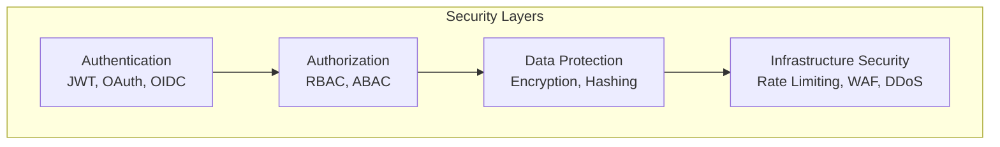

# 08 — Security

> Protect your systems from threats, vulnerabilities, and unauthorized access.

## Topics

| # | Topic | Description |
|---|-------|-------------|
| 1 | [Authentication](01-authentication.md) | Verifying identity |
| 2 | [Authorization](02-authorization.md) | Permission control |
| 3 | [JWT](03-jwt.md) | JSON Web Tokens |
| 4 | [OAuth 2.0](04-oauth.md) | Authorization framework |
| 5 | [OpenID Connect](05-openid-connect.md) | Identity layer on OAuth 2.0 |
| 6 | [RBAC](06-rbac.md) | Role-based access control |
| 7 | [ABAC](07-abac.md) | Attribute-based access control |
| 8 | [Encryption](08-encryption.md) | Data protection |
| 9 | [Hashing](09-hashing.md) | Secure data fingerprints |
| 10 | [Rate Limiting](10-rate-limiting.md) | Traffic control |
| 11 | [WAF](11-waf.md) | Web application firewall |
| 12 | [DDoS Protection](12-ddos-protection.md) | Attack mitigation |

---

Previous: [07 — Cloud Architecture](../07-Cloud-Architecture/README.md)
Next: [09 — Observability](../09-Observability/README.md)
