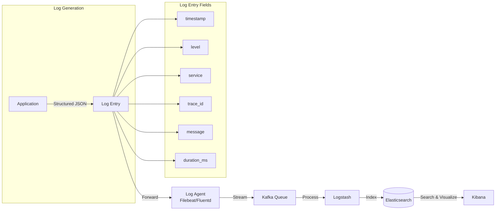

# Logging

## Definition
Logging records discrete events from applications and infrastructure. Logs provide a record of what happened at a specific time, essential for debugging, audit, and analysis.



## Log Levels

| Level | Purpose | Example |
|-------|---------|---------|
| **TRACE** | Fine-grained debug details | Function entry/exit |
| **DEBUG** | Diagnostic info for developers | Variable values |
| **INFO** | Normal operational events | Request started, service started |
| **WARN** | Unexpected but handled | Retry on failure, slow query |
| **ERROR** | Failures that need attention | Exception, DB connection failure |
| **FATAL** | Critical, service may shut down | Out of memory |

## Structured Logging (Best Practice)

```json
// BAD: Unstructured
"User 12345 logged in from 192.168.1.1 at 12:00:00"

// GOOD: Structured JSON
{
  "timestamp": "2026-06-04T12:00:00Z",
  "level": "INFO",
  "service": "auth-service",
  "trace_id": "abc-123-def",
  "user_id": "12345",
  "action": "login",
  "source_ip": "192.168.1.1",
  "duration_ms": 45,
  "success": true
}
```

## Centralized Logging Architecture

```
App ──► Log Agent (Filebeat/Fluentd)
               │
               ▼
          Queue (Kafka)
               │
        ┌──────┴──────┐
        ▼              ▼
   Logstash         Long-term
   (parse/filter)   Storage (S3)
        │
        ▼
   Elasticsearch
        │
        ▼
   Kibana (visualize + search)
```

## Interview Questions

1. What is structured logging and why is it important?
2. How do you design a centralized logging system for microservices?
3. How do you handle high-volume logging without impacting app performance?
4. What is log rotation and how does it work?
5. How does the ELK stack work for log management?
