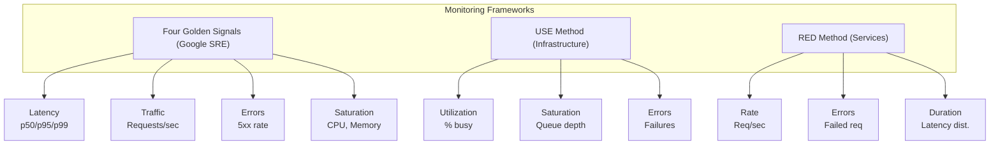

# Monitoring

## Definition
Monitoring is the continuous collection, analysis, and visualization of metrics to understand system health and performance. It answers: "What is happening right now?"



## The Four Golden Signals (Google SRE)

| Signal | What It Measures | Example |
|--------|-----------------|---------|
| **Latency** | Time to respond | p50/p95/p99 request duration |
| **Traffic** | Demand on system | Requests/sec, active users |
| **Errors** | Failure rate | HTTP 5xx rate, exception count |
| **Saturation** | How "full" the system is | CPU %, memory %, queue depth |

## USE Method (Infrastructure)

For every resource: **U**tilization, **S**aturation, **E**rrors

| Resource | Utilization | Saturation | Errors |
|----------|-------------|------------|--------|
| **CPU** | % busy | Run queue length | CPU errors |
| **Memory** | % used | OOM killer count, swap usage | OOM events |
| **Disk** | % I/O capacity | I/O queue depth | Disk errors |
| **Network** | % bandwidth | Dropped packets | Interface errors |
| **Database** | Connection % | Query queue length | Connection errors |

## RED Method (Services)

For every service: **R**ate, **E**rrors, **D**uration

- **Rate**: Requests per second
- **Errors**: Failed requests (5xx, exceptions)
- **Duration**: Response time distribution (p50, p95, p99)

## Monitoring Architecture

```
Application ──► Metrics SDK (Prometheus client)
                      │
                      ▼ (pull / push)
                Prometheus Server
                 (scrape every 15s)
                      │
              ┌───────┴───────┐
              ▼               ▼
          Alertmanager    Grafana
              │               │
              ▼               ▼
        PagerDuty/Slack   Dashboards
```

## Interview Questions

1. What are the Four Golden Signals of monitoring?
2. What is the difference between monitoring and observability?
3. How do you set meaningful alert thresholds?
4. What metrics would you monitor for a distributed system?
5. How do you monitor a Kafka cluster?
