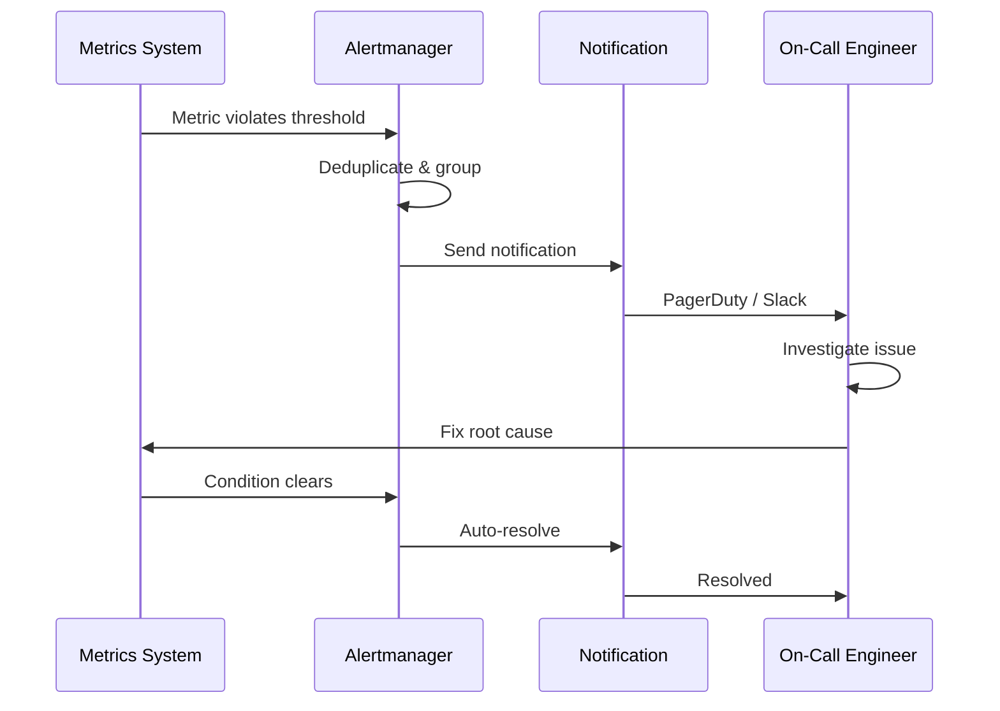

# Alerting

## Definition
Alerting notifies operators when system metrics indicate a problem. Good alerting is reliable, actionable, and not noise-producing.



## Alert Severity Levels

| Level | Response Time | Example |
|-------|---------------|---------|
| **P0/Critical** | < 15 min | Site down, data loss |
| **P1/High** | < 1 hour | High latency, errors > 5% |
| **P2/Medium** | < 8 hours | Degraded performance, disk > 80% |
| **P3/Low** | < 1 week | Expired SSL cert, orphaned resources |

## Alert Fatigue Prevention

```
The Problem:
  Too many alerts → alert fatigue → missed critical alerts
  
Solutions:
1. Alert on symptoms, not causes
   ❌ CPU > 80% (lack of sleep = symptom)
   ✅ Success rate < 99.9% (users affected = symptom)

2. Use alert thresholds wisely
   ❌ CPU > 80% for 1 minute (flapping)
   ✅ CPU > 80% for 15 minutes (sustained issue)

3. Group related alerts
   Instead of 10 alerts for 10 servers → 1 alert for service degraded

4. Auto-resolve
   If condition clears before alert acknowledged → auto-resolve

5. Actionable runbooks
   Every alert must have a documented response procedure
```

## Alert Types

| Type | Description | Example |
|------|-------------|---------|
| **Threshold** | Metric crosses a fixed value | Error rate > 1% |
| **Anomaly** | Metric deviates from historical pattern | Request rate drops 50% |
| **Rate of change** | Metric changes faster than expected | Connections/sec spikes |
| **Heartbeat** | Expected signal hasn't arrived | No metrics for 5 min |
| **Prediction** | Forecast crossing threshold | Disk full in 2 hours |

## Alerting Architecture

```
Alert rules (Prometheus)
        │
        ▼
  Alertmanager
   (dedup, group, silence)
        │
        ▼
  Notification channels
  ├── PagerDuty (on-call)
  ├── Slack/Teams (info)
  ├── Email (reports)
  └── Webhook (custom)
```

## Interview Questions

1. How do you distinguish a good alert from noise?
2. How do you handle alert fatigue in on-call rotations?
3. What is the difference between alerting on symptoms vs causes?
4. Design an alerting system for a global e-commerce platform
5. How do you implement auto-remediation with alerts?
