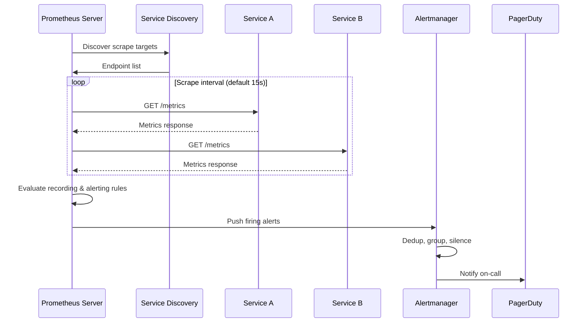

# Prometheus

## Architecture

```
Service    Service    Service
    │          │          │
    ├───>──┐   │   ┌──<──┤
           ▼   ▼   ▼
       ┌─────────────┐
       │  Prometheus  │
       │  Server      │
       └──────┬──────┘
              │
         ┌────▼────┐
         │Alert    │
         │Manager  │
         └────┬────┘
              │
         ┌────▼────┐
         │PagerDuty│
         └─────────┘
```



## Key Features
- **Pull-based metrics** — Scrapes targets at intervals
- **Multi-dimensional** — Labels enable flexible queries
- **Powerful query language** — PromQL
- **Built-in alerting** — Alertmanager
- **Service discovery** — Kubernetes, Consul, file-based

## PromQL Examples

```promql
# CPU usage by service
avg(rate(node_cpu_seconds_total{mode="user"}[5m])) by (service)

# Error ratio
sum(rate(http_requests_total{status=~"5.."}[5m])) 
  / sum(rate(http_requests_total[5m])) * 100

# P99 latency
histogram_quantile(0.99, 
  sum(rate(http_request_duration_seconds_bucket[5m])) by (le, service))
```

## Interview Questions
1. How does Prometheus's pull model differ from push-based monitoring?
2. How does Prometheus service discovery work in Kubernetes?
3. What are the limitations of Prometheus at scale?
4. How does Prometheus's Alertmanager handle deduplication?
5. Design a Prometheus-based monitoring solution for 1000 microservices
