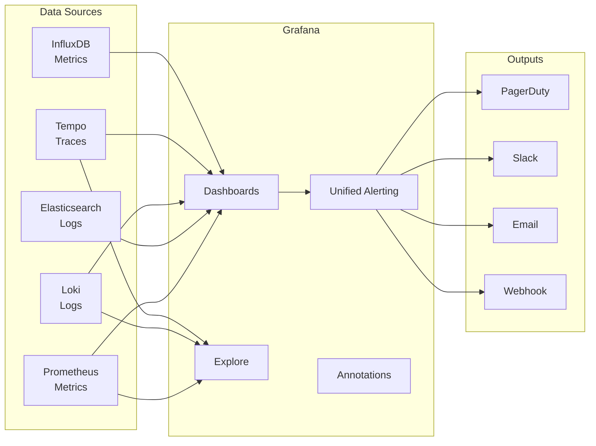

# Grafana

## Definition
Grafana is an open-source observability platform for visualizing metrics, logs, and traces. It connects to data sources (Prometheus, Elasticsearch, InfluxDB, etc.) and provides dashboards, alerts, and explore functionality.



## Key Features

| Feature | Description |
|---------|-------------|
| **Data sources** | 50+ built-in (Prometheus, Graphite, InfluxDB, Elasticsearch, CloudWatch) |
| **Dashboards** | Customizable panels (graph, table, stat, heatmap, logs) |
| **Alerting** | Unified alerting across all data sources |
| **Explore** | Ad-hoc querying without building dashboards |
| **Annotations** | Overlay events (deployments, incidents) on graphs |
| **Templating** | Dynamic dashboards with variable dropdowns |
| **Permissions** | Folder-level RBAC for teams |

## Common Dashboard Types

```
1. Service Overview Dashboard
   - Request rate, error rate, latency (RED method)
   - CPU, memory, GC for each service instance
   - Dependencies (upstream/downstream health)

2. Infrastructure Dashboard
   - CPU, memory, disk per host
   - Network throughput
   - Saturation metrics (queue depth, connection count)

3. Business Dashboard
   - Active users, sign-ups, revenue
   - Feature adoption metrics
   - SLI/SLO burn rate

4. Database Dashboard
   - Query latency (p50/p95/p99)
   - Connection pool status
   - Replication lag
   - Cache hit ratio
```

## Grafana + Prometheus Stack

```
Prometheus (metrics) ──► Grafana ──► Dashboards
                          │
Alertmanager ──► Grafana ──► PagerDuty (alerts)
                   Alerts

Loki (logs) ──► Grafana ──► Log exploration
Tempo (traces) ──► Grafana ──► Trace visualization
                          │
             Unified: See metrics → jump to logs → jump to trace
                          │
                 "Grafana for everything" strategy
```

## Interview Questions

1. How does Grafana differ from Kibana?
2. How do you design a dashboard hierarchy for different teams?
3. How does Grafana's unified alerting work?
4. What is the "Grafana for everything" approach?
5. How do you use Grafana to correlate metrics, logs, and traces?
