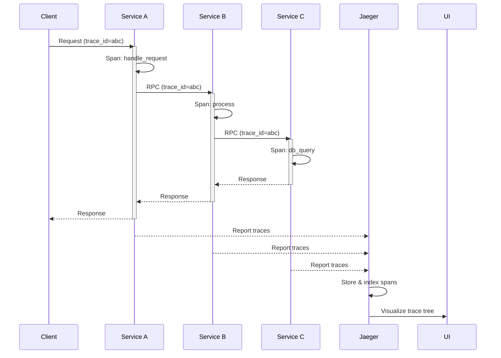

# Jaeger

## Definition
Jaeger is an open-source distributed tracing system. It monitors and troubleshoots transactions in complex distributed systems.



## Architecture

```
Service ──► Jaeger Agent ──► Jaeger Collector ──► Storage
    │                           │                     │
    └── UDP/gRPC ──────────────►│                     │
                                │                     ▼
                           ┌────┴────┐          Cassandra/
                           │ Query   │          Elasticsearch
                           │ Service │          /Badger
                           └────┬────┘
                                │
                           ┌────▼────┐
                           │  UI     │
                           └─────────┘
```

## Key Features
- **Root-cause analysis** — Find failures across services
- **Latency optimization** — Identify bottlenecks
- **Service dependency analysis** — Map service topology
- **Performance optimization** — Find expensive operations
- **Sampling** — Head-based, tail-based, probabilistic

## Interview Questions
1. How does Jaeger's sampling work?
2. Compare Jaeger vs Zipkin for distributed tracing
3. How do you trace requests through a message queue?
4. What storage backends does Jaeger support?
5. Design a distributed tracing solution with Jaeger
