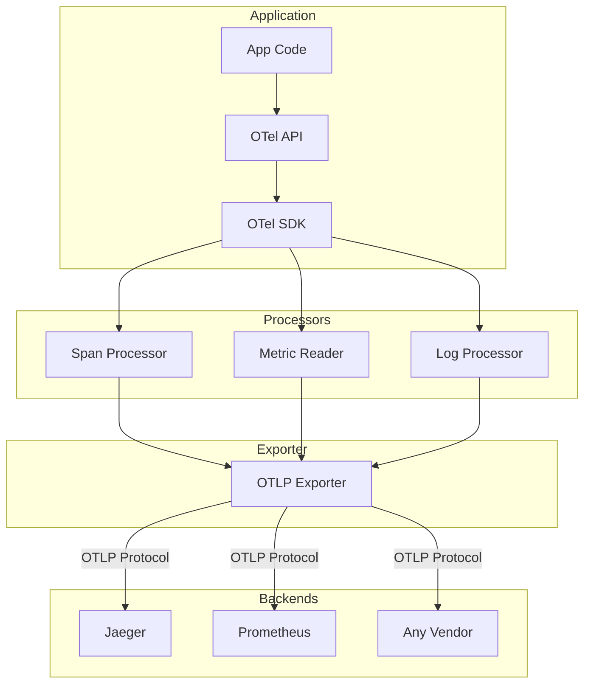

# OpenTelemetry

## Definition
OpenTelemetry (OTel) is a vendor-agnostic observability framework for collecting traces, metrics, and logs. It's the industry standard for instrumentation.



## The Three Pillars

```
┌─────────────────────────────────────────────┐
│           OpenTelemetry                       │
├─────────────────────────────────────────────┤
│                                               │
│  Traces     │    Metrics     │    Logs       │
│  ┌─────┐    │    ┌─────┐     │    ┌─────┐   │
│  │Spans │    │    │Count │     │    │Records│  │
│  │      │    │    │er,   │     │    │      │  │
│  │      │    │    │Gauge │     │    │      │  │
│  └─────┘    │    └─────┘     │    └─────┘   │
│                                               │
└─────────────────────────────────────────────┘
```

## SDK Architecture

```
Application Code
    │
    ├── OTel API (interfaces)
    │
    ├── OTel SDK (implementation)
    │    ├── Span Processor
    │    ├── Metric Reader
    │    ├── Log Processor
    │    └── Exporter (OTLP, Jaeger, Prometheus, etc.)
    │
    └── Backend (any vendor)
```

## Benefits
- **Vendor-agnostic** — Single instrumentation, multiple backends
- **Standard API** — Consistent across languages
- **Rich context propagation** — Trace, baggage, correlation
- **Growing ecosystem** — Supported by all major vendors

## Interview Questions
1. Why is OpenTelemetry becoming the industry standard?
2. How does OpenTelemetry's context propagation work?
3. How do you migrate from Jaeger/Zipkin to OpenTelemetry?
4. What is the OTLP protocol and why is it useful?
5. Design an observability strategy using OpenTelemetry
