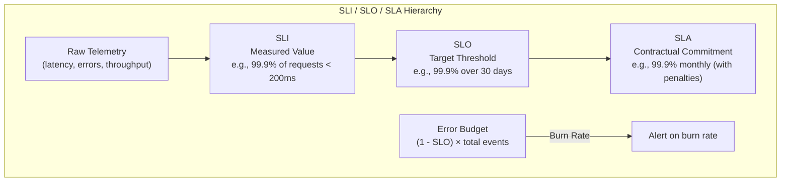
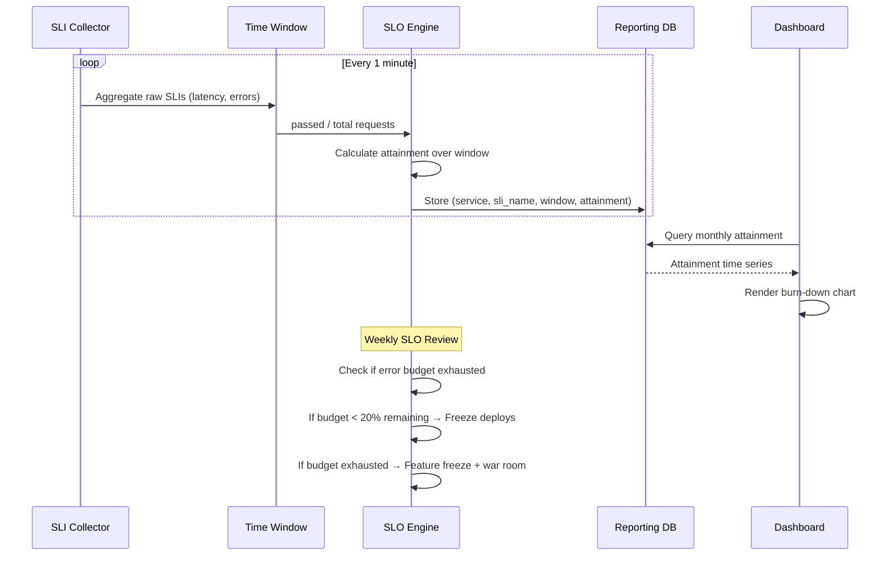

# SLI / SLO / SLA Deep Dive

## Definition

Service Level Indicators (SLIs) are measured metrics, Service Level Objectives (SLOs) are targets for SLIs, and Service Level Agreements (SLAs) are contractual commitments to customers. Together they form the reliability governance framework for any production service.



## SLI Definition by Service Type

| Service Type | Key SLIs | Measurement |
|---|---|---|
| **HTTP API** | Latency (p50/p95/p99), Error rate (5xx), Availability | Request-level distribution |
| **gRPC** | Server latency, Request success rate, Flow control throttling | Per-RPC metrics |
| **Message Queues** | Publish latency, Consumer lag, Dead-letter rate | Broker-side + consumer-side |
| **Data Pipelines** | Record processing latency, Throughput (records/sec), Data freshness | Lag from source to destination |
| **Databases** | Query latency, Connection pool utilization, Replication lag | Query engine + OS metrics |
| **Serverless** | Cold start duration, Execution duration, Invocation error rate | Function-level telemetry |
| **Batch Jobs** | Completion rate, Processing duration vs schedule, Data quality score | Job-run-level outcomes |
| **Storage** | Upload/download latency, Durability (object count), Throughput | Per-operation percentiles |

## Error Budget Policy

```
Error Budget = (1 - SLO) × total events over window

Example:
  SLO target: 99.9% availability over 30 days
  Total requests: 10,000,000
  Allowed errors: 10,000 (0.1%)
  Actual errors: 7,500 (0.075%)
  Remaining budget: 2,500 errors available

Burn rate = actual error rate / allowed error rate
  Burn rate = 1.0 means exactly consuming at budget rate
  Burn rate > 2 means errors are consuming budget too fast
  Burn rate < 0.5 means we have headroom
```



```mermaid
graph LR
    subgraph "Burn Rate Alerting"
        BR1["Burn Rate 1x<br/>Consuming evenly"] -->|"Alert if >24h"| Pages1[Page SRE]
        BR2["Burn Rate 2-5x<br/>Consuming fast"] -->|"Alert if >6h"| Pages2[Page Owner]
        BR3["Burn Rate 10x+<br/>Blazing fast"] -->|"Alert if >30min"| Pages3[Page Incident Commander]
    end
```

## Multi-Window Burn Rate Algorithm

```
Multi-window burn rate alerts use two windows:
  Short window (e.g., 1 hour) — rapid detection
  Long window (e.g., 6 hours) — confirmation

Alert fires when:
  short_window_burn_rate >= threshold AND
  long_window_burn_rate >= threshold

This reduces false positives from temporary spikes
while catching sustained degradation quickly.

Prometheus-style alerting rule:
  groups:
  - name: slo_burn_rate
    rules:
    - alert: HighErrorRate
      expr: |
        (
          sum(rate(errors_total[1h])) / sum(rate(requests_total[1h]))
        )
        /
        (1 - .99) > 0.1
      for: 5m
```

## Composite SLOs Across Dependencies

```
Service A ──► Service B ──► Service C
  │              │              │
  SLO=99.9%     SLO=99.95%    SLO=99.99%

Composite SLO = SLO_A × SLO_B × SLO_C
  = 0.999 × 0.9995 × 0.9999
  = 0.9984 (99.84%)

To achieve 99.9% end-to-end, each dependency must be tighter:
  Service A SLO: 99.97%
  Service B SLO: 99.97%
  Service C SLO: 99.97%
  Composite: ~99.91%
```

## SLO Attainment Reporting



## Best Practices

| Practice | Detail |
|----------|--------|
| **Fewer SLOs** | Start with 3-5 per service, not 50 |
| **Developer-owned** | SLO targets set by service owners, not management |
| **Burn rate alerts** | Alert on error budget burn rate, not raw metrics |
| **Window alignment** | Align measurement windows with business cycles |
| **Composite SLOs** | Model dependency chains for realistic end-to-end reliability |
| **SLO reviews** | Weekly error budget reviews in team standups |
| **SLA != SLO** | SLA is legal; SLO is technical. Keep SLA easier than SLO |

## Interview Questions

1. How do you define meaningful SLIs for a gRPC-based microservice?
2. Explain burn rate alerting and why multi-window approaches work better.
3. How do you compute a composite SLO across a call chain of 5 services?
4. What happens when a team exhausts their error budget?
5. How would you design an error budget policy for a real-time video service?
