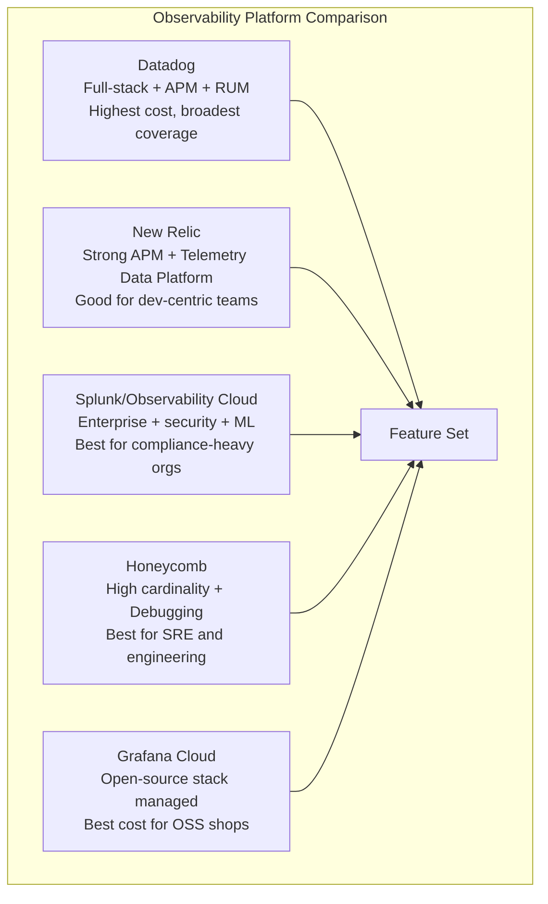
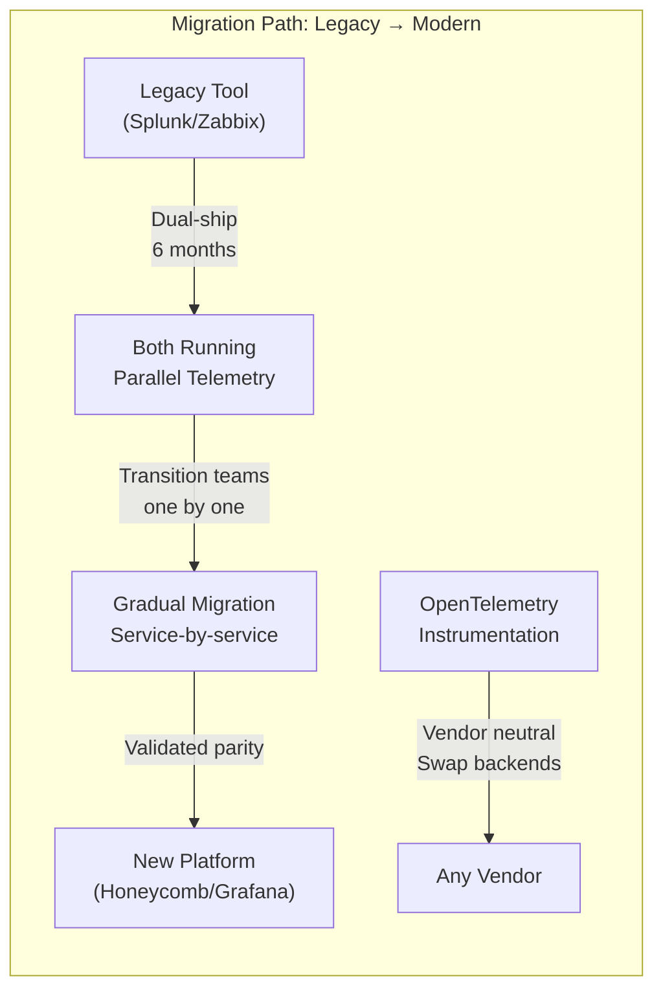

# Commercial Observability Platforms

## Overview

The major observability vendors each take different approaches to metrics, traces, logs, and the integrations between them. Choosing the right platform depends on scale, cost sensitivity, migration path, and organizational maturity.



## Comparison Table

| Feature | Datadog | New Relic | Splunk Observability | Honeycomb | Grafana Cloud |
|---------|---------|-----------|---------------------|-----------|---------------|
| **Metrics** | Prometheus + custom | NRQL-based | Metrics 2.0 (dimensions) | Custom (Honeycomb columns) | Prometheus/Mimir |
| **Traces** | APM (full distribution) | Distributed Tracing (100% sampling) | APM + AlwaysOn profiling | High-cardinality traces | Tempo (object store) |
| **Logs** | Log Management (index) | Logs | Splunk Enterprise | Logs (limited) | Loki (label-based) |
| **Dashboards** | Drag-and-drop + JSON | Custom NRQL dashboards | Programmatic + charts | Query-based boards | Grafana (richest) |
| **Alerting** | Monitor + composite | NRQL alert conditions | Detectors (ML-assisted) | Triggers + SLO | Grafana Alerting |
| **APM** | Distributed traces + profiles | Deep APM with code-level | Traces + AlwaysOn | eBPF auto-instrument | FarO Tel + Tempo |
| **RUM** | Session Replay + RUM | Browser + Mobile | RUM + Synthetics | Not native | Grafana Faro |
| **eBPF** | Universal Service Monitoring | Not native | OpenTelemetry collector | eBPF auto-instrument | Pyroscope continuous profiling |
| **SLO** | SLO monitoring | SLO + error budgets | SLO dashboard | SLO management | Grafana SLO |
| **Cost model** | Per-host + custom metrics | Per-GB ingested + user | Per-host + per-GB | Per-event | Per-series + logs GB |

## Pricing Models

```
Datadog:
  Pro: $15/host/month + $1.50/100M custom metrics
  Enterprise: $23/host/month + APM $31/host
  RUM: $1.50/100K sessions

New Relic:
  Free: 100GB/month, 1 full-access user
  Pro: $0.30/GB ingested
  Enterprise: Custom (volume + user) 

Honeycomb:
  Free tier: 1 billion events/month (5 users)
  Team: $30,000/year (50B events)
  Enterprise: Custom

Grafana Cloud:
  Free: 10K series, 50GB logs, 3 users
  Pro: $8/series + $0.50/GB logs
  Advanced: Custom

Splunk Observability:
  Infrastructure: $15/host/month
  APM: $40/host/month
  Logs: $1.5/GB ingested
```

## Migration Patterns



## When to Use Each

| Platform | Best For | Avoid When |
|----------|----------|------------|
| **Datadog** | All-in-one observability, large enterprise, multi-cloud | Cost is primary constraint |
| **New Relic** | Developer-centric teams, strong APM needs, startups | High-volume log analytics needed |
| **Splunk** | Compliance-heavy regulated industries, existing Splunk investment | Modern high-cardinality observability is priority |
| **Honeycomb** | Engineering-driven SRE teams, complex debugging, high-cardinality | SIEM/security compliance is required |
| **Grafana Cloud** | Open-source native, multi-tool composability, cost-sensitive | Fully managed turnkey enterprise support |

## OpenTelemetry Vendor Neutrality

```
Vendor lock-in mitigation strategy:
  1. Instrument with OpenTelemetry SDKs (one-time effort)
  2. Export OTLP to private collector (OpenTelemetry Collector)
  3. Split OTLP to multiple backends
  4. Swap backend vendors by changing collector config only

OpenTelemetry Collector:
  ┌──────────┐     ┌──────────┐     ┌──────────┐
  │ Service  │────►│ OTel     │────►│ Vendor A │
  │ (OTel    │     │ Collector│────►│ Vendor B │
  │ SDK)     │     │ (agent)  │     │ Vendor C │
  └──────────┘     └──────────┘     └──────────┘
```

## Interview Questions

1. Compare and contrast Datadog, Honeycomb, and Grafana Cloud for a 500-microservice environment.
2. How would you migrate from New Relic to Grafana Cloud with zero downtime?
3. What telemetry should you send to which vendor to optimize costs?
4. How does OpenTelemetry break vendor lock-in?
5. Design a multi-vendor observability strategy for cost optimization.
