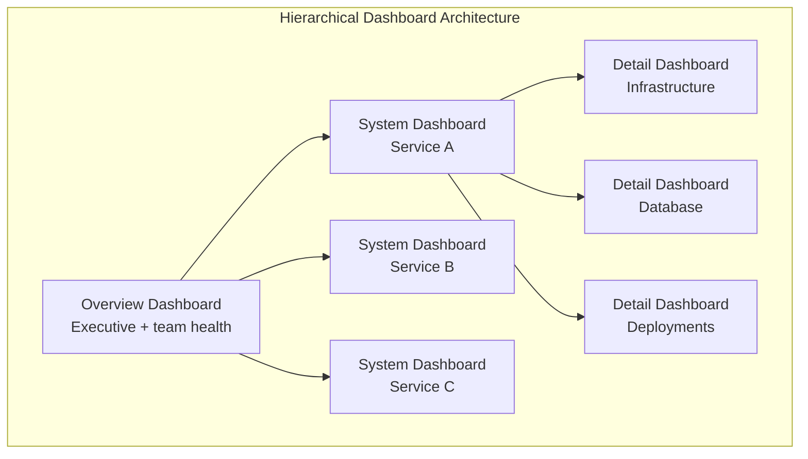
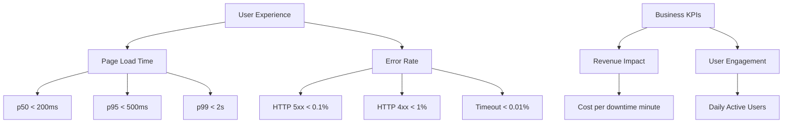

# Dashboard Design

## Definition

Dashboards are the visual interface of observability. Well-designed dashboards provide at-a-glance insight into system health and enable rapid incident response. Poor dashboards cause confusion, alert fatigue, and slow MTTR.



## The Three-Tier Hierarchy

```
┌─────────────────────────────────────────────────────────────┐
│  Tier 1: Overview Dashboard                                  │
│  ┌──────────────┐  ┌──────────────┐  ┌──────────────┐      │
│  │ SLO Summary   │  │ Latency Map  │  │ Error Budget │      │
│  │ (all services)│  │ (heatmap)    │  │ (burn-down)  │      │
│  └──────────────┘  └──────────────┘  └──────────────┘      │
│  ┌──────────────┐  ┌──────────────┐  ┌──────────────┐      │
│  │ Deployments  │  │ Alerts Fired │  │ Capacity     │      │
│  │ (recent)     │  │ (active)     │  │ (usage/limit)│      │
│  └──────────────┘  └──────────────┘  └──────────────┘      │
└─────────────────────────────────────────────────────────────┘

┌─────────────────────────────────────────────────────────────┐
│  Tier 2: System Dashboard (per service)                       │
│  ┌──────────────┐  ┌──────────────┐  ┌──────────────┐      │
│  │ RED Metrics   │  │ USE Metrics  │  │ Dependency   │      │
│  │ (Rate,Errors, │  │ (CPU,Mem,IO) │  │ Health       │      │
│  │ Duration)     │  │              │  │ (upstream)   │      │
│  └──────────────┘  └──────────────┘  └──────────────┘      │
│  ┌──────────────┐  ┌──────────────┐  ┌──────────────┐      │
│  │ Top K Spans  │  │ Log Patterns │  │ K8s Pods     │      │
│  │ (slowest)    │  │ (error grouping)│ (status)     │      │
│  └──────────────┘  └──────────────┘  └──────────────┘      │
└─────────────────────────────────────────────────────────────┘

┌─────────────────────────────────────────────────────────────┐
│  Tier 3: Detail Dashboard (deep dive)                         │
│  ┌──────────────┐  ┌──────────────┐  ┌──────────────┐      │
│  │ Flame Graph   │  │ Trace Search │  │ PromQL       │      │
│  │ (CPU profile) │  │ (filters)    │  │ (custom)     │      │
│  └──────────────┘  └──────────────┘  └──────────────┘      │
└─────────────────────────────────────────────────────────────┘
```

## RED Method (Services)

```
Rate:      Requests per second (throughput)
Errors:    Failed requests (5xx, timeouts, exceptions)
Duration:  Latency (p50, p95, p99)

Applies to: Web services, APIs, gRPC endpoints, queues
```

## USE Method (Infrastructure)

```
Utilization: Average time resource was busy (CPU: 70%, Memory: 60%)
Saturation:  Degree of extra work queued (CPU run queue, disk IO wait)
Errors:      Count of error events (disk errors, network drops)

Applies to: Servers, containers, databases, network devices
```

## KPI Trees



## Color Accessibility

```
Traffic Light System (accessible):
  Green:  #1a7f37 (passing, healthy)
  Yellow: #9a6700 (warning, degraded)
  Red:    #cf222e (critical, failing)

Color blindness safe alternatives:
  Use patterns + text alongside color
  Avoid red-green only indicators
  Add severity labels: OK / WARN / CRIT
```

## Dashboard-as-Code

```jsonnet
// Grafana Tanka / Jsonnet example
{
  dashboard(title='Service Overview', tags=['production', 'sre']) {
    panels: [
      promPanel('Request Rate', 'sum(rate(http_requests_total[5m]))'),
      promPanel('Error Ratio', 'sum(rate(http_requests_total{status=~"5.."}[5m])) / sum(rate(http_requests_total[5m])) * 100'),
    ],
    time: { from: 'now-6h', to: 'now' },
    refresh: '30s',
  }
}
```

```hcl
// Terraform Grafana provider
resource "grafana_dashboard" "service_overview" {
  config_json = jsonencode({
    title = "Service Overview"
    panels = [{
      title = "Latency p99"
      type  = "timeseries"
      targets = [{
        expr = "histogram_quantile(0.99, sum(rate(http_request_duration_seconds_bucket[5m])) by (le))"
      }]
    }]
  })
}
```

## Time Range Selection

```
Default time ranges:
  Overview dashboard:   Last 6 hours (refresh: 30s)
  System dashboard:     Last 1 hour (refresh: 15s)
  Detail dashboard:     Last 15 min (refresh: 10s)

Quick ranges: 5m, 15m, 1h, 6h, 24h, 7d, 30d
  Shift-click to zoom:  Select region to zoom in
  Double-click:         Reset to default range
```

## Best Practices

| Practice | Detail |
|----------|--------|
| **One-screen view** | No scrolling for Tier 1 and 2 dashboards |
| **Left to right, top to bottom** | Most important info top-left |
| **Consistent units** | All latency in ms, all rates in req/s |
| **Legend on every panel** | Independent understanding without context |
| **Annotation for deploys** | Mark deploy events on all time-series panels |
| **Template variables** | Environment, service, region as drop-downs |
| **Limit data density** | 6-8 panels per row, max 4 rows |

## Interview Questions

1. Design a three-tier hierarchical dashboard system for an e-commerce platform.
2. What panels belong on an overview vs system vs detail dashboard?
3. How do you ensure dashboard accessibility for color-blind operators?
4. Compare Grafana Tanka, Terraform, and manual dashboard management.
5. How do you prevent dashboard sprawl in a large organization?
