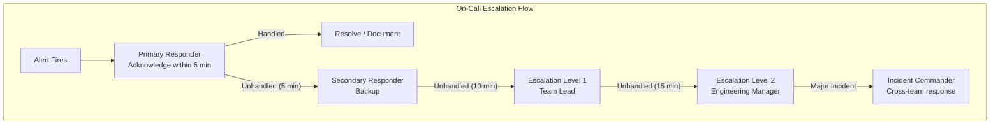
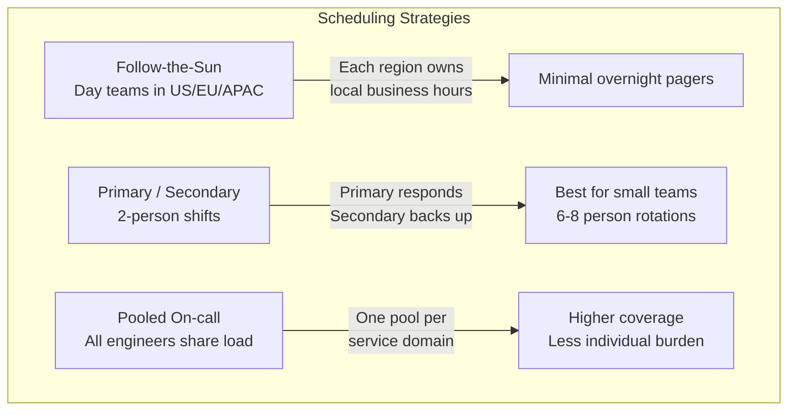
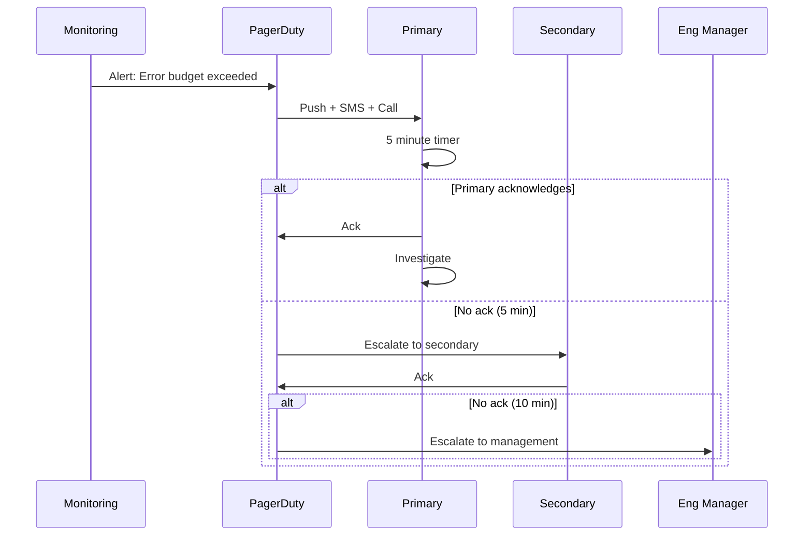

# On-Call Practices

## Definition

On-call is the operational practice where engineers are responsible for responding to production incidents outside regular working hours. Effective on-call practices balance reliability with engineer well-being.



## Incident Severity Matrix

| Severity | Definition | Response Time | Communication | Examples |
|----------|------------|---------------|---------------|----------|
| **SEV1** | Complete service outage, data loss, security breach | 5 min | Email + Slack + Phone | All customers down, payment failures |
| **SEV2** | Partial outage, major feature unavailable | 15 min | Slack + Email | Search broken, slow for 10% of users |
| **SEV3** | Minor feature degraded, cosmetic issues | 1 hour | Slack | Odd UI, rare errors |
| **SEV4** | Bug, non-critical, no user impact | Next business day | Jira ticket | Internal tool glitch |

## Shift Scheduling Models



## Schedule Rotation Examples

```
Weekly Rotation (typical for teams of 6-8):
  Week 1:   Alice (P)  Bob (S)
  Week 2:   Carol (P)  Dave (S)
  Week 3:   Eve (P)    Frank (S)
  Week 4:   Bob (P)    Alice (S)
  ...

Daily Rotation (for high-traffic services):
  Mon:  Alice
  Tue:  Bob
  Wed:  Carol
  Thu:  Dave
  Fri:  Eve
  Sat-Sun: Frank + Backup
```

## Handoff Procedures

```markdown
Daily Handoff Checklist:

[ ] Review unresolved alerts (last 24h)
[ ] Check active incidents + status
[ ] Review recent deployments
[ ] Check capacity/performance trends
[ ] Document known issues in handoff doc
[ ] Confirm PagerDuty schedule is correct

Handoff Template:
  Date:          2026-06-04
  From:          Alice
  To:            Bob
  Active Issues:  [SEV2] Payment gateway latency
  Deployments:    [PASS] Order service v2.3.1 rolled out
  Pending:        DB maintenance window tomorrow 2AM
  Notes:          Dashboard X shows expected anomaly — not actionable
```

## Fatigue Management

```
Guarding Against Burnout:

1. Shift length limits
   - Max 12-hour shifts
   - Max 7 consecutive days on-call
   - Minimum 48 hours off after on-call week
   - No on-call during PTO

2. Compensation
   - On-call pay or comp time
   - Incident response bonus for SEV1/SEV2
   - Breakfast/lunch if night incident

3. Blameless culture
   - No punishment for waking up
   - Postmortem without blame
   - Alert quality reviews (reduce noise)

4. Rotation health metrics
   - Alerts per shift (target: < 3/night)
   - False positive ratio (target: < 20%)
   - Time to acknowledgement (target: < 2 min)
   - Overtime incidents (target: < 1/week)
```

## Alert Routing by Severity

```
PagerDuty / OpsGenie Routing Rules:

SEV1 → Phone call + Push notification + SMS
SEV2 → Push notification + SMS
SEV3 → Slack notification (no page)
SEV4 → Jira ticket (no notification)

Business hours:  Team channel for SEV3+
After hours:     On-call engineer for SEV1-2 only

Day-of-week overrides:
  Mon-Fri 9-5:  All alerts to primary
  Mon-Fri 5-9:  SEV1-2 to primary, rest to queue
  Weekend:      Shorter rotation (Sat-Sun pair)
```



## Best Practices

| Practice | Detail |
|----------|--------|
| **Alert quality** | Review alerts weekly — silence noisy ones, add actionable ones |
| **Blame-free handoff** | No judgment for unresolved issues |
| **Automated runbooks** | PagerDuty runbook links for each alert |
| **Shadow on-call** | New team members shadow before taking shifts |
| **Post-incident debrief** | Retro after significant on-call events |
| **Swap policy**| Easy shift swapping without approval chains |

## Interview Questions

1. Design an on-call schedule for a 24/7 service with a team of 6 engineers.
2. How do you prevent on-call burnout and fatigue?
3. What's the difference between a SEV1 and SEV2 incident process?
4. How would you design escalation policies for a multi-region service?
5. How do you measure and improve on-call health?
