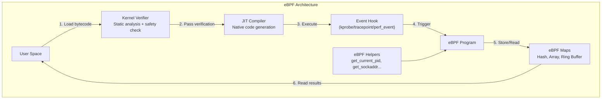
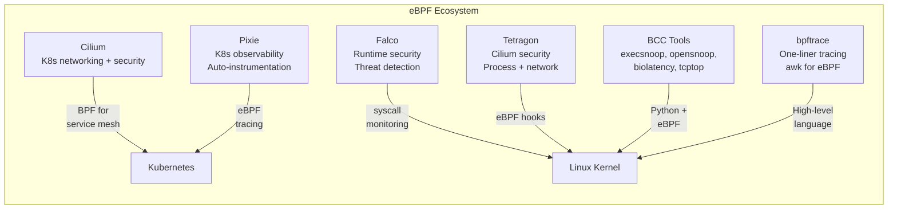

# eBPF Observability

## Definition

eBPF (extended Berkeley Packet Filter) is a Linux kernel technology that allows running sandboxed programs in kernel space without changing kernel source or loading kernel modules. It revolutionizes observability by providing safe, high-performance, and low-overhead instrumentation of system events.



## Key Components

| Component | Description |
|-----------|-------------|
| **Verifier** | Static analysis ensuring safety — no loops, bounded execution, valid memory access |
| **JIT Compiler** | Converts eBPF bytecode to native machine code for performance |
| **eBPF Maps** | Data structures shared between kernel and user space (hash, array, ring buffer, stack trace) |
| **Helpers** | Built-in kernel functions accessible from eBPF programs |
| **Hooks** | Attachment points: kprobes, tracepoints, perf_events, XDP, cgroup hooks |

## eBPF-Based Observability Tools



## BCC Tools

```
Commonly Used BCC Tools:

Name            What It Traces                   Use Case
execsnoop       New process executions           Detect short-lived processes
opensnoop       File opens (with path)           Find unexpected file access
biolatency      Block device I/O latency         Storage performance issues
tcptop          TCP connections by process       Network-heavy processes
tcplife         TCP session lifespan             Connection churn
runqlat         CPU scheduler run queue latency  CPU saturation
softirqs        Soft IRQ timing                  Network interrupt issues
hardirqs        Hard IRQ timing                  Hardware interrupt latency
mysqld_qslower  Slow MySQL queries               DB query profiling
```

## bpftrace Examples

```bash
# Trace all new processes
bpftrace -e 'tracepoint:syscalls:sys_enter_execve { printf("%s -> %s\n", comm, str(args->filename)); }'

# Count system calls per process
bpftrace -e 'tracepoint:raw_syscalls:sys_enter { @[comm] = count(); }'

# Block device I/O latency histogram
bpftrace -e 'kprobe:blk_account_io_start { @start[tid] = nsecs; } kretprobe:blk_account_io_done /@start[tid]/ { @usecs = hist((nsecs - @start[tid]) / 1000); delete(@start[tid]); }'

# TCP connect tracing with latency
bpftrace -e 'kprobe:tcp_v4_connect { @start[tid] = nsecs; } kretprobe:tcp_v4_connect /@start[tid]/ { $lat = (nsecs - @start[tid]) / 1000000; printf("PID %d: %s -> %s (%dms)\n", pid, comm, ntop(2, args->sk->__sk_common.skc_daddr), $lat); delete(@start[tid]); }'
```

## Cilium and eBPF for Kubernetes

```
┌──────────────────────────────────────────────────────────────┐
│                    Cilium eBPF Data Path                       │
├──────────────────────────────────────────────────────────────┤
│                                                               │
│  Pod A:     ──────────────►  Cilium Agent (eBPF)  ──────────►  Pod B
│  Service A                   │                               │  Service B
│                              │                               │
│                         ┌────┴────┐                        │
│                         │ eBPF    │                        │
│                         │ Maps    │                        │
│                         │ Policies│                        │
│                         └─────────┘                        │
│                              │                               │
│  Benefits:                   │                               │
│  • No iptables overhead      │                               │
│  • WireGuard encryption      │                               │
│  • L3/L4 + L7 visibility     │                               │
│  • Cluster mesh multi-cloud  │                               │
│                                                               │
└──────────────────────────────────────────────────────────────┘
```

## Pixie Auto-Instrumentation

```
Pixie uses eBPF to automatically instrument:
  - HTTP/gRPC spans without code changes
  - MySQL/PostgreSQL query tracing
  - DNS resolution times
  - CPU profiles (continuous, frame-level)
  - Network bandwidth per pod
  - TCP retransmits and RTT

Key advantage: Zero instrumentation code in application.
```

## Performance Characteristics

```
eBPF overhead:
  kprobe/kretprobe:     ~50-100ns per event
  tracepoint:           ~30-50ns per event
  XDP (packet drop):    ~5-10ns per packet
  XDP (forward):        ~20-60ns per packet

Comparisons:
  iptables packet:      ~500-1000ns
  Legacy kernel module: Kernel panic risk
  strace:               100x slowdown
  tcpdump:              5-10x slowdown
```

## Best Practices

| Practice | Detail |
|----------|--------|
| **Use tracepoints over kprobes** | Tracepoints are stable API; kprobes change with kernel versions |
| **Limit event volume** | High-frequency events (like packet-level) should use sampling |
| **Avoid complex loops** | eBPF verifier rejects loops; use bounded maps instead |
| **Map size planning** | Pre-allocate maps with expected max size |
| **Kernel version** | eBPF features depend on kernel; 5.15+ for most features |
| **CO-RE (Compile Once - Run Everywhere)** | Use BTF for kernel-agnostic eBPF programs |

## Interview Questions

1. How does eBPF provide safe code execution in kernel space?
2. Compare eBPF-based observability with traditional agent-based monitoring.
3. How does Cilium use eBPF to replace kube-proxy and iptables?
4. What is the difference between kprobes, tracepoints, and uprobes?
5. How would you use eBPF to debug a latency issue in a production service?
