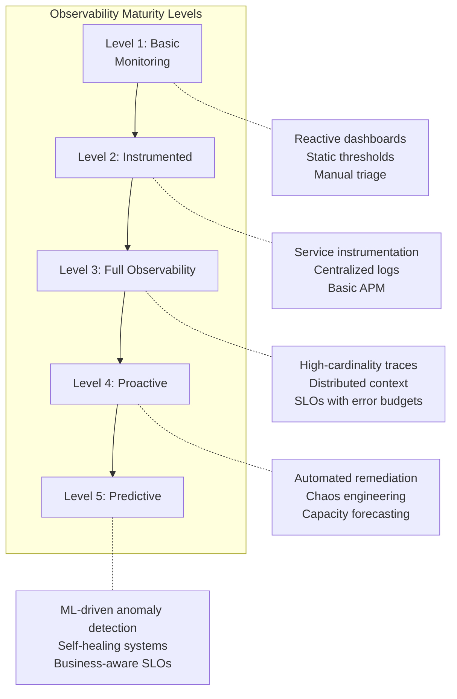
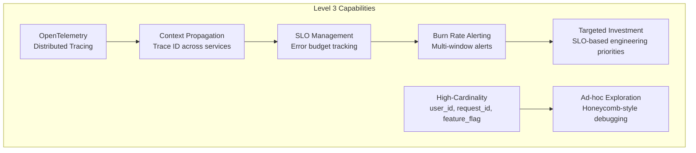

# Observability Maturity Model

## Definition

The Observability Maturity Model defines five progressive stages of observability capability, from basic monitoring through predictive operations. Each level builds on the previous, adding depth, automation, and intelligence.



## Level 1: Basic Monitoring

```
Characteristics:
  - Uptime monitoring (ping/health check)
  - Static threshold alerting (CPU > 80%)
  - Siloed dashboards per team
  - Manual incident response
  - No tracing or correlation

Assessment:
  □  Service health checks exist
  □  Basic CPU/memory/disk alerts
  □  Dashboards exist but are rarely updated
  □  Alert fatigue (high false positive rate)
  □  No dependency mapping

Pain points:
  - Cannot correlate metrics with deployments
  - Long MTTR (hours)
  - Frequent false alarms
  - Team silos, no shared context
```

## Level 2: Instrumented

```
Characteristics:
  - Application-level metrics (custom + framework)
  - Centralized log aggregation (ELK/Loki)
  - Basic APM for critical services
  - Structured logging (JSON)
  - Service-level dashboards

Assessment:
  □  All services emit metrics
  □  Centralized log platform in place
  □  APM enabled for top 10 services
  □  Dashboard refresh automated
  □  Logs have structured format

Capabilities:
  - Can debug per-service issues
  - Log search enables triage
  - Some correlation between services
```

## Level 3: Full Observability



```
Characteristics:
  - Distributed tracing (100% sampled or smart)
  - High-cardinality telemetry (user_id, request_id, feature flags)
  - SLOs defined with error budgets
  - Burn rate alerting (multi-window)
  - Ad-hoc exploration capability

Assessment:
  □  All services emit traces (OpenTelemetry)
  □  High-cardinality dimensions available in exploration
  □  SLOs defined for all critical services
  □  Burn rate alerts configured (short + long window)
  □  Teams can answer "why is this slow?" in minutes

Benefits:
  - MTTR reduced from hours to minutes
  - Engineering priorities driven by SLOs
  - Proactive error budget management
```

## Level 4: Proactive

```
Characteristics:
  - Automated runbooks and remediation
  - Chaos engineering (Gamedays, LITMUS tests)
  - Capacity forecasting and auto-scaling
  - Deployment gating (canary analysis + rollback)
  - Anomaly detection for known patterns

Assessment:
  □  >50% of alerts have automated first response
  □  Regular chaos engineering exercises
  □  Capacity plans updated quarterly
  □  Canary analysis blocks bad deployments
  □  Anomaly detection runbooks exist

Capabilities:
  - Most incidents auto-remediated
  - Deployment risk minimized
  - Capacity proactively added before saturation
```

## Level 5: Predictive

```
Characteristics:
  - ML-driven anomaly and root cause detection
  - Self-healing infrastructure
  - Predictive failure detection (malfunction before symptoms)
  - Business-aware SLOs (SLO linked to revenue impact)
  - Continuous optimization driven by telemetry

Assessment:
  □  ML models detect unknown failure patterns
  □  Auto-remediation for 80%+ incident types
  □  Predictive scaling (anticipates traffic spikes)
  □  Business metrics correlated with technical signals
  □  No human needed for routine operational events

Capabilities:
  - Systems self-heal from common failures
  - Failures predicted before user impact
  - Engineering focused on product, not operations
```

## Maturity Assessment Matrix

| Dimension | Level 1 | Level 2 | Level 3 | Level 4 | Level 5 |
|-----------|---------|---------|---------|---------|---------|
| **Data collection** | Infrastructure only | App + infrastructure | All telemetry unified | Real-time streaming | Predictive models |
| **Alerting** | Static thresholds | Multi-condition | Burn rate + SLO | ML-based anomalies | Pre-failure prediction |
| **Dashboards** | Ad-hoc, per team | Standardized | Hierarchical | Auto-generated | Business-aware |
| **Incident response** | Manual | Playbooks | Automated runbooks | Self-healing | Predictive prevention |
| **Culture** | Reactive | Organized | SLO-driven | Proactive engineering | Autonomous operations |
| **MTTR** | Hours | 1-2 hours | < 30 min | < 5 min | Near-zero |

## Migration Path

```
Start at Level 1:
  Month 1-2:  Centralize logs, basic metrics pipeline, health checks
  
Progress to Level 2:
  Month 3-4:  App instrumentation, structured logging, central dashboards
  
Progress to Level 3:
  Month 5-8:  OpenTelemetry rollout, distributed tracing, SLO definitions
  
Progress to Level 4:
  Month 9-12: Runbook automation, chaos engineering program, capacity planning
  
Progress to Level 5:
  12-18 months: ML models, self-healing, predictive pipelines
```

## Interview Questions

1. Where does your organization fit on the observability maturity model?
2. What is the biggest jump in value between any two levels?
3. How do you justify the investment to move from Level 2 to Level 3?
4. What are the prerequisites for achieving Level 4 (proactive) observability?
5. How would you design an observability maturity roadmap for a startup?
