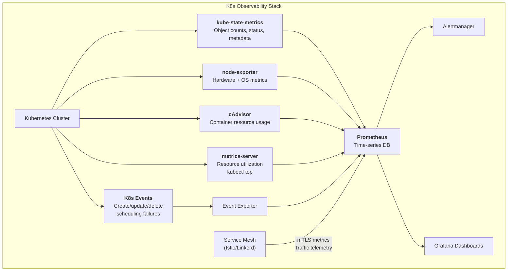
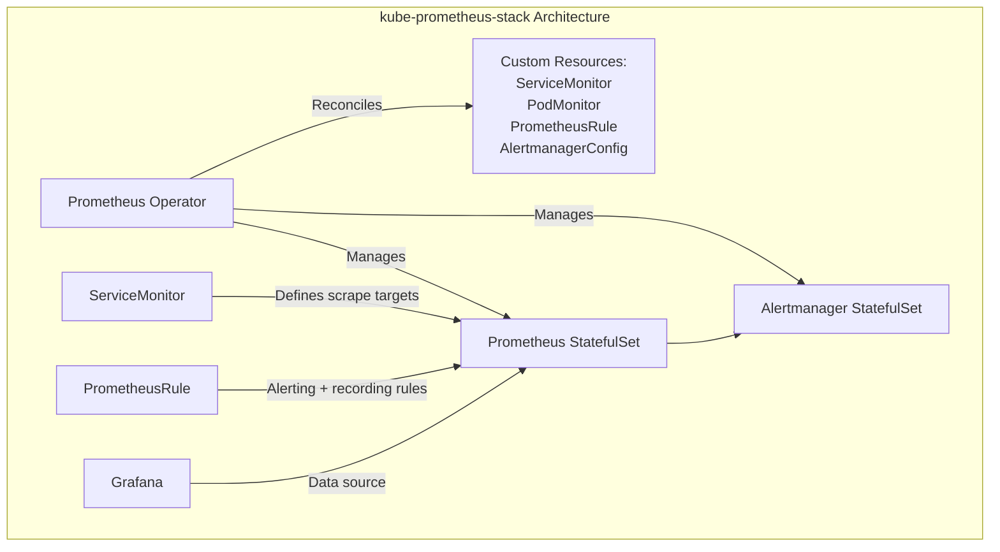

# Kubernetes Observability

## Definition

Kubernetes observability encompasses collecting, correlating, and visualizing metrics, logs, traces, and events from Kubernetes clusters, workloads, and the underlying infrastructure. It requires specialized tools that understand the dynamic, ephemeral nature of container orchestration.



## Core Components

| Component | Function | Data Source | Key Metrics |
|-----------|----------|-------------|-------------|
| **kube-state-metrics** | Kubernetes object state metrics | K8s API watch | pod count, deployment replicas, node conditions, PVC status |
| **node-exporter** | Node-level system metrics | /proc, /sys, cgroups | CPU/memory/disk/network utilization |
| **cAdvisor** | Container resource metrics | kubelet embedded | container_cpu_usage, container_memory_working_set |
| **metrics-server** | Resource usage for autoscaling | kubelet summary API | CPU/memory per pod/node (for HPA/VPA) |
| **K8s events** | Cluster event stream | K8s API | Scheduling failures, OOM kills, probe failures |

## kube-state-metrics Explained

```
Key metrics exposed:

kube_pod_status_phase{phase="Running|Pending|Failed|Unknown"}
kube_deployment_status_replicas_available
kube_node_status_condition{condition="Ready|DiskPressure|MemoryPressure"}
kube_pod_container_status_restarts_total
kube_persistentvolumeclaim_status_phase{phase="Pending|Bound|Lost"}

Usage example:
  # Find all pods not in Running state
  kube_pod_status_phase{phase!="Running"} != 0

  # Deployment availability ratio
  kube_deployment_status_replicas_available / kube_deployment_spec_replicas < 1

  # Node memory pressure
  kube_node_status_condition{condition="MemoryPressure", status="true"} == 1
```

## Service Mesh Telemetry

```
Istio Telemetry:

Request volume:    istio_requests_total{destination_service, source_workload}
Request duration:  istio_request_duration_milliseconds_bucket{...}
TCP throughput:    istio_tcp_sent_bytes_total, istio_tcp_received_bytes_total

Key advantages over direct Prometheus scraping:
  - mTLS metrics (encrypted connection health)
  - Request-level details (response flags, fault injection)
  - Cross-namespace service dependency graph
  - Retry/timeout metrics from proxy layer

Linkerd Telemetry:
  request_total, request_latency_ms
  tcp_open_connections, tcp_read_bytes_total, tcp_write_bytes_total
  response_total (by status, classification)
```

## Prometheus Operator / kube-prometheus-stack



```
Custom resources:

# ServiceMonitor — defines how to scrape a service
apiVersion: monitoring.coreos.com/v1
kind: ServiceMonitor
spec:
  selector:
    matchLabels:
      app: my-service
  endpoints:
  - port: http
    interval: 15s
    path: /metrics

# PrometheusRule — alerting rules
apiVersion: monitoring.coreos.com/v1
kind: PrometheusRule
spec:
  groups:
  - name: kubernetes
    rules:
    - alert: Watchdog
      expr: vector(1)
    - alert: KubePodCrashLooping
      expr: rate(kube_pod_container_status_restarts_total[5m]) > 0
```

## K8s Event Monitoring

```
Kubernetes events are ephemeral (TTL 1 hour by default).
To persist and alert on them:

1. Event exporter (event_exporter)
   - Watches K8s API for events
   - Exports as Prometheus metrics
   - Labels: type, reason, involved_object_kind

2. Loki + Promtail
   - Promtail watches K8s events
   - Ships to Loki for log-style querying

3. Custom webhook
   - Event webhook → Slack/PagerDuty
   - Filtered by severity (Warning events only)

Key events to monitor:
  - Pods: BackOff, CrashLoopBackOff, Failed, Evicted
  - Nodes: NodeNotReady, NodeHasDiskPressure
  - HPAs: FailedGetResourceMetric, FailedUpdateStatus
  - PersistentVolumes: FailedBinding, VolumeFailedDelete
```

## Recommended Dashboards

```
Tier 1: Cluster Overview
  - Node count (Ready/NotReady)
  - Pod capacity vs actual
  - CPU/Memory allocatable vs requested vs used
  - Namespace resource quotas
  - K8s event rate (errors/warnings)

Tier 2: Workload Dashboard
  - Deployment availability (replicas ready)
  - Pod restart rate
  - Container resource usage
  - HPA current vs target metrics
  - PVC usage

Tier 3: Node Deep Dive
  - Node conditions over time
  - Kubelet metrics
  - Container runtime metrics
  - Network bandwidth per interface
```

## Best Practices

| Practice | Detail |
|----------|--------|
| **Prometheus Operator** | Use kube-prometheus-stack for production monitoring |
| **ServiceMonitors** | Define scrape configs as Custom Resources, not config maps |
| **kube-state-metrics** | Essential for SLO tracking on deployments, pods, nodes |
| **Context labels** | Add cluster, namespace, workload labels to all metrics |
| **Aggregation** | Use recording rules for expensive queries (Kuberenetes API calls) |
| **Event persistence** | Don't rely on K8s events alone — route to persistent storage |
| **Cost awareness** | Monitor cluster resource efficiency (request vs usage ratios) |

## Interview Questions

1. How do you monitor Kubernetes control plane components?
2. What's the difference between kube-state-metrics and cAdvisor?
3. How does Prometheus Operator simplify Kubernetes monitoring?
4. How would you detect and alert on a node failure in a multi-node cluster?
5. Design a monitoring stack for a multi-tenant Kubernetes cluster (50+ namespaces).
