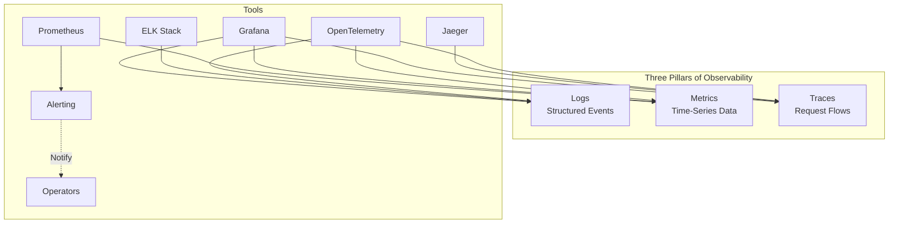

# 17 — Observability

> Understand what your system is doing. Monitor, trace, and log everything.

## Topics

| # | Topic | Description |
|---|-------|-------------|
| 1 | [Logging](01-logging.md) | Structured event records |
| 2 | [Monitoring](02-monitoring.md) | System health dashboards |
| 3 | [Distributed Tracing](03-tracing.md) | Request flow across services |
| 4 | [Metrics](04-metrics.md) | Numerical measurements |
| 5 | [Alerting](05-alerting.md) | Automated notifications |

### Tools
| # | Topic | Description |
|---|-------|-------------|
| 6 | [Prometheus](06-prometheus.md) | Metrics collection and alerting |
| 7 | [Grafana](07-grafana.md) | Visualization and dashboards |
| 8 | [ELK Stack](08-elk-stack.md) | Elasticsearch, Logstash, Kibana |
| 9 | [Jaeger](09-jaeger.md) | Distributed tracing |
| 10 | [OpenTelemetry](10-opentelemetry.md) | Observability framework |

---

Previous: [16 — Security](../16-Security/README.md)
Next: [18 — Case Studies](../18-Case-Studies/README.md)
