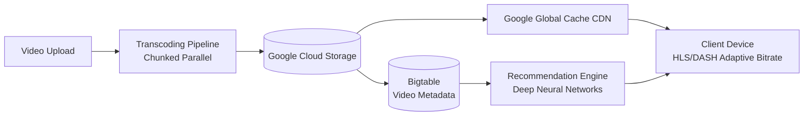

# YouTube Architecture

## Overview
YouTube serves 2B+ monthly active users, processing 500+ hours of video uploaded every minute.



## Architecture

```
Upload ──► Transcoder ──► Storage (Google Cloud Storage)
  │          │                    │
  │     Chunked in               │
  │     parallel                 │
  │                              ▼
  │                         CDN (Google Global Cache)
  │                              │
  └──────────────────────────────┤
                                 ▼
                           Client (adaptive bitrate)
```

## Key Lessons

| Technology | Description |
|------------|-------------|
| **Video Transcoding** | Converts to multiple formats/resolutions |
| **Adaptive Bitrate** | HLS/DASH dynamic quality switching |
| **Google CDN** | Edge caching for popular content |
| **Bigtable** | Video metadata storage |
| **Spanner** | Globally consistent data |
| **Recommendations** | Deep neural networks for suggestions |

## Interview Questions
1. How does YouTube handle video transcoding at scale?
2. How does adaptive bitrate streaming work?
3. How does YouTube's recommendation algorithm work?
4. How does YouTube store and serve petabytes of video data?
5. Design a simplified YouTube-like video platform
