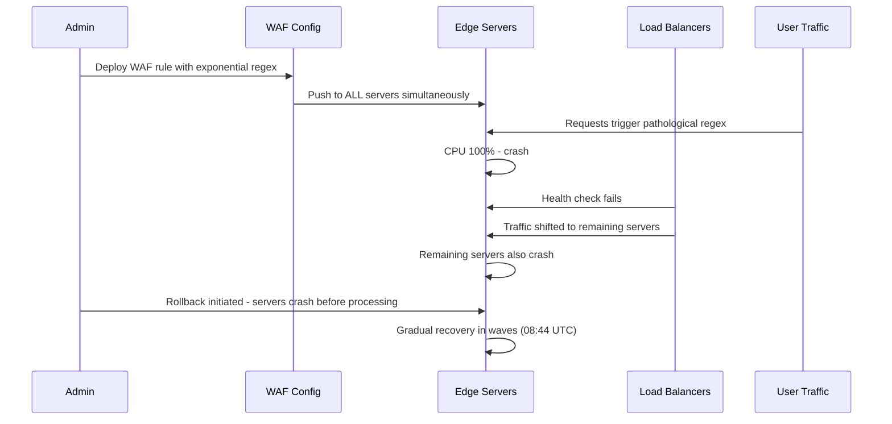

# Cloudflare Outage (2022)

## Event
On June 21, 2022, Cloudflare experienced a 2-hour outage that affected approximately 15-20% of global internet traffic. Major sites including Discord, Feedly, NordVPN, and multiple cryptocurrency exchanges were impacted.



## Timeline
- **06:44 UTC**: A core WAF rule deployment consumed excessive CPU on edge servers
- **06:46 UTC**: All globally distributed servers began crashing simultaneously
- **06:50 UTC**: Engineering team identified the bad deployment
- **06:55 UTC**: Rollback initiated — but all servers were crashing, making rollback slow
- **08:00 UTC**: Gradual recovery as servers came back in waves
- **08:44 UTC**: Full recovery

## Root Cause

```
The problem wasn't a traditional software bug — it was a computational complexity issue:

1. A new WAF rule was deployed to all servers simultaneously
2. The rule used a regular expression that had exponential worst-case complexity
3. Certain HTTP requests triggered the pathological case, consuming 100% CPU
4. Servers crashed from CPU starvation (couldn't handle health checks)
5. Load balancers marked servers as unhealthy → traffic shifted to remaining servers
6. Remaining servers also crashed from increased load → cascading failure

Why rollback was slow:
- Servers were crashing faster than they could process the rollback command
- Control plane was also affected (same binary, same bad regex)
```

## Key Lessons

| Lesson | Implementation |
|--------|---------------|
| **Staged deployments** | Never deploy to all servers at once — canary first |
| **Resource limits** | CPU/memory budgets for WAF rules — kill if exceeds |
| **Kill switches** | Global feature flag to disable a specific rule instantly |
| **Circuit breaker** | If a rule causes CPU > 50%, disable it automatically |
| **Gradual recovery** | Start servers in waves, not all at once (thundering herd) |

## Defenses Implemented

After this outage, Cloudflare implemented:
1. **CPU budget per process**: Any rule exceeding budget is auto-disabled
2. **Regex complexity analyzer**: Pre-deployment check for exponential regex
3. **Atomic deployments**: Deploy to 1% → 25% → 50% → 100%
4. **Global kill switch**: Single click to disable any rule across all PoPs
5. **Non-crash failure**: Bad rules return error instead of crashing process

## Interview Questions

1. How do you safely deploy performance-sensitive configurations?
2. What would you do if a bad deploy crashes all servers globally?
3. How do you implement a "kill switch" for software features?
4. How do you detect regex/algorithmic complexity issues before deployment?
5. Design a canary deployment system for infrastructure-level changes
