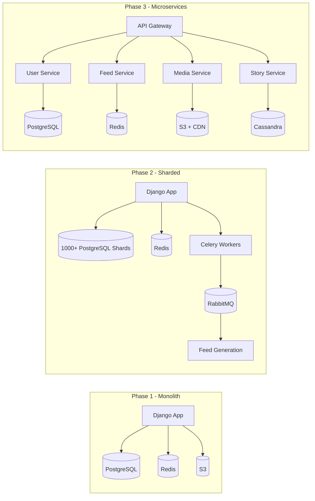

# Instagram Architecture

## Overview
Instagram grew from 0 to 1B+ users with a small engineering team, using PostgreSQL, Redis, and Python.



## Architecture Evolution

```
Phase 1 (Monolith):
  Django App ──► PostgreSQL ──► Redis ──► S3
  
Phase 2 (Sharded):
  Django App ──► PostgreSQL (1000+ shards) ──► Redis
       │
  Celery Workers ──► RabbitMQ ──► Feed generation
  
Phase 3 (Microservices):
  API Gateway ──► User Service ──► PostgreSQL
              ──► Feed Service ──► Redis
              ──► Media Service ──► S3 + CDN
              ──► Story Service ──► Cassandra
              ──► Direct Service ──► Cassandra
```

## Key Lessons

| Lesson | Detail |
|--------|--------|
| **PostgreSQL sharding** | 1000+ shards, custom sharding logic |
| **Feed generation** | Fanout-on-write for active users |
| **Redis clusters** | Timeline caching, session storage |
| **Python/Django** | Rapid iteration, single codebase |
| **Migration** | Monolith → Microservices gradually |

## Interview Questions
1. How does Instagram generate feeds for 1B+ users?
2. How did Instagram shard PostgreSQL at scale?
3. How does Instagram handle photo uploads and processing?
4. Why did Instagram choose Python for a high-scale system?
5. Design a simplified Instagram feed system
