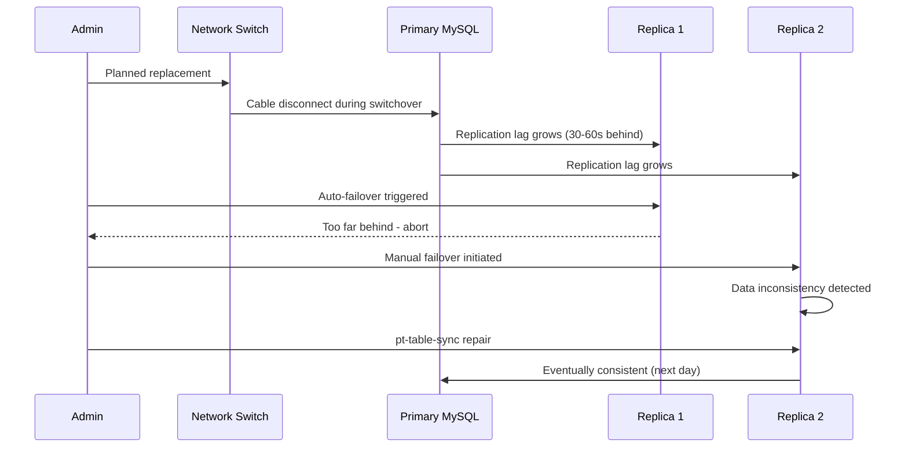

# GitHub Outage (2018)

## Event
On October 21, 2018, GitHub experienced a 24-hour, 11-minute service degradation affecting all GitHub services including repositories, issues, and GitHub Pages. The root cause was a database infrastructure failure with a cascading impact.



## Timeline
- **22:15 UTC (Oct 20)**: Planned maintenance to replace a failing network switch
- **22:30 UTC**: Network connectivity to primary database was lost
- **22:32 UTC**: Auto-failover attempted — but replica was too far behind in replication
- **22:45 UTC**: Manual failover to a different replica initiated
- **02:00 UTC**: Multiple database replicas out of sync; data inconsistency
- **10:00 UTC**: Decision to use `pt-table-sync` to repair replication lag
- **18:00 UTC**: System functionally recovered
- **Next day**: Data fully consistent after replication caught up

## Root Cause

```
Primary failure chain:
1. Network switch replacement: Routine maintenance, approved change
2. Cable disconnect: The switch replacement caused a brief disconnect
3. Primary database: Lost connection to replicas during the switchover
4. Replication lag: Because primary was under high write load, replicas were 30-60s behind
5. Failover failure: Orchestrator attempted failover, found no healthy replica with current data
6. Recovery complexity: Had to manually promote a replica, then fix replication gaps

Underlying issues:
- Network topology: Single point of failure in database network path
- Replication lag: MySQL async replication couldn't keep up with write volume
- Failover testing: Failover hadn't been tested in production conditions
- Capacity: Database was already at 85%+ capacity before the incident
```

## Lessons Learned

```
Manual (don't just automate — verify):

1. Regular failover testing
   - Schedule quarterly DR drills
   - Test with production traffic patterns
   - Measure actual RTO and RPO
   - Document every failed attempt

2. Database replication monitoring
   - Track replication lag (alarm at > 5s)
   - Alert on any replica drift
   - Test partial failure scenarios

3. Infrastructure resilience
   - Don't share network paths between DB replicas
   - Use Multi-AZ deployment (automatic failover)
   - Keep replicas in different failure domains

4. Capacity planning
   - Proactive scaling (don't wait for 85%)
   - Regular load testing
   - Headroom for traffic spikes
```

## Interview Questions

1. How would you design a database failover process?
2. What regular maintenance prevents database capacity issues?
3. How do you test disaster recovery procedures?
4. How do you monitor and manage MySQL replication lag?
5. Design a database topology that survives network partition
