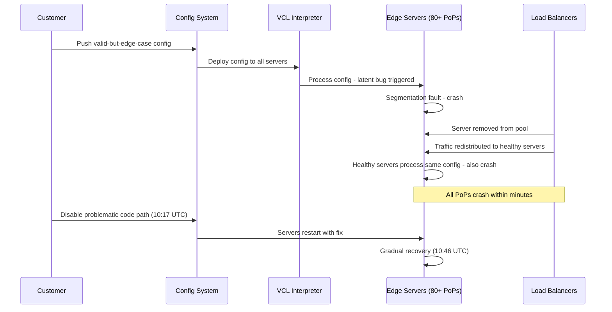

# Fastly Outage (2021)

## Event
On June 8, 2021, Fastly's CDN experienced a 59-minute global outage, taking down major websites including Amazon, Reddit, Twitch, The Guardian, The New York Times, Spotify, Pinterest, and dozens of other major services. It was one of the largest CDN outages in history.



## Timeline
- **09:47 UTC**: A customer pushed a valid-but-edge-case configuration change
- **09:48 UTC**: The configuration triggered a previously undiscovered software bug
- **09:49 UTC**: One Fastly edge server encountered the bug and rejected the config
- **09:50 UTC**: Server crash cascaded — failing servers triggered others to fail
- **09:55 UTC**: All 80+ Fastly PoPs affected globally
- **10:17 UTC**: Engineering team identified the bug and disabled the problematic config path
- **10:46 UTC**: Services gradually recovered as servers restarted with the fix

## Root Cause

```
Technical detail:
- Fastly uses a custom VCL (Varnish Configuration Language) interpreter
- A customer's configuration triggered a latent bug in a rarely-used code path
- The bug caused a segmentation fault in the VCL processing engine
- Crash → server removed from load balancer → traffic shifted → more servers crashed

Why it cascaded:
1. Initial crash caused traffic to redistribute to healthy servers
2. Healthy servers processed the same bad config and also crashed (same bug)
3. Within minutes, all servers had processed the config and crashed
4. New servers brought online to replace failed ones loaded the same config and crashed

Why disable was slow:
- Configuration was pushed through the same control plane that was crashing
- Recovery required a code change (not just config rollback)
```

## Key Lessons

| Lesson | Application |
|--------|------------|
| **Configuration testing** | Test edge case configs in isolated environment |
| **Load-shedding** | Config processing failure shouldn't crash the process |
| **Canary deployments** | Test config changes on 1% of traffic first |
| **Process isolation** | Each request should be isolated (don't crash the whole server) |
| **Multi-CDN** | Never depend on a single CDN provider for critical traffic |
| **Graceful degradation** | Return stale content instead of 502 when config fails |

## Defenses

1. **Config sandboxing**: VCL runs in isolated process; crash doesn't kill the edge
2. **Canary config rollout**: 1% → 10% → 100% with automatic rollback
3. **Circuit breaker**: If config causes > 5% error rate, auto-disable
4. **Multi-CDN strategy**: Route traffic across CloudFront + Fastly + Cloudflare
5. **Static fallback**: If all CDNs fail, serve from S3 directly with cached HTML
6. **Health cascades**: Monitor upstream health; don't shift all traffic to failing pools

## Interview Questions

1. How would you design a configuration deployment system for a CDN?
2. How do you handle cascading failures in a distributed system?
3. How would you design multi-CDN redundancy?
4. How do you test configuration changes at scale?
5. Design a health-check system that prevents traffic cascading
